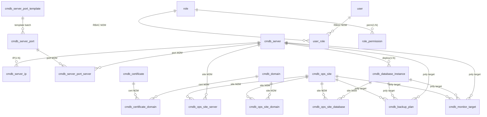

# RzOps CMDB — Project Handover

> **Audience**: future developers / AI agents
> **Goal**: after reading this document, fully understand *what the project is, why it is designed this way, which pitfalls were hit, and what comes next* — without re-reading the whole codebase.
> **Companions**: [README.en.md](../README.en.md) (intro & startup) · [AGENTS.md](../AGENTS.md) (AI cheat sheet) · Chinese version [HANDOVER.md](HANDOVER.md)

---

## 1. Project Overview

| Item | Value |
|---|---|
| Positioning | CMDB / asset management platform for small-to-medium ops teams |
| Backend | Rust 2021 edition · axum 0.8 · sqlx 0.8 (runtime-tokio / tls-rustls) · tokio 1 · tower-http |
| Frontend | Svelte 5.56 (runes) · SvelteKit 2.63 · Vite 8 · TypeScript 6 (strict) · Tailwind v4 · bits-ui |
| Database | PostgreSQL 16 (compose: `rzops-db-1`, db `rzopsdb`) |
| Auth | JWT (HS256); login returns `access_token` |
| Menus | 19 business menus + Dashboard (see §5) |
| History | 106 commits on main (2026-06-22 → 2026-09-09) |

**One-liner architecture**: a strictly layered 7-crate Rust backend (SQL only in `infra`), a SvelteKit static-SPA frontend (API proxied), everything dict-driven with soft-delete and RBAC, and a unified list-page UX standard.

---

## 2. Quick Start

### 2.1 Requirements

- Docker (with Compose) — recommended (**dev & test unified on compose**); or local Rust (stable) + Node 22+ + PostgreSQL 16.
- Runtime is WSL Docker Compose: `rzops-db-1`(5432) / `rzops-api-1`(8000) / `rzops-web-1`(8080). The legacy systemd setup (`rzops-api.service` / `rzops-web.service`) and the `rzops-postgres` dev-db container are stopped & disabled, kept only as background history.

### 2.2 One-command startup (Docker Compose)

```bash
cp .env.example .env        # optional: ports / passwords / admin account
docker compose up -d --build
# Web http://localhost:8080 · API http://localhost:8000 · Postgres :5432
# default account admin@rzops.local / admin123 (seeder creates it idempotently)
```

Init logic: `database/schema.sql` (standard SQL DDL) + `database/seed-data.sql` (only base data: dicts / roles / role permissions, INSERT syntax) are mounted as **named files** into postgres `/docker-entrypoint-initdb.d`; the container builds the DB on first boot. The API only runs seeders (admin account, base dicts) and **does not use the sqlx migration mechanism**. Business data (servers/domains/sites, etc.) starts empty and is entered by users.

> Optional test data: `database/test-data.sql` (realistic sample data — test users gust/eval, 21 business tables, audit/change logs) is **not** auto-executed; run it manually, idempotently (TRUNCATEs business tables first): `docker exec -i rzops-db-1 psql -U rzops -d rzopsdb < database/test-data.sql`. Note: compose mounts are named files (`01-schema.sql`/`02-seed-data.sql`); reverting to a directory mount would auto-run test-data.sql on first boot.

### 2.3 Manual startup (dev)

```bash
# Database
docker run -d --name rzops-postgres -e POSTGRES_USER=rzops -e POSTGRES_PASSWORD=rzops \
  -e POSTGRES_DB=rzopsdb -p 5432:5432 postgres:16-alpine
docker exec -i rzops-postgres psql -U rzops -d rzopsdb < database/schema.sql
docker exec -i rzops-postgres psql -U rzops -d rzopsdb < database/seed-data.sql

# Backend (env vars: rzops-api/.env.example)
cd rzops-api && cargo run --release -p rzops-app   # listens :8000

# Frontend (dev)
cd rzops-web && npm install && npm run dev         # :5173, /api proxied to 8000
```

### 2.4 Common commands

```bash
docker exec -it rzops-db-1 psql -U rzops -d rzopsdb      # psql (compose primary)
cd rzops-api && cargo clippy --workspace -- -D warnings  # lint
cd rzops-web && npm run check                            # svelte-check
```

> Compose mode: rebuild the web service with `docker compose up -d --build web` after frontend edits (the legacy WSL systemd `/mnt/c` watcher issue no longer applies).

---

## 3. System Architecture

### 3.1 Backend layers (7-crate workspace)

```
rzops-api/
├── app/      → main.rs (wiring only: config → AppState → run)
├── server/   → router, AppState, middleware, migrations/, seeder
├── api/      → HTTP handlers + DTOs (maps domain errors to HTTP)
├── domain/   → models + service traits (pure; no sqlx/axum/HTTP types)
├── infra/    → sqlx repository impls (the ONLY layer allowed to write SQL)
├── config/   → env loading (RZOPS_ prefix, double-underscore nesting)
└── common/   → shared errors (AppError, thiserror) & base types

Dependency direction (strict, one-way):
app → server → api → domain
      server → infra → domain
      server → config; everything → common
```

Key mechanisms:
- **State injection**: `AppState { Arc<dyn Trait>... }`, handlers use `State(state)`.
- **Schema**: `database/schema.sql` (standard SQL) is the single source of truth; startup does **not** run migrations (migration mode is deprecated; `server/migrations/` is kept as historical record only).
- **Seeder** (`server/src/seeder.rs`): idempotently creates the superuser from env vars and writes base dicts when empty.
- **Errors**: `common` defines `AppError` (NotFound/Unauthorized/Validation/Internal…) → `api` implements `IntoResponse` → uniform JSON `{ "error": ... }`; unknown errors return 500 and the frontend shows a toast.

### 3.2 Frontend structure (SvelteKit static SPA)

```
rzops-web/
├── src/routes/            # 68 pages (list/new/detail/edit/recycle…)
├── src/lib/api/           # client.ts unified request wrapper + 24 resource modules
├── src/lib/types/         # 22 type modules (mirror of backend DTOs)
├── src/lib/components/    # shared components
│   ├── shared/            #   DataTable (sticky header/index/pagination/column toggles),
│   │                      #   Pagination, SearchInput, EmptyState, StatusBadge, PageHeader…
│   ├── forms/             #   resource forms (ServerForm/OpsSiteForm…) + inline cards
│   └── ui/                #   bits-ui wrappers (Modal/Select/Checkbox/Toast…)
└── vite.config.ts         # adapter-static, /api proxy, cacheDir, allowedHosts
```

Key mechanisms:
- **Static SPA**: `adapter-static` + `ssr=false` + `prerender=false`; `npm run build` outputs pure static `build/`; nginx SPA fallback.
- **Unified client** (`client.ts`): JWT injection, 401 redirect only on non-`/login` (anti-loop), `sanitizeEmptyRefs` strips empty `_id/_date/_time` fields before submit (backend `Option` fields reject empty strings).
- **Dict loading**: global dict cache after login; `translateDict` for labels; badge colors from `extra_data.color`.
- **Error UX**: global toast with ApiError message; login page never preloads auth-required endpoints.

### 3.3 Auth & data flow

```
Browser → (JWT Bearer) → api handlers → State.services → infra repos → Postgres
             ↑ 401 (non-/login) → frontend redirects to login
```

- Login: `POST /api/v1/auth/login` → `{ access_token }` (signed with `RZOPS_JWT__SECRET`, default 86400s).
- Permissions: handlers check `is_superuser` or `role_permission` (§7).

---

## 4. Database Design

### 4.1 Tables (25, excluding migration-record table)

| Group | Tables | Notes |
|---|---|---|
| Core | `cmdb_server` / `cmdb_data_center` / `cmdb_provider` | servers (environment/hardware/lease), data centers, providers |
| Network | `cmdb_domain` / `cmdb_certificate` / `cmdb_certificate_domain` | domains, certs, cert↔domain (M2M) |
| | `cmdb_server_ip` / `cmdb_server_port` / `cmdb_server_port_server` / `cmdb_server_port_template` | IPs, ports, port↔server (M2M), port templates |
| Apps | `cmdb_ops_site` / `cmdb_ops_site_server` / `cmdb_ops_site_database` / `cmdb_ops_site_domain` / `cmdb_database_instance` | sites + 3 relation tables (M2M), DB instances |
| Ops | `cmdb_backup_plan` / `cmdb_monitor_target` | backup plans, monitor targets (polymorphic target) |
| Admin | `cmdb_dict` / `cmdb_attachment` | dicts, attachments |
| RBAC | `user` / `role` / `user_role` / `role_permission` | 4 RBAC tables |
| Audit | `cmdb_audit_log` / `cmdb_change_record` | audit & change logs |
| Legacy | `cmdb_contract` / `cmdb_credential` | contracts (keep/remove TBD), credentials (feature removed, table to clean) |

### 4.2 Core relations



Design principles:
- **Big-table relations go through junction tables** (M2M) instead of foreign-key columns: site↔server/db/domain, port↔server, cert↔domain.
- **Polymorphic targets** (backup/monitor): `target_type` + `target_id`; backend resolves names and returns `target_name`; UI shows `name(status)`.
- **Soft delete**: business tables carry `is_deleted` / `deleted_at` / `deleted_by`; delete = UPDATE; lists filter by default; recycle bin reads the deleted snapshot.
- **Timestamps**: `created_at` / `updated_at` maintained by DB defaults.

### 4.3 Schema-evolution conventions (standard SQL, no migration mechanism)

- **Single source of truth**: `database/schema.sql` (standard `CREATE TABLE` / `ALTER TABLE`, PostgreSQL dialect). **No sqlx migration mode** (`sqlx::migrate!` has been removed from startup; `server/migrations/` is kept only as historical record and is not executed).
- **Schema changes**: edit `database/schema.sql` directly (dev) → run the matching `ALTER TABLE` delta manually on deployed DBs (prod). **Always keep schema.sql in sync** — the file is the authority.
- **Data init**: `database/seed-data.sql` contains only base data (dicts/roles/role permissions, INSERT syntax); accounts are created by the seeder; business data starts empty.
- Historical migration files are named `NNN_short-description.sql` (e.g. `009_rbac.sql`) and serve as an evolution audit trail only.

### 4.4 Database compatibility note (decision record)

- **Today**: the project has been **PostgreSQL-only since its first commit** — `sqlx` enables only the `postgres` feature; all 10 migrations are PG dialect (`jsonb` / `timestamptz` / plpgsql triggers / `ON CONFLICT`); infra SQL uses PG `$1` placeholders. **SQLite / MySQL were never implemented** (early "multi-DB" talk never made it into code).
- **Decision (2026-09)**: keep PostgreSQL as the primary database (best fit for multi-user CMDB with concurrency & JSON queries); the `database/` snapshot is explicitly PG-dialect.
- **Evolution path (already in place)**: `domain` service traits + `infra` as the only SQL layer. To support MySQL later: add MySQL-dialect repository implementations under `infra` plus `NNN_xxx.mysql.sql` dialect migrations under `server/migrations/` (sqlx supports per-dialect migration files of the same version); `domain`/`api`/`server` stay untouched.
- **Cost if staffed later**: dual-dialect migrations + all repository SQL rewritten (different placeholder systems) + type downgrades (jsonb functions, triggers, timestamptz semantics) + a multi-DB test matrix; estimate weeks. SQLite is not recommended for a multi-user CMDB (global write lock, weak typing).

---

## 5. Feature Overview (by menu)

> Each menu: core capabilities / design notes / special interactions. §5.0 applies to every menu.

### 5.0 Global list-page standard (all menus)

- **Table**: sticky header + sticky index column; pagination (page size 10/20/50/100); column show/hide (settings popover, sensible defaults).
- **Filters**: top search box + per-menu advanced filters (dict fields use dict dropdowns; relation fields use remote-search dropdowns / recent 6 items).
- **Sorting**: default `created_at` DESC; inactive/retired/archived records are **pinned to the bottom** with status color (font color from dict `extra_data.color`).
- **Row status**: retired/offline/disabled/expired rows show status color (not full-row background — the sticky index column would not sync, historical lesson).
- **Actions**: Edit goes straight to the edit page; clicking name/first column opens detail; delete asks in a Modal (soft delete) and removes the row locally without a full-table refresh.
- **Detail page**: sectioned info; relations show **names (with status suffix)** and are clickable through to target detail.
- **Form page**: top-right action bar (save/cancel) + bottom save unified; frontend + backend validation.

### 5.1 Dashboard

- Resource stat cards (servers/domains/certs/providers/data centers/DB instances).
- **Expiry reminders**: server/domain/certificate renewals grouped by type; retired/disabled resources auto-filtered; mobile-adaptive cards.

### 5.2 Servers (core menu)

- **Basics**: name, type (dict), environment (prod/staging/test, dict), status (running/retired…), data center/provider, hardware (CPU/RAM/disk/RAID — **RAID level selectable only when RAID is checked**; "DB server" checkbox reveals the **inline database-instance card**), lease info (price, currency dict).
- **Inline sub-table cards** (managed during create/edit): IPs (create-only; EIPs are managed on cloud platforms), server ports (**batch add from port templates**, server multi-select), database instances (shown when "DB server" checked, placed after the ports card), owned sites (read-only).
- **Advanced filters**: keyword + IP search + type + environment + is-db-server + data center.
- **Detail**: full info + related IPs/ports/db instances/sites; retired shows `name(已退役)`.

### 5.3 Data Centers / Providers

- Data center: name, country, address, line types (**dict multi-select**); province/city fields removed (address covers it).
- Provider: name, type (dict, incl. "domain" category), country, address, contacts.
- Filters: keyword + country (dict).

### 5.4 Domains

- Registrar (dict), registration/expiry dates (**validation: registration ≤ expiry**), DNS records, status (active/disabled, dict color).
- Detail: bound certificates (click-through).
- Filters: keyword + registrar + status.

### 5.5 Certificates

- Certificate info (issuer, serial, key algorithm…), **bound domains** (picker over **existing** domains, multi-row; each row auto-fills domain/mode).
- Status: active / archived / expired (**colors driven by dict `extra_data.color`** — adding a status needs no code change).
- Filters: keyword + status; expiry participates in Dashboard reminders.

### 5.6 Server IPs

- IP (supports `nic:ip` form), NIC name, ISP provider (dict), server (**single-select, optional** — EIPs can be unbound; table picker popup).
- Status linkage: server retired → show `server(已退役)`; IPs of deleted servers pinned to bottom.
- Filters: keyword + IP type (dict) + server (remote-search dropdown, recent 6).

### 5.7 Server Ports (architecture reworked twice, §6.4)

- **Per-server independent ports**: one record = one port of one server (protocol/port/service/access scope/server single-select via popup).
- **Batch input via templates**: `cmdb_server_port_template` (e.g. ssh/22, http/80) → server form "add from template" multi-selects templates to generate ports.
- List: multiple servers truncated as `name, xxx, xxx… +N`; detail page paginates servers (TableSelectModal standard).
- Filters: keyword + protocol (dict). (Server filter was removed — full dropdowns get too long at scale, historical decision.)

### 5.8 Database Instances

- Type (MySQL/PostgreSQL/Redis…, dict), version, **server** (single-select, table picker), purpose (dict), port.
- Site relations; backup plans / monitor targets (polymorphic).
- Filters: keyword + type + server (**remote-search dropdown**, recent 6 — was a full dropdown, changed for scale).

### 5.9 Sites (relations are the core)

- Basics: name (required), URL (required), repo type (dict), status (running / temp-offline / permanent-offline — offline statuses support **operation time** input), environment.
- **Related resources** (managed inline during create/edit, **add/remove only, no edit of a single relation** — business decision): servers, DB instances, domains, one card each (popup picker, M2M).
- Backup plans / monitor targets: checkbox reveals **add-card** (same pattern as server IP/port cards, not a dropdown).
- List: temp-offline before permanent-offline at the bottom, distinct status colors.

### 5.10 Backup Plans / Monitor Targets

- Common fields: name, frequency/policy, status (active/disabled/archived).
- **Relation info** (separate card, unified pattern): target type (server/db/site…) → target object (popup picker); multi-row; shows target name(status).
- Backup targets only **DB instances and sites** (servers are not backup targets — business decision).
- Monitor targets may link a site; providers/data centers are **not** monitor targets (business decision).

### 5.11 Users / Roles (RBAC, §7)

- User: email (login), password, name, enabled, **multiple roles**, superuser flag.
- Role: name, description; permissions = business-resource perms (per menu: view/create/edit/delete, progressive) + system-admin perms (dict/attachment/user/role/recycle menus).

### 5.12 Dicts

- Types (server_status, environment, protocol…) + entries (code/label/sort/status).
- **extra_data (JSON)**: extension attributes incl. status colors (`extra_data.color`) consumed by badges.
- Pagination + search; global TTL cache (§8); new types/entries take effect immediately.

### 5.13 Recycle Bin (soft-delete system)

- Lists all soft-deleted records (resource type + snapshot JSON + delete time/actor + delete type: soft/permanent).
- Actions: **restore** (put data back), **permanent delete** (physical; audit log records `delete_type=permanent`).
- Snapshot expandable; the menu itself is permission-controlled.

### 5.14 Attachments

- Real file upload (multipart), linked to any target type (server/domain/cert…).
- List/detail show `target name` (clickable to target detail) and `uploader username`, not UUIDs.
- target_type/target_id/uploader/storage_key/content_type/file_size are **computed by the program**, not user-entered.

### 5.15 Audit Logs / Change Records

- Full write trail: actor, action (create/update/delete), resource type/id/name snapshot, time, change details.
- **Resource column**: resolves names per type (falls back to ID on failure instead of endless loading).
- **Change records**: filter by change type, resource type, created-time range.
- Deletes record `delete_type` (soft/permanent); recycle-bin purges are also logged.

---

## 6. Core Decisions & Pitfalls (ADR-style)

> Chronological. Each: **context → decision → pitfall/lesson**. The most valuable part of this doc.

### 6.1 Enums → Dict-driven (major)

- **Context**: early on, 28 hard-coded enums scattered in the frontend; new values meant code changes.
- **Decision**: converge everything into `cmdb_dict`; dropdowns/badges/filters go through the dict API; **no new hard-coded enums**.
- **Pitfall**: a missing dict type shows raw codes instead of labels (once missed `environment`/`domain_role`) — register new types in the loading list.

### 6.2 Soft-delete system (major)

- **Context**: CMDB data is "almost never deleted"; early design had `is_delete` then removed it; accidental deletes became unrecoverable.
- **Decision**: re-introduce soft delete (`is_deleted`/`deleted_at`/`deleted_by`); delete = UPDATE; add **Recycle Bin** (snapshot/restore/permanent); audit/change logs record `delete_type`.
- **Pitfall**: some queries once missed the `is_deleted` filter, leaking deleted rows into lists/stats — every list query must filter.

### 6.3 Relations via junction tables (major)

- **Context**: big-table relations (site↔server/db/domain, port↔server, cert↔domain).
- **Decision**: always M2M junction tables; polymorphic targets use `target_type+target_id`.
- **Pitfall**: junction tables once had an `is_primary` flag whose meaning was ambiguous (primary/replica vs prod/test) — **removed**, replaced by per-entity `environment` (dict).

### 6.4 Server-port architecture reworked twice (important)

- **v1 (shared ports)**: one port record bound to many servers (M2M) → **pitfall**: editing the port on one server **affected all bound servers**; more servers → more relation rows.
- **v2 (per-server ports)**: one record = one port of one server; **port templates** for batch entry.
- **Rationale**: researched similar products; shared-port semantics are rare in practice; templates compensate the input cost. **Current is v2 — do not revert.**

### 6.5 Login infinite-refresh loop (high impact)

- **Symptom**: `/login` reloaded endlessly, inputs unusable.
- **Root cause**: the login page preloaded auth-required dict endpoints → 401 → redirect logic re-entered `/login` → reload loop.
- **Fix**: login page no longer preloads protected endpoints; `client.ts` 401 redirect excludes `/login`.
- **Lesson**: global 401 redirect must exclude the login page, and the login page must not fire auth-required requests.

### 6.6 Public reverse-proxy triple pitfall (deployment)

1. **Blocked request. This host is not allowed** → Vite dev `allowedHosts` whitelist (local dev is fine; public domains rejected) → set `allowedHosts` or use a static build.
2. **Infinite refresh via public access** → Vite HMR WebSocket broken through proxy/frp → **production must use a static build** (`npm run build`, no HMR).
3. **Save returns 403** → cloud WAF (ModSecurity + OWASP CRS) allows only GET/HEAD/POST/OPTIONS by default and **blocks PUT** (rule 911100); business fields containing `ssh` are misjudged as RCE (rule 932250) — **not an app defect**, a WAF config issue; no API change needed, but public access requires allowing PUT / tuning CRS.

### 6.7 Backend `Option` fields reject empty strings

- **Symptom**: form submit fails on empty strings for `Option<Uuid>`/`Option<DateTime>` fields.
- **Decision**: `client.ts` `sanitizeEmptyRefs` strips empty `_id/_date/_time` fields before submit; all new forms must go through this wrapper.

### 6.8 Vite cross-drive performance (WSL dev)

- **Symptom**: Vite very slow on `/mnt/c`; code changes not picked up (legacy systemd dev mode only).
- **Decision**: `vite.config.ts` `cacheDir` on the native disk (`~/.cache/rzops-vite`) + `warmup`; cross-drive watcher misses changes.
- **Now (compose mode)**: `docker compose up -d --build web` after frontend edits; no watcher/systemd involved.

### 6.9 Edit page "ID first, name later" (UX)

- **Symptom**: entering edit, relation fields flash ID then resolve to names.
- **Root cause**: async fill race (detail returns raw ID; names resolve later).
- **Fix**: show placeholder (`-`) until loaded, render names in one pass; never render IDs first. Same class: server-IP edit page once showed the server ID — unified to names.

### 6.10 Picked target displayed as ID (UX)

- **Symptom**: backup/monitor target backfilled as UUID after selection.
- **Fix**: backend returns `target_name`; UI shows names; relation info unified as "target type → target object (popup)".
- **Derived pitfall**: switching target type shifted the target-object dropdown a few pixels (layout shift) — fixed with min-height/stable container.

### 6.11 TableSelectModal evolution (large-data pickers)

- **Need**: server pickers unusable as full dropdowns at scale.
- **Journey**: full dropdown → popup table picker (remote search + pagination) → a "beautified" version → **reverted** (double-X, worse) → standard version (sticky header + unified style + single-select disables select-all).
- **Conclusion**: the popup table picker is the only standard (reuses the list-page component); do not reintroduce full dropdowns.

### 6.12 Unified list UX (multi-round iteration summary)

- Sticky header (see it while scrolling long tables) → selectable page size → column show/hide (sensible defaults) → sticky index column (visible when horizontally scrolling) → cell truncation + tooltip (some columns partially clipped when hidden) → row status colors (full-row gray was tried and dropped because the sticky index column desynced) → Modal delete + local row removal (no full-table refresh) → per-menu filter customization (server dropdown filters removed / switched to remote search at scale) → inactive records pinned to bottom.
- **Dict status colors**: stored in dict `extra_data.color` — **adding a status needs no code change**.

### 6.13 Site relations: add/remove only

- **Decision**: on site edit, related resources support **add and remove only**, never editing a single relation (relations have no independent editable attributes).
- The detail page has no relation-edit entry (only the top-right "Edit" button enters edit mode).

### 6.14 Delete semantics: status display instead of cascade delete (major)

- **Context**: when a server retires, what about its IPs/ports/sites/db instances? Cascade delete is risky (multi-bound ports, irreversible data).
- **Decision**: **everything by status** — retired servers pinned & colored; relations show `name(已退役)`; no cascade delete; IPs/ports likewise (a port only drops its binding to a retired server; the port itself stays). Delete still goes through soft-delete + recycle bin.

### 6.15 Form validation & SQL injection protection

- Frontend validates all forms (required/format/**time ranges** e.g. domain registration ≤ expiry); core injection protection is backend parameterized queries (infra `sqlx::query` with bind params).
- **Lesson**: dynamic SQL concatenation is an injection surface (audit once found `format!`-built queries; fixed to parameterized) — never concatenate user input into SQL.

### 6.16 Static deployment (adapter-static)

- Frontend is a SvelteKit **static SPA** (`ssr=false`, `prerender=false`); `npm run build` → `build/`; nginx config with SPA fallback + `/api` proxy (`rzops-web/nginx.conf`).
- Verified: `build/` + nginx container runs the full app (login, lists, details).

### 6.17 Query performance (N+1 / dict cache)

- List endpoints once resolved relation names row-by-row (N+1) → batched joins / prefetch; N+1 eliminated.
- Dict endpoint got a **TTL in-memory cache** (invalidated on dict change) so pages don't hit the DB per request; cache size is tiny (hundreds of rows), memory impact negligible.

### 6.18 Attachment field automation

- Attachments are read-only; target-ID/uploader-ID show resolved names (click-through); target_type/target_id/storage_key/content_type/file_size are **computed by the program**.

### 6.19 Windows/PowerShell toolchain pitfalls (dev env)

- Complex `wsl -e sh -lc` commands break on PowerShell quoting → use `seed/_xxx.sh` scripts + `sed -i 's/\r$//'` to strip CRLF; sudo password `1`.

---

## 7. RBAC

### 7.1 Model

```
user ──< user_role >── role ──< role_permission >── permission point
superuser (user.is_superuser=true) bypasses all checks
```

- **One user, many roles**: `user_role` M2M (research: multi-role is common; single-role only suits ultra-strict setups).
- **Two permission dimensions**:
  - **Business-resource perms** (per menu): view / create / edit / delete, **progressive** — selecting "create" implies "view"; selecting "edit" requires "create" (the lone "create-without-edit" configuration was once possible; now forbidden by the progressive rule).
  - **System-admin perms** (admin menus): dicts, attachments, users, roles, recycle bin, independently checkable.
- Attachments/dicts are admin-class; business menus (servers/sites/…) are business-class.

### 7.2 Enforcement

- **Backend**: handler entry checks (superuser passes; otherwise look up `role_permission` for menu+action).
- **Frontend**: menus render by permission; action buttons hidden/disabled by permission.
- **Known**: an early version hid menus on the frontend but did not enforce on the backend, so a read-only role could still edit (fixed — permissions must be enforced on both sides).

### 7.3 Audit

- Every write is logged (actor, action, resource, details); deletes record `delete_type`.

---

## 8. Dict & Log Systems

### 8.1 Dicts (`cmdb_dict`)

| Field | Meaning |
|---|---|
| dict_type | type code (server_status / environment / protocol / domain_role / deploy_role / db_purpose / currency…) |
| code / label | value code + Chinese label |
| extra_data | JSON extension (`{"color":"#…"}` drives status badge colors) |
| sort_order / is_active | ordering & enable |

- The frontend fetches the full dict cache after login (memory + TTL); `translateDict(type, code)` renders labels; **colors come from `extra_data.color`** — adding a status value only adds a dict row, no code change.
- Special types (environment / domain_role…) are registered in the dict-loading list (`src/lib/api/dicts.ts` or equivalent); new types must be registered there.

### 8.2 Audit / change logs

- `cmdb_audit_log`: operation trail (who, when, which resource, what, before/after JSON snapshots).
- `cmdb_change_record`: change dimension (resource type, resource name, change type, time-range filter).
- **Resource column linkage**: resolves the resource name per `resource_type`; falls back to ID on failure (no endless loading); click-through to detail.

---

## 9. Deployment & Operations

### 9.1 Runtime (Docker Compose, recommended)

| Service | Container | Port | Update |
|---|---|---|---|
| Postgres | `rzops-db-1` | 5432 | volume `rzops_pgdata`; init mounted from `database/` |
| API | `rzops-api-1` | 8000 | after Rust edits: `docker compose up -d --build api` |
| Web | `rzops-web-1` | 8080 | after frontend edits: `docker compose up -d --build web` |

- Port conflicts: override `API_PORT` / `POSTGRES_PORT` / `WEB_PORT` in root `.env` (not committed).
- Attachments: uploads volume; API connection via `RZOPS_*` in `docker-compose.yml`.
- **Legacy (disabled)**: WSL systemd `rzops-api.service` / `rzops-web.service` and the `rzops-postgres` dev container are stopped & `systemctl disable`d — background history only.

### 9.2 Production

1. **Build static frontend**: `cd rzops-web && npm ci && npm run build` → `build/`.
2. **Host**: any static server (nginx reference `rzops-web/nginx.conf`: SPA fallback + `/api` proxy + asset caching).
3. **Backend**: `cargo build --release --workspace` → `target/release/rzops-app` + env vars (`RZOPS_JWT__SECRET` **must be changed**).
   - **Static link (recommended)**: `cargo build --release --target x86_64-unknown-linux-musl --workspace` produces a pure static binary (no glibc dependency) runnable on any Linux; the Dockerfile already uses this (rust:1-alpine build → alpine runtime).
4. **Database**: init via `database/schema.sql` (DDL) + `database/seed-data.sql` (base data) — no migration mechanism; for a production empty DB run these two files first (or apply incremental `ALTER` statements manually).
5. **Public access**: never expose Vite dev directly; WAFs must allow PUT (OWASP CRS blocks it by default, §6.6).

### 9.3 Docker Compose (quick sample)

- Three services: `db` (postgres:16-alpine, auto-init), `api` (multi-stage build), `web` (node build + nginx).
- Volumes: `pgdata`, `uploads`; ports overridable via `.env` (`POSTGRES_PORT`/`API_PORT`/`WEB_PORT`).
- Build notes: first API `cargo build --release` takes ~5–10 min; no compile-time sqlx macros, so building needs no database.

---

## 10. Known Issues & Leftovers

| # | Item | Status / suggestion |
|---|---|---|
| 1 | `cmdb_contract` (contracts) | menu exists but business value is questionable (contracts should live in OA/paper); **keep/remove TBD** |
| 2 | `cmdb_credential` (credentials) | feature removed; table remains; **to clean** (incl. "manage credential" field on DB instances) |
| 3 | frontend `$app/stores` | audit suggests progressive migration to `$app/state` (Svelte 5); non-blocking |
| 4 | permission-system test coverage | needs systematic verification (business/admin matrix, multi-role stacking, superuser) |
| 5 | attachment "auto-link" | target/uploader names already resolved; field-level automation to finish per §5.14 if not complete |
| 6 | list sorting/status colors | unified across menus; new menus must follow §5.0 |
| 7 | `seed/` directory | historical scripts (80 SQL + 112 sh); `_`-prefixed temp scripts are deleted after use and never committed; authoritative init is `database/` |

---

## 11. Roadmap (discussed, not implemented)

1. **Finer roles**: prebuilt Ops-Engineer split (DBA ops / server ops…).
2. **Backup physical management**: soft delete covers logical recovery; physical delete / backup strategy management (export/restore) TBD.
3. **Contract feature keep/remove**: see §10-1.
4. **Expiry reminders enhancements**: Dashboard has it; email/IM notifications next.
5. **User center**: avatar, profile, password change (no self-service page today).
6. **Query performance deep dive**: keyset pagination, index review, large-log archiving.
7. **Mobile UX**: responsive base done; complex forms (server create) on narrow screens to improve.
8. **Multi-instance / multi-tenant** deployment (not evaluated).
9. **Multi-database support**: currently Postgres-bound (see §4.4); the architecture path is ready — staff MySQL support along §4.4 if needed.

---

## Appendix: Doc & Code Map

| Concern | Location |
|---|---|
| Router/State/middleware/migrations/seeder | `rzops-api/server/src/`, `server/migrations/` |
| HTTP handlers & DTOs | `rzops-api/api/src/` |
| Domain models / service traits | `rzops-api/domain/src/` |
| SQL implementations (only) | `rzops-api/infra/src/db/` |
| Config loading | `rzops-api/config/src/settings.rs` |
| Frontend pages | `rzops-web/src/routes/` (68 pages) |
| Frontend API client | `rzops-web/src/lib/api/` (24 modules) |
| Frontend type mirror | `rzops-web/src/lib/types/` (22 modules) |
| Shared components | `rzops-web/src/lib/components/` |
| DB snapshot | `database/schema.sql`, `database/seed-data.sql` |
| Rust audit report | `rzops-api/docs/AUDIT_REPORT.md` |
| Frontend audit report | `rzops-web/docs/FRONTEND_AUDIT_REPORT.md` |

---

*Handover distilled from the full RzOps development history (2026-09-09). Pair with [AGENTS.md](../AGENTS.md); both humans and AI agents can ramp up quickly.*

