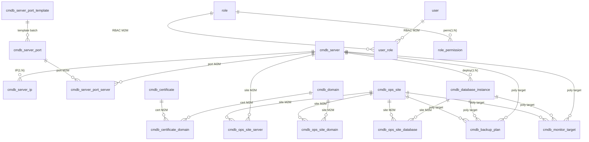

# RzOps CMDB — Project Handover

> **Audience**: future developers / AI agents
> **Goal**: after reading this document, fully understand *what the project is, why it is designed this way, which pitfalls were hit, and what comes next* — without re-reading the whole codebase.
> **Companions**: [README.en.md](../README.en.md) (intro & startup) · [AGENTS.md](../AGENTS.md) (AI cheat sheet) · Chinese version [HANDOVER.md](HANDOVER.md)

---

## 1. Project Overview

| Item | Value |
|---|---|
| Positioning | CMDB / asset management platform for small-to-medium ops teams |
| Backend | Rust 2021 edition · axum 0.8 · sqlx 0.8 (runtime-tokio / tls-rustls) · tokio 1 · tower-http |
| Frontend | Svelte 5.56 (runes) · SvelteKit 2.63 · Vite 8 · TypeScript 6 (strict) · Tailwind v4 · bits-ui |
| Database | PostgreSQL 16 (compose: `rzops-db-1`, db `rzopsdb`) |
| Auth | JWT (HS256); login returns `access_token` |
| Menus | 19 business menus + Dashboard (see §5) |
| History | 106 commits on main (2026-06-22 → 2026-09-09) |

**One-liner architecture**: a strictly layered 7-crate Rust backend (SQL only in `infra`), a SvelteKit static-SPA frontend (API proxied), everything dict-driven with soft-delete and RBAC, and a unified list-page UX standard.

---

## 2. Quick Start

### 2.1 Requirements

- Docker (with Compose) — recommended (**dev & test unified on compose**); or local Rust (stable) + Node 22+ + PostgreSQL 16.
- Runtime is Docker Compose: `rzops-db-1`(5432) / `rzops-api-1`(8000) / `rzops-web-1`(8080). The legacy systemd setup (`rzops-api.service` / `rzops-web.service`) and the `rzops-postgres` dev-db container are stopped & disabled, kept only as background history.

### 2.2 One-command startup (Docker Compose)

```bash
cp .env.example .env        # optional: ports / passwords / admin account
docker compose up -d --build
# Web http://localhost:8080 · API http://localhost:8000 · Postgres :5432
# default account admin@rzops.local / admin123 (seeder creates it idempotently)
```

Init logic: `database/schema.sql` (standard SQL DDL) + `database/seed-data.sql` (only base data: dicts / roles / role permissions, INSERT syntax) are mounted as **named files** into postgres `/docker-entrypoint-initdb.d`; the container builds the DB on first boot. The API only runs seeders (admin account, base dicts) and **does not use the sqlx migration mechanism**. Business data (servers/domains/sites, etc.) starts empty and is entered by users.

> Optional test data: `database/test-data.sql` (realistic sample data — test users gust/eval, 21 business tables, audit/change logs) is **not** auto-executed; run it manually, idempotently (TRUNCATEs business tables first): `docker exec -i rzops-db-1 psql -U rzops -d rzopsdb < database/test-data.sql`. Note: compose mounts are named files (`01-schema.sql`/`02-seed-data.sql`); reverting to a directory mount would auto-run test-data.sql on first boot.

### 2.3 Manual startup (dev)

```bash
# Database
docker run -d --name rzops-postgres -e POSTGRES_USER=rzops -e POSTGRES_PASSWORD=rzops \
  -e POSTGRES_DB=rzopsdb -p 5432:5432 postgres:16-alpine
docker exec -i rzops-postgres psql -U rzops -d rzopsdb < database/schema.sql
docker exec -i rzops-postgres psql -U rzops -d rzopsdb < database/seed-data.sql

# Backend (env vars: rzops-api/.env.example)
cd rzops-api && cargo run --release -p rzops-app   # listens :8000

# Frontend (dev)
cd rzops-web && npm install && npm run dev         # :5173, /api proxied to 8000
```

### 2.4 Common commands

```bash
docker exec -it rzops-db-1 psql -U rzops -d rzopsdb      # psql (compose primary)
cd rzops-api && cargo clippy --workspace -- -D warnings  # lint
cd rzops-web && npm run check                            # svelte-check
```

> Compose mode: rebuild the web service with `docker compose up -d --build web` after frontend edits (dev mode does not depend on vite watcher hot-reload; see §6.6 and README for static deployment).

---

## 3. System Architecture

### 3.1 Backend layers (7-crate workspace)

```
rzops-api/
├── app/      → main.rs (wiring only: config → AppState → run)
├── server/   → router, AppState, middleware, migrations/, seeder
├── api/      → HTTP handlers + DTOs (maps domain errors to HTTP)
├── domain/   → models + service traits (pure; no sqlx/axum/HTTP types)
├── infra/    → sqlx repository impls (the ONLY layer allowed to write SQL)
├── config/   → env loading (RZOPS_ prefix, double-underscore nesting)
└── common/   → shared errors (AppError, thiserror) & base types

Dependency direction (strict, one-way):
app → server → api → domain
      server → infra → domain
      server → config; everything → common
```

Key mechanisms:
- **State injection**: `AppState { Arc<dyn Trait>... }`, handlers use `State(state)`.
- **Schema**: `database/schema.sql` (standard SQL) is the single source of truth; startup does **not** run migrations (migration mode is deprecated; `server/migrations/` is kept as historical record only).
- **Seeder** (`server/src/seeder.rs`): idempotently creates the superuser from env vars and writes base dicts when empty.
- **Errors**: `common` defines `AppError` (NotFound/Unauthorized/Validation/Internal…) → `api` implements `IntoResponse` → uniform JSON `{ "error": ... }`; unknown errors return 500 and the frontend shows a toast.

### 3.2 Frontend structure (SvelteKit static SPA)

```
rzops-web/
├── src/routes/            # 68 pages (list/new/detail/edit/recycle…)
├── src/lib/api/           # client.ts unified request wrapper + 24 resource modules
├── src/lib/types/         # 22 type modules (mirror of backend DTOs)
├── src/lib/components/    # shared components
│   ├── shared/            #   DataTable (sticky header/index/pagination/column toggles),
│   │                      #   Pagination, SearchInput, EmptyState, StatusBadge, PageHeader…
│   ├── forms/             #   resource forms (ServerForm/OpsSiteForm…) + inline cards
│   └── ui/                #   bits-ui wrappers (Modal/Select/Checkbox/Toast…)
└── vite.config.ts         # adapter-static, /api proxy, cacheDir, allowedHosts
```

Key mechanisms:
- **Static SPA**: `adapter-static` + `ssr=false` + `prerender=false`; `npm run build` outputs pure static `build/`; nginx SPA fallback.
- **Unified client** (`client.ts`): JWT injection, 401 redirect only on non-`/login` (anti-loop), `sanitizeEmptyRefs` strips empty `_id/_date/_time` fields before submit (backend `Option` fields reject empty strings).
- **Dict loading**: global dict cache after login; `translateDict` for labels; badge colors from `extra_data.color`.
- **Error UX**: global toast with ApiError message; login page never preloads auth-required endpoints.

### 3.3 Auth & data flow

```
Browser → (JWT Bearer) → api handlers → State.services → infra repos → Postgres
             ↑ 401 (non-/login) → frontend redirects to login
```

- Login: `POST /api/v1/auth/login` → `{ access_token }` (signed with `RZOPS_JWT__SECRET`, default 86400s).
- Permissions: handlers check `is_superuser` or `role_permission` (§7).

---

## 4. Database Design

### 4.1 Tables (25, excluding migration-record table)

| Group | Tables | Notes |
|---|---|---|
| Core | `cmdb_server` / `cmdb_data_center` / `cmdb_provider` | servers (environment/hardware/lease), data centers, providers |
| Network | `cmdb_domain` / `cmdb_certificate` / `cmdb_certificate_domain` | domains, certs, cert↔domain (M2M) |
| | `cmdb_server_ip` / `cmdb_server_port` / `cmdb_server_port_server` / `cmdb_server_port_template` | IPs, ports, port↔server (M2M), port templates |
| Apps | `cmdb_ops_site` / `cmdb_ops_site_server` / `cmdb_ops_site_database` / `cmdb_ops_site_domain` / `cmdb_database_instance` | sites + 3 relation tables (M2M), DB instances |
| Ops | `cmdb_backup_plan` / `cmdb_monitor_target` | backup plans, monitor targets (polymorphic target) |
| Admin | `cmdb_dict` / `cmdb_attachment` | dicts, attachments |
| RBAC | `user` / `role` / `user_role` / `role_permission` | 4 RBAC tables |
| Audit | `cmdb_audit_log` / `cmdb_change_record` | audit & change logs |
| Legacy | `cmdb_contract` / `cmdb_credential` | contracts (keep/remove TBD), credentials (feature removed, table to clean) |

### 4.2 Core relations



Design principles:
- **Big-table relations go through junction tables** (M2M) instead of foreign-key columns: site↔server/db/domain, port↔server, cert↔domain.
- **Polymorphic targets** (backup/monitor): `target_type` + `target_id`; backend resolves names and returns `target_name`; UI shows `name(status)`.
- **Soft delete**: business tables carry `is_deleted` / `deleted_at` / `deleted_by`; delete = UPDATE; lists filter by default; recycle bin reads the deleted snapshot.
- **Timestamps**: `created_at` / `updated_at` maintained by DB defaults.

### 4.3 Schema-evolution conventions (standard SQL, no migration mechanism)

- **Single source of truth**: `database/schema.sql` (standard `CREATE TABLE` / `ALTER TABLE`, PostgreSQL dialect). **No sqlx migration mode** (`sqlx::migrate!` has been removed from startup; `server/migrations/` is kept only as historical record and is not executed).
- **Schema changes**: edit `database/schema.sql` directly (dev) → run the matching `ALTER TABLE` delta manually on deployed DBs (prod). **Always keep schema.sql in sync** — the file is the authority.
- **Data init**: `database/seed-data.sql` contains only base data (dicts/roles/role permissions, INSERT syntax); accounts are created by the seeder; business data starts empty.
- Historical migration files are named `NNN_short-description.sql` (e.g. `009_rbac.sql`) and serve as an evolution audit trail only.

### 4.4 Database compatibility note (decision record)

- **Today**: the project has been **PostgreSQL-only since its first commit** — `sqlx` enables only the `postgres` feature; all 10 migrations are PG dialect (`jsonb` / `timestamptz` / plpgsql triggers / `ON CONFLICT`); infra SQL uses PG `$1` placeholders. **SQLite / MySQL were never implemented** (early "multi-DB" talk never made it into code).
- **Decision (2026-09)**: keep PostgreSQL as the primary database (best fit for multi-user CMDB with concurrency & JSON queries); the `database/` snapshot is explicitly PG-dialect.
- **Evolution path (already in place)**: `domain` service traits + `infra` as the only SQL layer. To support MySQL later: add MySQL-dialect repository implementations under `infra` plus `NNN_xxx.mysql.sql` dialect migrations under `server/migrations/` (sqlx supports per-dialect migration files of the same version); `domain`/`api`/`server` stay untouched.
- **Cost if staffed later**: dual-dialect migrations + all repository SQL rewritten (different placeholder systems) + type downgrades (jsonb functions, triggers, timestamptz semantics) + a multi-DB test matrix; estimate weeks. SQLite is not recommended for a multi-user CMDB (global write lock, weak typing).

---

## 5. Feature Overview (by menu)

> Each menu: core capabilities / design notes / special interactions. §5.0 applies to every menu.

### 5.0 Global list-page standard (all menus)

- **Table**: sticky header + sticky index column; pagination (page size 10/20/50/100); column show/hide (settings popover, sensible defaults).
- **Filters**: top search box + per-menu advanced filters (dict fields use dict dropdowns; relation fields use remote-search dropdowns / recent 6 items).
- **Sorting**: default `created_at` DESC; inactive/retired/archived records are **pinned to the bottom** with status color (font color from dict `extra_data.color`).
- **Row status**: retired/offline/disabled/expired rows show status color (not full-row background — the sticky index column would not sync, historical lesson).
- **Actions**: Edit goes straight to the edit page; clicking name/first column opens detail; delete asks in a Modal (soft delete) and removes the row locally without a full-table refresh.
- **Detail page**: sectioned info; relations show **names (with status suffix)** and are clickable through to target detail.
- **Form page**: top-right action bar (save/cancel) + bottom save unified; frontend + backend validation.

### 5.1 Dashboard

- Resource stat cards (servers/domains/certs/providers/data centers/DB instances).
- **Expiry reminders**: server/domain/certificate renewals grouped by type; retired/disabled resources auto-filtered; mobile-adaptive cards.

### 5.2 Servers (core menu)

- **Basics**: name, type (dict), environment (prod/staging/test, dict), status (running/retired…), data center/provider, hardware (CPU/RAM/disk/RAID — **RAID level selectable only when RAID is checked**; "DB server" checkbox reveals the **inline database-instance card**), lease info (price, currency dict).
- **Inline sub-table cards** (managed during create/edit): IPs (create-only; EIPs are managed on cloud platforms), server ports (**batch add from port templates**, server multi-select), database instances (shown when "DB server" checked, placed after the ports card), owned sites (read-only).
- **Advanced filters**: keyword + IP search + type + environment + is-db-server + data center.
- **Detail**: full info + related IPs/ports/db instances/sites; retired shows `name(已退役)`.

### 5.3 Data Centers / Providers

- Data center: name, country, address, line types (**dict multi-select**); province/city fields removed (address covers it).
- Provider: name, type (dict, incl. "domain" category), country, address, contacts.
- Filters: keyword + country (dict).

### 5.4 Domains

- Registrar (dict), registration/expiry dates (**validation: registration ≤ expiry**), DNS records, status (active/disabled, dict color).
- Detail: bound certificates (click-through).
- Filters: keyword + registrar + status.

### 5.5 Certificates

- Certificate info (issuer, serial, key algorithm…), **bound domains** (picker over **existing** domains, multi-row; each row auto-fills domain/mode).
- Status: active / archived / expired (**colors driven by dict `extra_data.color`** — adding a status needs no code change).
- Filters: keyword + status; expiry participates in Dashboard reminders.

### 5.6 Server IPs

- IP (supports `nic:ip` form), NIC name, ISP provider (dict), server (**single-select, optional** — EIPs can be unbound; table picker popup).
- Status linkage: server retired → show `server(已退役)`; IPs of deleted servers pinned to bottom.
- Filters: keyword + IP type (dict) + server (remote-search dropdown, recent 6).

### 5.7 Server Ports (architecture reworked twice, §6.4)

- **Per-server independent ports**: one record = one port of one server (protocol/port/service/access scope/server single-select via popup).
- **Batch input via templates**: `cmdb_server_port_template` (e.g. ssh/22, http/80) → server form "add from template" multi-selects templates to generate ports.
- List: multiple servers truncated as `name, xxx, xxx… +N`; detail page paginates servers (TableSelectModal standard).
- Filters: keyword + protocol (dict). (Server filter was removed — full dropdowns get too long at scale, historical decision.)

### 5.8 Database Instances

- Type (MySQL/PostgreSQL/Redis…, dict), version, **server** (single-select, table picker), purpose (dict), port.
- Site relations; backup plans / monitor targets (polymorphic).
- Filters: keyword + type + server (**remote-search dropdown**, recent 6 — was a full dropdown, changed for scale).

### 5.9 Sites (relations are the core)

- Basics: name (required), URL (required), repo type (dict), status (running / temp-offline / permanent-offline — offline statuses support **operation time** input), environment.
- **Related resources** (managed inline during create/edit, **add/remove only, no edit of a single relation** — business decision): servers, DB instances, domains, one card each (popup picker, M2M).
- Backup plans / monitor targets: checkbox reveals **add-card** (same pattern as server IP/port cards, not a dropdown).
- List: temp-offline before permanent-offline at the bottom, distinct status colors.

### 5.10 Backup Plans / Monitor Targets

- Common fields: name, frequency/policy, status (active/disabled/archived).
- **Relation info** (separate card, unified pattern): target type (server/db/site…) → target object (popup picker); multi-row; shows target name(status).
- Backup targets only **DB instances and sites** (servers are not backup targets — business decision).
- Monitor targets may link a site; providers/data centers are **not** monitor targets (business decision).

### 5.11 Users / Roles (RBAC, §7)

- User: email (login), password, name, enabled, **multiple roles**, superuser flag.
- Role: name, description; permissions = business-resource perms (per menu: view/create/edit/delete, progressive) + system-admin perms (dict/attachment/user/role/recycle menus).

### 5.12 Dicts

- Types (server_status, environment, protocol…) + entries (code/label/sort/status).
- **extra_data (JSON)**: extension attributes incl. status colors (`extra_data.color`) consumed by badges.
- Pagination + search; global TTL cache (§8); new types/entries take effect immediately.

### 5.13 Recycle Bin (soft-delete system)

- Lists all soft-deleted records (resource type + snapshot JSON + delete time/actor + delete type: soft/permanent).
- Actions: **restore** (put data back), **permanent delete** (physical; audit log records `delete_type=permanent`).
- Snapshot expandable; the menu itself is permission-controlled.

### 5.14 Attachments

- Real file upload (multipart), linked to any target type (server/domain/cert…).
- List/detail show `target name` (clickable to target detail) and `uploader username`, not UUIDs.
- target_type/target_id/uploader/storage_key/content_type/file_size are **computed by the program**, not user-entered.

### 5.15 Audit Logs / Change Records

- Full write trail: actor, action (create/update/delete), resource type/id/name snapshot, time, change details.
- **Resource column**: resolves names per type (falls back to ID on failure instead of endless loading).
- **Change records**: filter by change type, resource type, created-time range.
- Deletes record `delete_type` (soft/permanent); recycle-bin purges are also logged.

---

## 6. Core Decisions & Pitfalls (ADR-style)

> Chronological. Each: **context → decision → pitfall/lesson**. The most valuable part of this doc.

### 6.1 Enums → Dict-driven (major)

- **Context**: early on, 28 hard-coded enums scattered in the frontend; new values meant code changes.
- **Decision**: converge everything into `cmdb_dict`; dropdowns/badges/filters go through the dict API; **no new hard-coded enums**.
- **Pitfall**: a missing dict type shows raw codes instead of labels (once missed `environment`/`domain_role`) — register new types in the loading list.

### 6.2 Soft-delete system (major)

- **Context**: CMDB data is "almost never deleted"; early design had `is_delete` then removed it; accidental deletes became unrecoverable.
- **Decision**: re-introduce soft delete (`is_deleted`/`deleted_at`/`deleted_by`); delete = UPDATE; add **Recycle Bin** (snapshot/restore/permanent); audit/change logs record `delete_type`.
- **Pitfall**: some queries once missed the `is_deleted` filter, leaking deleted rows into lists/stats — every list query must filter.

### 6.3 Relations via junction tables (major)

- **Context**: big-table relations (site↔server/db/domain, port↔server, cert↔domain).
- **Decision**: always M2M junction tables; polymorphic targets use `target_type+target_id`.
- **Pitfall**: junction tables once had an `is_primary` flag whose meaning was ambiguous (primary/replica vs prod/test) — **removed**, replaced by per-entity `environment` (dict).

### 6.4 Server-port architecture reworked twice (important)

- **v1 (shared ports)**: one port record bound to many servers (M2M) → **pitfall**: editing the port on one server **affected all bound servers**; more servers → more relation rows.
- **v2 (per-server ports)**: one record = one port of one server; **port templates** for batch entry.
- **Rationale**: researched similar products; shared-port semantics are rare in practice; templates compensate the input cost. **Current is v2 — do not revert.**

### 6.5 Login infinite-refresh loop (high impact)

- **Symptom**: `/login` reloaded endlessly, inputs unusable.
- **Root cause**: the login page preloaded auth-required dict endpoints → 401 → redirect logic re-entered `/login` → reload loop.
- **Fix**: login page no longer preloads protected endpoints; `client.ts` 401 redirect excludes `/login`.
- **Lesson**: global 401 redirect must exclude the login page, and the login page must not fire auth-required requests.

### 6.6 Public reverse-proxy triple pitfall (deployment)

1. **Blocked request. This host is not allowed** → Vite dev `allowedHosts` whitelist (local dev is fine; public domains rejected) → set `allowedHosts` or use a static build.
2. **Infinite refresh via public access** → Vite HMR WebSocket broken through proxy/frp → **production must use a static build** (`npm run build`, no HMR).
3. **Save returns 403** → cloud WAF (ModSecurity + OWASP CRS) allows only GET/HEAD/POST/OPTIONS by default and **blocks PUT** (rule 911100); business fields containing `ssh` are misjudged as RCE (rule 932250) — **not an app defect**, a WAF config issue; no API change needed, but public access requires allowing PUT / tuning CRS.

### 6.7 Backend `Option` fields reject empty strings

- **Symptom**: form submit fails on empty strings for `Option<Uuid>`/`Option<DateTime>` fields.
- **Decision**: `client.ts` `sanitizeEmptyRefs` strips empty `_id/_date/_time` fields before submit; all new forms must go through this wrapper.

### 6.8 Vite dev-time performance

- **Current**: rebuild the web service with `docker compose up -d --build web` after frontend edits; use `npm run dev` during development. `vite.config.ts` keeps `warmup` to pre-warm common routes and reduce first-paint latency.

### 6.9 Edit page "ID first, name later" (UX)

- **Symptom**: entering edit, relation fields flash ID then resolve to names.
- **Root cause**: async fill race (detail returns raw ID; names resolve later).
- **Fix**: show placeholder (`-`) until loaded, render names in one pass; never render IDs first. Same class: server-IP edit page once showed the server ID — unified to names.

### 6.10 Picked target displayed as ID (UX)

- **Symptom**: backup/monitor target backfilled as UUID after selection.
- **Fix**: backend returns `target_name`; UI shows names; relation info unified as "target type → target object (popup)".
- **Derived pitfall**: switching target type shifted the target-object dropdown a few pixels (layout shift) — fixed with min-height/stable container.

### 6.11 TableSelectModal evolution (large-data pickers)

- **Need**: server pickers unusable as full dropdowns at scale.
- **Journey**: full dropdown → popup table picker (remote search + pagination) → a "beautified" version → **reverted** (double-X, worse) → standard version (sticky header + unified style + single-select disables select-all).
- **Conclusion**: the popup table picker is the only standard (reuses the list-page component); do not reintroduce full dropdowns.

### 6.12 Unified list UX (multi-round iteration summary)

- Sticky header (see it while scrolling long tables) → selectable page size → column show/hide (sensible defaults) → sticky index column (visible when horizontally scrolling) → cell truncation + tooltip (some columns partially clipped when hidden) → row status colors (full-row gray was tried and dropped because the sticky index column desynced) → Modal delete + local row removal (no full-table refresh) → per-menu filter customization (server dropdown filters removed / switched to remote search at scale) → inactive records pinned to bottom.
- **Dict status colors**: stored in dict `extra_data.color` — **adding a status needs no code change**.

### 6.13 Site relations: add/remove only

- **Decision**: on site edit, related resources support **add and remove only**, never editing a single relation (relations have no independent editable attributes).
- The detail page has no relation-edit entry (only the top-right "Edit" button enters edit mode).

### 6.14 Delete semantics: status display instead of cascade delete (major)

- **Context**: when a server retires, what about its IPs/ports/sites/db instances? Cascade delete is risky (multi-bound ports, irreversible data).
- **Decision**: **everything by status** — retired servers pinned & colored; relations show `name(已退役)`; no cascade delete; IPs/ports likewise (a port only drops its binding to a retired server; the port itself stays). Delete still goes through soft-delete + recycle bin.

### 6.15 Form validation & SQL injection protection

- Frontend validates all forms (required/format/**time ranges** e.g. domain registration ≤ expiry); core injection protection is backend parameterized queries (infra `sqlx::query` with bind params).
- **Lesson**: dynamic SQL concatenation is an injection surface (audit once found `format!`-built queries; fixed to parameterized) — never concatenate user input into SQL.

### 6.16 Static deployment (adapter-static)

- Frontend is a SvelteKit **static SPA** (`ssr=false`, `prerender=false`); `npm run build` → `build/`; nginx config with SPA fallback + `/api` proxy (`rzops-web/nginx.conf`).
- Verified: `build/` + nginx container runs the full app (login, lists, details).

### 6.17 Query performance (N+1 / dict cache)

- List endpoints once resolved relation names row-by-row (N+1) → batched joins / prefetch; N+1 eliminated.
- Dict endpoint got a **TTL in-memory cache** (invalidated on dict change) so pages don't hit the DB per request; cache size is tiny (hundreds of rows), memory impact negligible.

### 6.18 Attachment field automation

- Attachments are read-only; target-ID/uploader-ID show resolved names (click-through); target_type/target_id/storage_key/content_type/file_size are **computed by the program**.

### 6.19 Dev-script conventions

- Ad-hoc dev scripts live under `seed/` with an `_` prefix (e.g. `seed/_xxx.sh` / `seed/_xxx.py`); **delete them after use, never commit**. If checked out on a non-Linux toolchain where CRLF crept in, run `sed -i 's/\r$//'` before executing shell scripts.

---

## 7. RBAC

### 7.1 Model

```
user ──< user_role >── role ──< role_permission >── permission point
superuser (user.is_superuser=true) bypasses all checks
```

- **One user, many roles**: `user_role` M2M (research: multi-role is common; single-role only suits ultra-strict setups).
- **Two permission dimensions**:
  - **Business-resource perms** (per menu): view / create / edit / delete, **progressive** — selecting "create" implies "view"; selecting "edit" requires "create" (the lone "create-without-edit" configuration was once possible; now forbidden by the progressive rule).
  - **System-admin perms** (admin menus): dicts, attachments, users, roles, recycle bin, independently checkable.
- Attachments/dicts are admin-class; business menus (servers/sites/…) are business-class.

### 7.2 Enforcement

- **Backend**: handler entry checks (superuser passes; otherwise look up `role_permission` for menu+action).
- **Frontend**: menus render by permission; action buttons hidden/disabled by permission.
- **Known**: an early version hid menus on the frontend but did not enforce on the backend, so a read-only role could still edit (fixed — permissions must be enforced on both sides).

### 7.3 Audit

- Every write is logged (actor, action, resource, details); deletes record `delete_type`.

---

## 8. Dict & Log Systems

### 8.1 Dicts (`cmdb_dict`)

| Field | Meaning |
|---|---|
| dict_type | type code (server_status / environment / protocol / domain_role / deploy_role / db_purpose / currency…) |
| code / label | value code + Chinese label |
| extra_data | JSON extension (`{"color":"#…"}` drives status badge colors) |
| sort_order / is_active | ordering & enable |

- The frontend fetches the full dict cache after login (memory + TTL); `translateDict(type, code)` renders labels; **colors come from `extra_data.color`** — adding a status value only adds a dict row, no code change.
- Special types (environment / domain_role…) are registered in the dict-loading list (`src/lib/api/dicts.ts` or equivalent); new types must be registered there.

### 8.2 Audit / change logs

- `cmdb_audit_log`: operation trail (who, when, which resource, what, before/after JSON snapshots).
- `cmdb_change_record`: change dimension (resource type, resource name, change type, time-range filter).
- **Resource column linkage**: resolves the resource name per `resource_type`; falls back to ID on failure (no endless loading); click-through to detail.

---

## 9. Deployment & Operations

### 9.1 Runtime (Docker Compose, recommended)

| Service | Container | Port | Update |
|---|---|---|---|
| Postgres | `rzops-db-1` | 5432 | volume `rzops_pgdata`; init mounted from `database/` |
| API | `rzops-api-1` | 8000 | after Rust edits: `docker compose up -d --build api` |
| Web | `rzops-web-1` | 8080 | after frontend edits: `docker compose up -d --build web` |

- Port conflicts: override `API_PORT` / `POSTGRES_PORT` / `WEB_PORT` in root `.env` (not committed).
- Attachments: uploads volume; API connection via `RZOPS_*` in `docker-compose.yml`.
- **Legacy (disabled)**: systemd `rzops-api.service` / `rzops-web.service` and the `rzops-postgres` dev container are stopped & `systemctl disable`d — background history only.

### 9.2 Production

1. **Build static frontend**: `cd rzops-web && npm ci && npm run build` → `build/`.
2. **Host**: any static server (nginx reference `rzops-web/nginx.conf`: SPA fallback + `/api` proxy + asset caching).
3. **Backend**: `cargo build --release --workspace` → `target/release/rzops-app` + env vars (`RZOPS_JWT__SECRET` **must be changed**).
   - **Static link (recommended)**: `cargo build --release --target x86_64-unknown-linux-musl --workspace` produces a pure static binary (no glibc dependency) runnable on any Linux; the Dockerfile already uses this (rust:1-alpine build → alpine runtime).
4. **Database**: init via `database/schema.sql` (DDL) + `database/seed-data.sql` (base data) — no migration mechanism; for a production empty DB run these two files first (or apply incremental `ALTER` statements manually).
5. **Public access**: never expose Vite dev directly; WAFs must allow PUT (OWASP CRS blocks it by default, §6.6).

### 9.3 Docker Compose (quick sample)

- Three services: `db` (postgres:16-alpine, auto-init), `api` (multi-stage build), `web` (node build + nginx).
- Volumes: `pgdata`, `uploads`; ports overridable via `.env` (`POSTGRES_PORT`/`API_PORT`/`WEB_PORT`).
- Build notes: first API `cargo build --release` takes ~5–10 min; no compile-time sqlx macros, so building needs no database.

---

## 10. Known Issues & Leftovers

| # | Item | Status / suggestion |
|---|---|---|
| 1 | `cmdb_contract` (contracts) | menu exists but business value is questionable (contracts should live in OA/paper); **keep/remove TBD** |
| 2 | `cmdb_credential` (credentials) | feature removed; table remains; **to clean** (incl. "manage credential" field on DB instances) |
| 3 | frontend `$app/stores` | audit suggests progressive migration to `$app/state` (Svelte 5); non-blocking |
| 4 | permission-system test coverage | needs systematic verification (business/admin matrix, multi-role stacking, superuser) |
| 5 | attachment "auto-link" | target/uploader names already resolved; field-level automation to finish per §5.14 if not complete |
| 6 | list sorting/status colors | unified across menus; new menus must follow §5.0 |
| 7 | `seed/` directory | historical scripts (80 SQL + 112 sh); `_`-prefixed temp scripts are deleted after use and never committed; authoritative init is `database/` |

---

## 11. Roadmap (discussed, not implemented)

1. **Finer roles**: prebuilt Ops-Engineer split (DBA ops / server ops…).
2. **Backup physical management**: soft delete covers logical recovery; physical delete / backup strategy management (export/restore) TBD.
3. **Contract feature keep/remove**: see §10-1.
4. **Expiry reminders enhancements**: Dashboard has it; email/IM notifications next.
5. **User center**: avatar, profile, password change (no self-service page today).
6. **Query performance deep dive**: keyset pagination, index review, large-log archiving.
7. **Mobile UX**: responsive base done; complex forms (server create) on narrow screens to improve.
8. **Multi-instance / multi-tenant** deployment (not evaluated).
9. **Multi-database support**: currently Postgres-bound (see §4.4); the architecture path is ready — staff MySQL support along §4.4 if needed.

---

## Appendix: Doc & Code Map

| Concern | Location |
|---|---|
| Router/State/middleware/migrations/seeder | `rzops-api/server/src/`, `server/migrations/` |
| HTTP handlers & DTOs | `rzops-api/api/src/` |
| Domain models / service traits | `rzops-api/domain/src/` |
| SQL implementations (only) | `rzops-api/infra/src/db/` |
| Config loading | `rzops-api/config/src/settings.rs` |
| Frontend pages | `rzops-web/src/routes/` (68 pages) |
| Frontend API client | `rzops-web/src/lib/api/` (24 modules) |
| Frontend type mirror | `rzops-web/src/lib/types/` (22 modules) |
| Shared components | `rzops-web/src/lib/components/` |
| DB snapshot | `database/schema.sql`, `database/seed-data.sql` |
| Rust audit report | `rzops-api/docs/AUDIT_REPORT.md` |
| Frontend audit report | `rzops-web/docs/FRONTEND_AUDIT_REPORT.md` |

---

## Appendix: Recent Changes

### 2026-09-11 — Build-warning cleanup & actions-column fix

- **Three-line warning cleanup**: `cargo clippy --workspace --all-targets` → 0 warnings (infra closures→fn pointers, unused-index removals, dead-code removal; api unwrap_or_default / from_ref / clamp; auth_extractor `result_large_err` and change_log `too_many_arguments` are official clippy exemptions); frontend `npm run build` → 0 warnings (23 a11y label associations, 24 Svelte-5 value-capture ignores, 3 `$derived` closures fixed); both container Dockerfiles → 0 warnings.
- **Actions column final form** (settled after several iterations): DataTable default actions column `w-[120px]`, button group and "操作" header both **horizontally centered** (`justify-center` + `text-center`); Delete button sits 18-19px from the table's right edge; Users page with 3 action buttons (Reset password + Edit + Delete) → `w-[200px]`. Fixes both the "Delete" clipped to "Del" issue and the button hugging the right edge on high-resolution screens.
- **Lesson: locate the layer first** — "actions column hugs the right" was first misdiagnosed as a browser/content-area margin issue (tried both `max-w-[1600px]` fixed and `xl:px-[5vw]` viewport-ratio paddings); the real cause was insufficient inner spacing between the buttons and the td's right edge (only 8px padding). For layout/visual issues, measure first in the browser (`getBoundingClientRect` on td vs button right edges) to pinpoint the layer before changing code.
- **`hideBelow` semantics fixed**: the column was previously hard-hidden at narrow widths by the render filter (even if checked in the column settings). Now it only affects the **default checked state** — hidden by default on narrow screens, but always shown once the user explicitly checks it (user choice beats auto-hide); "Reset defaults" computes defaults from the current viewport width.
- **Pitfall: multi-line commit messages get truncated (important)** — passing `-m "multi-line..."` through `wsl -e sh -lc '...'` loses the body (PowerShell→WSL argument mangling); the final message ended up as just `fix:`. **Rule: always commit multi-line messages via `git commit -F <file>`** (Write the file → `sed -i 's/\r$//'` to strip CRLF → `git commit -F`).
- **Line-ending lessons**: the repo historically mixes CRLF/LF (Windows dev, mostly CRLF); WSL python writes default to LF and produces whole-file diffs. After edits, align line endings **per file** against the baseline commit (LF stays LF, CRLF stays CRLF) — never batch-normalize.
- **The three `.env.example` templates (knowledge)** — root template = main docker-compose config (`cp .env.example .env`, compose reads it automatically); `rzops-api/.env.example` = standalone backend run (`cargo run`); backend `main.rs` auto-loads the `.env` in its working dir via `dotenvy::dotenv()`; `rzops-web/.env.example` = frontend vite dev only (`RZOPS_PUBLIC_HOST`, unnecessary for localhost). **Pitfall we hit**: the rzops-api template had stale values for months (DB name `rzops` / password `changeme` vs root template `rzopsdb` / `rzops`), so a standalone backend would connect to the wrong database — now aligned with the root template.
- **License changed to Apache-2.0** (2026-09-12): `LICENSE` is the official Apache-2.0 text (must stay unmodified); attribution goes in the `NOTICE` file (`Copyright 2026 0x5c0f`) per Apache convention — never in the LICENSE body; `rzops-api/Cargo.toml` workspace.package and all 7 sub-crates (`license.workspace = true`) marked Apache-2.0; `rzops-web/package.json` got `"license": "Apache-2.0"`; README (zh/en) License sections updated with the copyright line.


### 2026-09-14 Recycle-bin confirm dialog, unified single-select pickers, dropdown backfill layout
- **Recycle bin purge now has a confirm dialog and result toast**: `recycle/+page.svelte` split `handlePurge` into `requestPurge` (opens `ConfirmDialog`) + `confirmPurge` (success: `showToast('已彻底删除','success')` then `loadData()`; failure: `showToast('彻底删除失败，请重试','error')`; `finally` resets `purging/pendingPurge/confirmOpen`); `handleRestore` got success/failure toasts too. **Gotcha**: repeated "purge failed" in the browser was traced to a stale test-session token (api container restarts + repeated script logins) plus the bu sandbox blocking all in-page fetch (even same-origin GET returns Failed to fetch); the backend/proxy layer (direct 8000/8080) purged with 200 `{"ok":true}`. Lesson: when UI failure contradicts a healthy backend, rule out session/token and browser-automation sandbox before suspecting business code.
- **Monitor target / backup plan target object unified to RemoteSearchSelect (single-select)**: both forms moved from `TableSelectModal` (modal table) to `RemoteSearchSelect` (trigger + remote-search panel, same as the server picker on the DB-instance edit page); target types map to server/database/site/domain (monitor also certificate via new `searchCertificateOptions`). `TableSelectModal` now shows the chosen label inside the trigger for single-select and renders the selected-badges row only in multi-select mode — fixing the "backfilled value appears above the field and pushes the layout down" issue. **Gotcha (important)**: `$effect(() => { if (form.target_type) { form.target_id = ''; ... } })` also runs on first mount in Svelte 5, silently wiping the edit-page backfilled `target_id` (invisible on the create page). Fix: `let prevTargetType = $state(form.target_type)` and only clear when `t !== prevTargetType`. Any `$effect` that watches one field and mutates another must compare the previous value first.
- **DB-instance status cascade evaluation (no code change)**: `database_instance_repo::find_all` ORDER BY already uses `CASE WHEN status IN (retired/offline/inactive/disabled) THEN 2 WHEN server_id IS NULL OR server deleted/retired THEN 1 ELSE 0 END`, and the list page already shows the server status tag plus dims invalid rows — retired/deleted servers already sink their instances to the bottom.
- **Monitor-target multi-select evaluation (kept single-select)**: `target_id` is a single-value backend field; multi-select would need a new `target_ids` column + join table; a monitor/backup target is single today, so single-select stays. Multi-select cases (server ports, site linked resources) keep the TableSelectModal modal table.

### 2026-09-14 Unified soft-delete / DB-instance edit echo / related-dropdown limits
- **Recycle bin "only sites show up, other menus lose data" root cause & fix**: the recycle list itself was fine (`recycle_repo.rs` dynamically UNIONs `deleted_at IS NOT NULL` from business tables; the `RESOURCE_TABLE` whitelist covers all 17 types and all 17 tables have `deleted_at`). The real root cause: **9 repos used physical `DELETE FROM`**, so the rows were gone. Changed them all to soft delete `UPDATE ... SET deleted_at = now() WHERE id=$1 AND deleted_at IS NULL` and added `deleted_at IS NULL` filters to `find_by_id`/`find_all`/`count`: `server_port_repo.rs`, `datacenter_repo.rs`, `provider_repo.rs`, `server_ip_repo.rs`, `server_port_template_repo.rs`, `backup_plan_repo.rs`, `monitor_target_repo.rs`, `attachment_repo.rs`, `contract_repo.rs`. **E2E verified**: create+delete server/datacenter/provider/server_ip/server_port/server_port_template/backup_plan/monitor_target/contract, then `/recycle?resource_type=*` hit for all 9 (delete=204 + recycle_hit=True). server/domain/certificate/database_instance/ops_site/role were already soft-delete; dict uses `enabled=FALSE`. **Lesson: every new business table must use soft delete (deleted_at), otherwise the recycle list (dynamic UNION query) silently loses that type.**
- **DB-instance edit page "server shows ID first, then name" root cause & fix**: `DatabaseInstanceForm.onMount` used `searchServerOptions('')` (latest 6 only) for echo and fell back to `{ label: server_id, value: server_id }` when the bound server was not in the top 6; `RemoteSearchSelect.labelOf` returns the raw value (ID) when labelCache/allOptions miss; the async onMount assignment also rendered the ID in the first frame. Fix: added an `initialServerName` prop and initialized `serverDisplayOptions` **synchronously** (`form.server_id && initialServerName ? [{label: initialServerName, value: form.server_id}] : []`); the edit page passes `instance.server_name` (already JOINed by the backend); onMount only falls back to search for abnormal data with no name. Same pattern as ServerIpForm. **Convention: edit echo of a related entity must be initialized synchronously from a name field passed by the parent page — never rely on search hits or show a bare ID.**
- **Unified limit for related dropdowns "empty keyword loads everything"**: `entity-options.ts` `searchDatabaseInstanceOptions`/`searchDomainOptions`/`searchCertificateOptions`/`searchOpsSiteOptions`/`searchProviderOptions` used a fixed `per_page: 20`, now `keyword.trim() ? 20 : 6` (empty keyword returns the 6 newest, typed keyword returns 20), matching `searchServerOptions`. **Convention: every RemoteSearchSelect searchFn must cap the empty-keyword result at 6 (newest first) and the keyword result at 20.**

### 2026-09-14 Build warnings to zero (npm notice & Dockerfile output hygiene)
- **Full no-cache rebuild exposed the only warning**: `docker compose build --no-cache api web` output contained only npm's version-update notice (`npm notice New major version of npm available! 10.9.8 -> 12.0.2`); Rust build (cargo build --release --target x86_64-unknown-linux-musl) had 0 warnings, frontend `npm run build` 0 warnings, container runtime logs 0 warn/error.
- **Fix npm notice**: web Dockerfile now sets `ENV npm_config_update_notifier=false`. **Gotcha: `NO_UPDATE_NOTIFIER=1` does NOT work for npm 10** (that is a yarn/pnpm variable); npm requires `npm_config_update_notifier=false`.
- **api Dockerfile de-masking**: the dependency-cache layer used `cargo build ... 2>/dev/null || true` (silencing stderr); removed `2>/dev/null`, kept `|| true` — the layer only pre-compiles dependency cache and failure is non-fatal, but output must be visible so warnings can be found and fixed.
- **Method note**: to verify build warnings correctly, run `docker compose build --no-cache` (cache hits mask npm install / cargo output); when grepping, beware false matches from file names containing "error" (`serde_path_to_error`, `thiserror`, `_error.svelte`, `error_response`).

### 2026-09-14 TDZ gotcha: $state init order (DB-instance edit page white screen)
- **Symptom**: DB-instance new/edit page did not open; console: `Uncaught ReferenceError: Cannot access 'Y' before initialization` (minified name).
- **Root cause**: while fixing "server field flashes ID first", the `serverDisplayOptions` synchronous init (`form.server_id && initialServerName ? [...] : []`) was placed **before the `form` declaration** — `let` has a temporal dead zone (TDZ), so referencing the later-declared variable throws. ServerIpForm was fine only because its `form` is declared before `serverDisplayOptions`.
- **Fix**: moved the `serverDisplayOptions` init after `form`; scanned all 13 form components with a script to confirm no other `$state` init references a later-declared variable (0 risk).
- **Lesson (important)**: in Svelte 5, **any `$state` initializer that references another `let`/`$state` variable requires that variable to be declared above it**. When touching "echo/display" code, verify declaration order in source before building. Also: when the browser error bundle hash (`app.B5yKyMB2.js`) differs from the deployed hash (`app.BfomGHhY.js`), ask the user to **hard refresh (Ctrl+Shift+R)** to rule out stale JS cache before concluding it's still broken.
- **Verification note**: the bu browser sandbox blocks in-page `fetch` (`Failed to fetch`) and its network is isolated from WSL (127.0.0.1 refused), so bu **cannot** do UI-level verification of this local SPA; fall back to `npx svelte-check` (no new errors in changed files) + direct API checks + verifying the compiled bundle hash changed + user hard-refresh confirmation. Console errors like `VM1079 ... reportAllChanges ... startTime` come from a **browser extension** (injected.js WebSocket proxy / performance script), unrelated to the app.

### 2026-09-14 Recycle-bin 502 panic: NULL name-column decode + DB-instance dual name fields
- **Symptom**: after creating a DB instance via the frontend UI and deleting it, `/api/v1/recycle` returned 502; API log: `panicked at recycle_repo.rs:113 ... ColumnDecode { index: "name", source: UnexpectedNullError }`.
- **Root cause (two layers)**:
  1. **Frontend field name mismatch**: the DB-instance form binds/validates/submits `name`, while the backend `CreateDatabaseInstanceRequest` has both `name` (required) and `instance_name` (optional) — the frontend only sent `name`, so `instance_name` was always NULL (earlier test data was inserted via SQL directly, so it never surfaced).
  2. **Recycle query not NULL-tolerant**: `recycle_repo.rs` builds a 17-table UNION with `({name_col})::text AS name`; any NULL name column (e.g. `instance_name`) made `r.get::<String>("name")` throw `UnexpectedNullError` → tokio worker panic → 502.
- **Fix**:
  1. `recycle_repo.rs`: wrap the name column in `COALESCE(({name_col})::text, '')` so all resource types tolerate NULL.
  2. `database_instance_handlers.rs` create/update: fall back to `name` when `instance_name` is not sent (`body.instance_name.or(Some(body_name))`); extract fields from `body` first to avoid Rust partial-move compile errors.
  3. Backfill dirty rows: `UPDATE cmdb_database_instance SET instance_name = name WHERE instance_name IS NULL AND name <> ''`.
- **Lesson**: ① frontend/backend field names must be aligned 1:1 (check DTO vs form bindings when adding a resource type); ② backend UNION/aggregate queries must `COALESCE` nullable columns or decode as `Option<T>` — **never `unwrap()` a possibly-NULL column** (that was the panic source; the recycle bin never surfaced it before because test data was SQL-inserted with non-null names); ③ such end-to-end data-flow bugs (frontend entry → DB → cross-table query) must be tested through the real frontend entry path plus DB verification — SQL-inserted data cannot reveal them.

### 2026-09-14 Full UI test via bu browser automation (report: docs/UI_TEST_REPORT.md)
- **Method**: bu (seed_browser_use) real-browser, menu-by-menu testing as a user; all test data entered through the frontend; covers 19 menus + dashboard + recycle + permissions (incl. creating a read-only user to verify RBAC). Entry http://127.0.0.1:8080 (172.23.158.6 is unreachable — do not use).
- **Found 8 bugs (1 critical / 3 medium / 4 low)**: BUG-1 edit-page enum echo lost → saving wipes status/environment (data loss); BUG-2 list advanced-filter server RemoteSearchSelect click ineffective; BUG-3 server-port server picker single-select (should be multi); BUG-4 detail-page status badge wrong mapping (datacenter "运行中"→"活跃", cert "运行中"→"有效"); BUG-5 server/site detail missing "environment"; BUG-6 audit-log resource column shows "-" for creates; BUG-7 viewer role still sees attachment delete button on detail; BUG-8 viewer role menu lacks "Audit".
- **bu clicking gotchas**: bits-ui Dialog confirm buttons must NOT be located by `[role="dialog"]` (bits-ui role is not "dialog"); locate the container via the modal-title text upward to `data-[state=open]` then find the button; `b.click()` does not work on some buttons — use the `['pointerdown','mousedown','pointerup','mouseup','click']` event sequence; during delete flows never refresh mid-way (loses the dialog state).

### 2026-09-14 All 8 BUGs fixed + regression (containers rebuilt)
- **BUG-1 (critical, data loss)**: root-cause chain — ① 3 edit pages' `toForm()` missed the `environment` mapping; ② edit-page `status` used `?? 'active'` which does NOT fall back for empty string; ③ frontend serialized the empty string; ④ backend `unwrap_or(existing.status)` only protected `None`, not `Some("")`. Frontend: 3 edit pages toForm + `environment`, all 10 edit pages `??`→`||` for status, ServerForm createInitial `status:'active'`; backend: 3 update handlers filter empty-string status/environment. **Gotcha: empty string (`Some("")`) ≠ None — `??` does not catch it, must use `||`; backend must filter `Some("")` too; and `or(x.clone())` → `unwrap_or_else(|| x.clone())` (closure laziness / type).**
- **BUG-2 (filter click dead)**: RemoteSearchSelect gained an `onValueChange` callback prop; list pages call `query={...query,page:1}; loadData()`. Lesson: a controlled filter component must explicitly trigger re-query on value change — mutating `query` state alone is not enough.
- **BUG-3 (port multi-server)**: data model = **one `cmdb_server_port` row per server** (multi-server binding = batch create); ServerPortForm `multiple={!editing}` + loop submit `CreateServerPortRequest[]` on create; onSubmit/handleUpdate types accept the array.
- **BUG-4 (badge mapping)**: detail pages pass `label`/`color` via `getOptionLabel`/`getOptionColor` from the dict store (authoritative), no longer the static `resource-status.ts` map.
- **BUG-5 (detail environment)**: server/site detail basic-info cards got an "环境/Environment" row.
- **BUG-6 (audit resource "-") — audit middleware rewritten**: root cause — the middleware resolved the resource id from the URL *before* the request, so POST creates had no id → None; change_records store the real id from inside the handler, hence they show names. Fix: **synchronous write** (no more `tokio::spawn`): ① a POST can extract the created id from the response body before writing the audit row; ② avoids async/read races. POST reads the body via `axum::body::to_bytes`, `extract_resource_id` pulls `{"id":...}`; **on read failure remove the Content-Length header and return an empty body** (otherwise body-length mismatch errors). Compile traps: `finalize(&str)` signature, `extract_resource_id` borrow lifetimes, body move after `to_bytes`.
- **BUG-7 (viewer attachment delete)**: AttachmentSection now gates the per-item delete button with `canDelete('attachment')`.
- **BUG-8 (viewer menu lacks Audit)**: `database/seed-data.sql` viewer role got `system:audit`/`system:change` rows (live DB got a manual `INSERT 0 2`). Lesson: editing seed-data.sql alone does not affect the running DB — apply the same INSERT to the live database.
- **Also found & fixed on the way**: **TableSelectModal checkbox double-toggle** — the checkbox `onchange` and its row's `tr onclick` both call `toggleRow`; clicking the checkbox fires change then bubbles to tr → two toggles cancel each other (row cannot be selected). Fix: checkbox gets `onclick={(e)=>e.stopPropagation()}` (row click via tr, checkbox via its own change). ServerForm cleaned leftover "主用节点"(is_primary) UI/type refs after the field was removed; `lease_amount`→`price` validation name; RemoteSearchSelect `selectedValues` explicit `$derived<string[]>` (`multiple` is a plain `boolean`, TS cannot narrow the `[value]` branch — annotate + `typeof value==='string'`); ServerPortForm createInitial per-field `??` fallback (spread overwrite raises "specified more than once"); `hideBelow: 'sm' as const`; `link` returns `null` not `undefined` (Column type).
- **Regression**: all 8 BUGs verified through the browser (see UI_TEST_REPORT §六); recycle bin 502 also re-verified OK. **Dialog close confirmed by manual recheck (2026-09-14)**: in a real browser the port-new server dialog closes on "确认", the selection backfills, and Esc closes it — the bu-automation non-close is an **automation-compatibility limitation, not a product defect**. **Gotcha: Dialog open/close behavior must be judged by real-browser manual recheck; bu-automation Dialog state is not a valid criterion (bits-ui Dialog + portal fails to close under automation but works with real clicks).**
- **Known leftover**: full-repo `svelte-check` still has 72 errors + 2 warnings (historical: servers/+page `is_database_server` query field, users/+page asChild/email validation, certificates list `certificate_type`, backup-plans edit entityId, ServerPortTemplateForm spread overwrite, etc.) — scheduled for a dedicated cleanup round.

### 2026-09-15 Round-2 UX optimization (6 items + 4 linked fixes)

- **Background**: user raised 6 polish items and asked to "watch linked behaviors while fixing". All code changes done, `svelte-check` (changed files) clean, `npm run build` OK, web container rebuilt. **Browser regression**: item ⑥ verified via bu end-to-end; items ①-⑤ only code-verified because the bu sandbox fetch proxy became unstable this round (repeated `Failed to fetch` / `ERR_CONNECTION_REFUSED`, no self-healing) — **bu infra issue, not a product defect**; a quick manual spot-check of ①-⑤ is recommended.
- **① Provider-type multi-select backfill layout (FormMultiSelect component refactor)**: selected tags used to render in a separate Badge row **above** the Trigger, so backfill pushed the Trigger down. Refactor: tags render **inline inside the Trigger** (`flex-wrap`), `maxDisplay=2` folds the rest as `+N`; remove-X is a `<span role=button>` with `stopPropagation/preventDefault` (Trigger's `[&_svg]:pointer-events-none` makes the svg non-interactive, the click lands on the span); Trigger gets `flex-wrap whitespace-normal` to override bits-ui `whitespace-nowrap`. **Do not add `data-slot="select-value"` to inline tags** — the Trigger base class `*:data-[slot=select-value]:line-clamp-1` truncates multi-tags. Reused by ServerForm (role tags)/DataCenterForm (line types)/ProviderForm (provider types), so one fix covers the whole site.
- **② Domain required dates**: registered_date/expiry_date got `required: true` + DateField `required`; also added `required` to the registrar FormSelect (was required in validate but missing the red star).
- **③ Server-IP required marker**: IP-type FormSelect got `required` (validate already required it; the star was missing).
- **④ Backup-plan wording/marker**: schedule Label got a red star; validate message label changed from "执行计划" to "调度计划" (matching the field); **removed the `target_type` required check** (backend `backup_plan.target_type` is `Option`, the card says "（可选）" truthfully; the front-end hard requirement contradicted it).
- **⑤ Monitor-target validation decision**: backend `monitor_target.target_type`/`target_id` are both `Option` (schema: only name NOT NULL; `chk_monitor_target_target_type` allows NULL) → **dropped the front-end `target_type` requirement**; **monitor_type stays required and got its red star**.
- **⑥ Server-port list for deleted servers**: `cmdb_server_port.server_id` is NOT NULL (port is a server sub-resource), so after a soft-delete the JOIN yields no name → the list showed "-" and the link still went to `/servers/{id}` (404). Fix: `!server_name` renders "服务器已删除"; link returns `null` when `!server_name` (not clickable); getRowClass adds a `text-red-500` branch (consistent with the server-ips "deleted server" convention; the user's original wording was "gray the row", implemented as red text — the difference was called out on delivery).
- **Linked fixes found during the sweep (4)**: ① `CertificateForm` certificate type was required but starless → added `required`; ② `DatabaseInstanceForm` label was "数据库类型 *" (manual star + component star = double star) → "数据库类型" + `required`; ③ `backup-plans/+page` target column now renders "目标已删除" and nulls the link when `target_id` exists but `target_name` is empty (was a 404 link); ④ `monitor-targets/+page` same.
- **DateField star unified**: `{label}{required ? ' *' : ''}` → red `<span class="text-destructive">*</span>` (consistent with the rest of the site).
- **Gotchas**: ① when auditing required markers, **don't just scan `validate`** — check each template control for the `required` prop (this round CertificateForm/ServerIpForm were "required in validate but starless in the control"); ② a manual `*` in the label plus the component's `required` produces a **double star** (DatabaseInstanceForm instance); ③ bu sandbox fetch proxy is flaky: when the login form submit is blocked but `bu.js` fetch works, inject the token into `localStorage` to bypass; after navigation lands on chrome-error, `bu.resync()` + close/reopen the tab; when bu is unusable, verify backend logic with WSL `curl` (this round provider API, port create/soft-delete/aggregation were all curl-verified: 200 and `server_name:null`).


---

*Handover distilled from the full RzOps development history (2026-09-09, continuously updated). Pair with [AGENTS.md](../AGENTS.md); both humans and AI agents can ramp up quickly.*

### 2026-09-15 Round 3 UX Fixes (3 issues)
- **Provider type "cannot unselect" interaction fix**: In `FormMultiSelect`, previously-selected items in the dropdown were `disabled` (clicking them did nothing; removal only worked via the × on the trigger badge, which users did not discover). Changed to **click-to-toggle**: clicking a selected item unselects it, clicking an unselected item selects it; selected items get `text-primary` highlight plus a "已选（点击取消）" hint; also added `onkeydown` (Enter/Space) on the × to clear the a11y warning. **Pending product decision**: provider types are stored as a JSONB array (`provider_types text[]`) and the UI intentionally supports multi-select (one provider can be marked with several types). The user believes it "should be single-select". Switching to single-select requires: DB column change (`provider_types jsonb → provider_type varchar`) + live DB migration + backend DTO/repo + seed data + ProviderForm (FormMultiSelect→FormSelect) + list/filter changes — medium effort, **waiting for user confirmation**.
- **Domain date validation & detail display**:
  - **Picker-level constraints**: registered date `max=expiry date`, expiry date `min=registered date` (or today when unset) — prevents "registered later than expiry" combinations at the UI level; save-side `validateDateRange` already existed (`start > end` → "注册日期不能晚于到期日期"), double protection.
  - **Detail page shows registered date**: `/domains/[id]/+page.svelte` basic-info card gained a "注册日期" row (previously only expiry). API already returns `registered_date`; no backend change needed.
- **Server IP duplicate-key friendly handling**: Root cause: `cmdb_server_ip.UNIQUE(ip_address)` still applies to soft-deleted rows, so creating an existing IP hits the constraint and every DB error was returned as 500 with raw database text. Fix: repo `create` maps `sqlx::Error::Database` with `is_unique_violation()` to `RepositoryError::Constraint("该 IP 地址已存在（可能已被删除，可在回收站处理）")` (that variant existed in the enum but was never used); handler returns `409 Conflict` + friendly message for `Constraint` (other errors remain 500). Frontend `ServerIpForm` catch now shows `err.message` instead of a fixed "保存失败，请重试".
- **Test record**: Backend 409 verified via curl (duplicate IP create → `{"error":"该 IP 地址已存在（可能已被删除，可在回收站处理）"}` + HTTP 409); domain detail API confirmed to return `registered_date`. **bu browser sandbox was broken this round** (fetch proxy dead — login click produced no network requests, reload timed out), so frontend interactions (multi-select toggle, date picker constraints) are code-verified (svelte-check clean + `npm run build` ok) and await manual review.
- **Gotcha: PowerShell→WSL argument mangling** — `$` and `@` inside `wsl -e bash -lc "..."` are interpreted by PowerShell first (splatting errors); any command with variables/file references should be written as a script file (Write → `sed -i 's/\r$//'` → `bash script.sh`).
### 2026-09-15 Round 4: server IP — drop global unique constraint
- **Context**: `cmdb_server_ip.ip_address` had a global `UNIQUE(ip_address)` constraint. The user pointed out it is unreasonable: ① recycled-IP reuse (soft-deleted rows still occupy the IP, so IPs released by decommissioned servers cannot be reassigned); ② reuse when an IP record is not bound to a server; ③ same private subnet across remote datacenters (10.x/172.16/192.168 can legitimately repeat in different network partitions).
- **Change**: ran `ALTER TABLE cmdb_server_ip DROP CONSTRAINT cmdb_server_ip_ip_address_key` on the live DB; removed the constraint block from `database/schema.sql` (the CREATE TABLE has no inline UNIQUE; only the constraint section needed removal). No other references to the constraint name in the repo; seed-data.sql has no IP records.
- **Backend**: the `is_unique_violation` → `RepositoryError::Constraint` → 409 mapping in `server_ip_repo::create` is **kept as defense** (no longer triggered in the normal flow).
- **Verified**: creating the same IP twice now returns 201 both times (previously the second was 409); test records cleaned up.
- **Gotcha: PowerShell→WSL quoting** — commands containing psql `'...'::regclass` and nested quotes always break inside `wsl -e bash -lc` (PowerShell parses `$`/`"`/`@` first); always write a script file instead.
### 2026-09-15 Round 5: server IP duplicate-reminder on create
- **Requirement**: when creating a server IP, if a record with the same IP exists that is **not bound to any server**, prompt for confirmation (non-blocking). Same IPs bound to servers do NOT trigger the reminder (legal same-subnet duplicates across datacenters); **soft-deleted records are excluded** (list API `WHERE deleted_at IS NULL` filters them out naturally, so recycled-IP reuse is not disturbed).
- **Implementation (frontend-only, zero backend changes)**: in `ServerIpForm.handleSave`, after validation and before submit, call `GET /api/v1/server-ips?q={ip}&per_page=100`, filter records where `ip_address === input && !server_id`; if hits exist show `ConfirmDialog` ("该 IP 已存在 N 条未绑定服务器的记录，确认继续添加吗？"), then `doSave()` on confirm. A failed check is silently skipped (`console.warn`) and never blocks saving; the check is skipped when editing an existing record.
- **Verified**: created unbound IP `203.0.113.251` via API → `q` query returns 1 row with `server_id=None`, so the frontend filter condition holds. **bu browser sandbox has been broken for two consecutive rounds** (fetch proxy dead); the dialog interaction is code-verified (svelte-check clean + build ok) and awaits manual review. Test record `203.0.113.251` is kept for review; clean up after verification.
### 2026-09-15 Round 5 addendum: same-server + same-IP duplicate reminder
- **Follow-up requirement**: the original "IP duplicate reminder" only covered records with the same IP and no server bound. The user pointed out the edge case: if the same IP is already bound to server S and a new record is created with **the same server S and the same IP**, it creates "one server with multiple identical IPs" — the old check could not catch this.
- **Implementation**: in `ServerIpForm`, the hit condition now matches `same IP && (unbound || bound to the SAME server as this submission)`; the description distinguishes types ("X 条未绑定服务器的记录" / "Y 条绑定当前服务器的记录"). Same IPs bound to **other** servers remain non-blocking (legal same-subnet duplicates across datacenters); soft-deleted records are still excluded; the check is skipped when editing.
- **Verified**: created "IP 203.0.113.252 bound to server S" via API → simulating the frontend filter gave hits=1, same_server=1 (would trigger); svelte-check clean + build ok; test data cleaned up. bu sandbox still broken; dialog awaits manual review.
