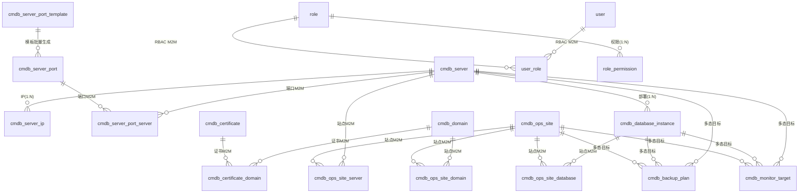

# RzOps CMDB — 项目交接文档

> **面向对象**：后续开发人员 / AI Agent
> **目标**：读完本文档即可完全理解"项目是什么、为什么这样设计、遇到过的坑、下一步怎么走"，无需重读全库。
> **配套**：[README.md](../README.md)（项目介绍与启动）· [AGENTS.md](../AGENTS.md)（AI 速查）· 英文版 [HANDOVER.en.md](HANDOVER.en.md)

---

## 1. 项目概览

| 项 | 值 |
|---|---|
| 定位 | 面向中小运维团队的资产管理（CMDB）平台 |
| 后端 | Rust 2021 edition · axum 0.8 · sqlx 0.8（runtime-tokio/tls-rustls）· tokio 1 · tower-http |
| 前端 | Svelte 5.56（runes）· SvelteKit 2.63 · Vite 8 · TypeScript 6（strict）· Tailwind v4 · bits-ui |
| 数据库 | PostgreSQL 16（开发环境 Docker 容器 `rzops-postgres`，库 `rzopsdb`） |
| 认证 | JWT（HS256），登录返回 `access_token` |
| 菜单 | 19 个业务菜单 + Dashboard（详见 §5） |
| 提交 | git 主分支 106 个提交（2026-06-22 至 2026-09-09） |

**一句话架构**：后端 7-crate workspace 严格分层（SQL 只在 infra），前端 SvelteKit 静态 SPA（API 代理），数据全量字典驱动 + 软删除 + RBAC，列表页统一交互规范。

---

## 2. 快速上手

### 2.1 环境要求

- Docker（含 Compose）——推荐一键启动（**开发与测试统一走 compose**）；或本机 Rust（stable）+ Node 22+ + PostgreSQL 16。
- 运行环境为 Docker Compose 三服务：`rzops-db-1`(5432) / `rzops-api-1`(8000) / `rzops-web-1`(8080)。历史 systemd 方式（`rzops-api.service`/`rzops-web.service`）与开发库容器 `rzops-postgres` 已停用（`systemctl disable`），仅作背景记录。

### 2.2 一键启动（Docker Compose）

```bash
cp .env.example .env        # 可选：改端口/密码/管理员账号
docker compose up -d --build
# Web http://localhost:8080 · API http://localhost:8000 · Postgres :5432
# 默认账号 admin@rzops.local / admin123（seeder 自动创建，幂等）
```

初始化原理：`database/schema.sql`（标准 SQL 建表）+ `database/seed-data.sql`（仅基础数据：字典/角色/角色权限，INSERT 语法）以**指定文件**挂载到 postgres 的 `/docker-entrypoint-initdb.d`，容器首次启动自动建库；API 启动仅执行 seeder（创建 admin 账号、补齐字典），**不使用 sqlx 迁移机制**。业务数据（服务器/域名/站点等）首启为空，由用户录入。

> 可选测试数据：`database/test-data.sql`（模拟真实环境：测试用户 gust/eval、21 张业务表样例、审计/变更记录）**不参与自动初始化**，需手动执行且可重复（自带 TRUNCATE 清空业务表）：`docker exec -i rzops-db-1 psql -U rzops -d rzopsdb < database/test-data.sql`。注意：compose 挂载已改为**指定文件**（`01-schema.sql`/`02-seed-data.sql`），若改回目录挂载会导致 test-data.sql 被首启自动执行。

### 2.3 手动启动（开发）

```bash
# 数据库
docker run -d --name rzops-postgres -e POSTGRES_USER=rzops -e POSTGRES_PASSWORD=rzops \
  -e POSTGRES_DB=rzopsdb -p 5432:5432 postgres:16-alpine
docker exec -i rzops-postgres psql -U rzops -d rzopsdb < database/schema.sql
docker exec -i rzops-postgres psql -U rzops -d rzopsdb < database/seed-data.sql

# 后端（环境变量见 rzops-api/.env.example）
cd rzops-api && cargo run --release -p rzops-app   # 监听 :8000

# 前端（开发）
cd rzops-web && npm install && npm run dev         # :5173，/api 代理到 8000
```

### 2.4 数据库与常用操作

```bash
docker exec -it rzops-db-1 psql -U rzops -d rzopsdb      # psql（compose 主库）
cd rzops-api && cargo clippy --workspace -- -D warnings  # lint
cd rzops-web && npm run check                            # svelte-check
```

> compose 模式改前端后：`docker compose up -d --build web` 即可生效（生产/静态部署见 §6.6 与 README；开发期不依赖 vite watcher 热更新）。

---

## 3. 系统架构

### 3.1 后端分层（7-crate workspace）

```
rzops-api/
├── app/      → main.rs（仅装配：读配置 → 建 AppState → 启动）
├── server/   → 路由注册、AppState、中间件、migrations/、seeder
├── api/      → HTTP handlers + DTO（把领域错误转 HTTP 响应）
├── domain/   → 模型 + 服务 trait（纯业务，禁止 sqlx/axum/HTTP 类型）
├── infra/    → sqlx 仓储实现（全项目唯一允许写 SQL 的层）
├── config/   → 环境变量加载（RZOPS_ 前缀，双下划线嵌套）
└── common/   → 共享错误（AppError, thiserror）与基础类型

依赖方向（严格单向）：
app → server → api → domain
      server → infra → domain
      server → config；全部 → common
```

关键机制：
- **State 注入**：`AppState { Arc<dyn Trait>... }`，handler 通过 `State(state)` 获取服务。
- **表结构**：以 `database/schema.sql`（标准 SQL）为唯一权威；启动**不执行迁移**（迁移模式已废弃，`server/migrations/` 仅留作历史记录）。
- **Seeder**：`server/src/seeder.rs` 启动时按环境变量创建超级管理员（幂等），并写入基础字典（若空）。
- **错误处理**：`common` 定义 `AppError`（NotFound/Unauthorized/Validation/Internal...）→ `api` 层实现 `IntoResponse` 统一 JSON 结构 `{ "error": ... }`；未知错误返回 500 且前端 toast 提示"未知错误"。

### 3.2 前端结构（SvelteKit 静态 SPA）

```
rzops-web/
├── src/routes/            # 68 个页面（列表/新建/详情/编辑/回收站等）
├── src/lib/api/           # client.ts 统一请求封装 + 24 个资源模块
├── src/lib/types/         # 22 个类型模块（镜像后端 DTO）
├── src/lib/components/    # 共享组件
│   ├── shared/            #   DataTable（固定表头/序号/分页/列显隐）、Pagination、
│   │                      #   SearchInput、EmptyState、StatusBadge、PageHeader…
│   ├── forms/             #   各资源表单（ServerForm/OpsSiteForm…）+ 内联卡片
│   └── ui/                #   bits-ui 封装（Modal/Select/Checkbox/Toast…）
└── vite.config.ts         # adapter-static、/api 代理、cacheDir、allowedHosts
```

关键机制：
- **静态 SPA**：`adapter-static` + `ssr=false` + `prerender=false`，`npm run build` 产出纯静态 `build/`，nginx SPA fallback。
- **统一请求** `client.ts`：JWT 注入、401 仅非 `/login` 跳转（防死循环）、`sanitizeEmptyRefs` 提交前剔除空 `_id/_date/_time` 字段（后端 Option 字段拒绝空串）。
- **字典加载**：登录后全局拉取字典缓存，`translateDict` 展示中文，徽章颜色读 `extra_data.color`。
- **错误反馈**：全局 toast（ApiError 信息），登录页不预载需认证接口。

### 3.3 认证与数据流

```
浏览器 → (JWT Bearer) → api handlers → State.services → infra 仓储 → Postgres
             ↑ 401（非/login）→ 前端跳登录页
```

- 登录：`POST /api/v1/auth/login` 返回 `{ access_token }`（RZOPS_JWT__SECRET 签名，默认 86400s）。
- 权限：handler 内校验 `is_superuser` 或 `role_permission`（§7）。

---

## 4. 数据库设计

### 4.1 表总览（25 张，不含迁移记录表）

| 分组 | 表 | 说明 |
|---|---|---|
| 核心资源 | `cmdb_server` / `cmdb_data_center` / `cmdb_provider` | 服务器（含 environment/硬件/租赁）、数据中心、供应商 |
| 网络 | `cmdb_domain` / `cmdb_certificate` / `cmdb_certificate_domain` | 域名、证书、证书-域名绑定（M2M） |
| | `cmdb_server_ip` / `cmdb_server_port` / `cmdb_server_port_server` / `cmdb_server_port_template` | IP、端口、端口-服务器（M2M）、端口模板 |
| 应用 | `cmdb_ops_site` / `cmdb_ops_site_server` / `cmdb_ops_site_database` / `cmdb_ops_site_domain` / `cmdb_database_instance` | 站点 + 三类关联（M2M）、数据库实例 |
| 运维 | `cmdb_backup_plan` / `cmdb_monitor_target` | 备份计划、监控目标（关联目标为多态） |
| 管理 | `cmdb_dict` / `cmdb_attachment` | 字典、附件 |
| 权限 | `user` / `role` / `user_role` / `role_permission` | RBAC 四表 |
| 审计 | `cmdb_audit_log` / `cmdb_change_record` | 审计日志、变更记录 |
| 遗留 | `cmdb_contract` / `cmdb_credential` | 合同（待评估去留）、凭证（功能已下线，表残留待清理） |

### 4.2 关系模型（核心）



设计要点：
- **大表间关系一律中间表**（M2M），不互加外键列——站点↔服务器/数据库/域名、端口↔服务器、证书↔域名均如此。
- **多态关联**（备份计划/监控目标）：`target_type` + `target_id`，后端按类型解析名称并返回 `target_name`；前端展示"名称(状态)"。
- **软删除**：业务表带 `is_deleted` / `deleted_at` / `deleted_by`；删除=UPDATE，列表默认过滤；回收站单独查快照。
- **时间字段**：`created_at` / `updated_at` 由数据库默认值维护；`deleted_at` 软删时间。

### 4.3 表结构演进规范（标准 SQL，无迁移机制）

- **唯一权威**：`database/schema.sql`（标准 `CREATE TABLE` / `ALTER TABLE`，PostgreSQL 方言）。**不使用 sqlx 迁移模式**（`sqlx::migrate!` 已从启动流程移除，`server/migrations/` 目录仅保留作历史记录，不参与运行）。
- **结构变更**：直接修改 `database/schema.sql`（开发环境）→ 在已部署库上手动执行对应的 `ALTER TABLE` 增量 SQL（生产环境）。**每次结构变更同步更新 schema.sql**，保持文件即权威。
- **数据初始化**：`database/seed-data.sql` 仅含基础数据（字典/角色/角色权限，INSERT 语法），账号由 seeder 创建；业务数据首启为空。
- 历史迁移文件命名：`NNN_简短描述.sql`（如 `009_rbac.sql`、`010_system_soft_delete.sql`），仅作演进审计。

### 4.4 数据库兼容性说明（决策记录）

- **现状**：项目从首个提交起就**只支持 PostgreSQL**——`sqlx` 仅启用 `postgres` feature；10 个迁移全为 PG 方言（`jsonb` / `timestamptz` / plpgsql 触发器 / `ON CONFLICT`）；infra 层 SQL 使用 PG `$1` 占位符体系。**SQLite / MySQL 从未实现过**（早期"支持多库"仅停留在口头设想）。
- **决策（2026-09）**：保持 Postgres 为主数据库（CMDB 多用户、并发、JSON 查询场景下最合适）；`database/` 快照明确为 PG 方言。
- **演进通道（已就绪）**：`domain` 层服务 trait 隔离 + `infra` 是唯一 SQL 层。未来支持 MySQL 的路径：仅需在 `infra` 新增 MySQL 方言仓储实现 + `database/` 提供 `schema.mysql.sql` 方言文件，`domain`/`api`/`server` 上层零改动。
- **代价提示**（若未来立项）：迁移双写 + 全部仓储 SQL 双写（占位符体系不同）+ 类型降级（jsonb 函数、触发器、timestamptz 语义）+ 双库测试矩阵，估算数周级；SQLite 因全局写锁/弱类型不推荐用于多用户 CMDB。

---

## 5. 功能全景（按菜单）

> 每个菜单列出：核心能力 / 设计要点 / 特殊交互。列表页通用能力（§5.0）所有菜单共享。

### 5.0 列表页通用规范（所有菜单一致）

- **表格**：固定表头 + 固定序号列；分页（大小可选：10/20/50/100）；列显示/隐藏（列设置弹层，默认显示核心列）。
- **筛选**：顶部搜索框 + 每菜单差异化高级筛选（字典类条件用字典，关联类用远程搜索下拉/最近 6 条）；仅服务器保留"高级搜索"折叠区。
- **排序**：默认 `created_at` 倒序；非活跃/停用/退役/归档记录**置底**并按状态着色（字体颜色，色值来自字典 `extra_data.color`）。
- **行状态**：下线/退役/停用/过期行显示状态色（不再整行灰底——固定序号列导致行背景不同步，历史教训）。
- **操作**：编辑直达编辑页；点击名称/首列进详情；删除弹 Modal 确认（软删除）；删除后本地移除，不整表刷新。
- **详情页**：信息分区展示，关联对象显示**名称（含状态后缀）**，点击可跳转对应资源详情。
- **表单页**：右上角操作栏（保存/取消）+ 底部保存统一；前端校验 + 后端校验双保险。

### 5.1 Dashboard

- 资源统计卡片（服务器/域名/证书/供应商/数据中心/数据库实例等数量）。
- **到期提醒**：服务器、域名、证书的到期/续费提醒，按类型分组卡片展示，已退役/停用资源自动过滤；手机端卡片自适应缩小。

### 5.2 服务器（核心菜单）

- **基本信息**：名称、类型（字典）、环境（生产/测试/预发布，字典）、状态（运行中/已退役等）、所属数据中心/供应商、硬件配置（CPU/内存/磁盘/RAID——**勾选 RAID 才可选级别**，数据服务器勾选后出现**数据库实例内联卡片**）、租赁信息（价格，币种字典）。
- **内联子表卡片**（新建/编辑时同步录入）：IP 地址（只新建，EIP 在云平台维护）、服务端口（支持**从端口模板批量添加、多选服务器**）、数据库实例（勾选"数据库服务器"后显示，位置在服务端口卡片后）、所属站点（只读展示关联）。
- **高级筛选**：名称/关键词搜索 + IP 搜索 + 类型 + 环境 + 是否数据库服务器 + 数据中心。
- **详情**：全量信息 + 关联 IP/端口/数据库实例/站点展示，退役显示"名称(已退役)"。

### 5.3 数据中心 / 供应商

- 数据中心：名称、国家、地址、线路类型（**字典多选**）；仅保留国家（省/市字段已移除，地址已冗余表达）。
- 供应商：名称、类型（**字典，含"域名"分类**）、国家、地址、联系人。
- 筛选：关键词 + 国家（字典）。

### 5.4 域名

- 注册商（字典）、注册日期 / 到期日期（**校验注册 ≤ 到期**）、DNS 记录、状态（启用/停用，字典色）。
- 详情：绑定证书列表（点击跳转）。
- 筛选：关键词 + 注册商 + 状态。

### 5.5 证书

- 证书信息（签发机构、序列号、公私钥算法等）、**绑定域名**（弹层选择**已录入**的域名，多行绑定；每行自动带出域名/模式）。
- 状态：运行中 / 已归档 / 已过期（**颜色由字典 extra_data.color 驱动**，新增状态无需改代码）。
- 筛选：关键词 + 状态；到期提醒参与 Dashboard。

### 5.6 服务器IP

- IP 地址（支持网卡名:IP 形式）、网卡名称、ISP 供应商（字典）、服务器（**单选、非必填**——EIP 可解绑；弹出表格选择器）。
- 状态联动：服务器退役 → 详情/列表显示"服务器名(已退役)"；删除服务器的 IP 置底。
- 筛选：关键词 + IP 类型（字典）+ 服务器（远程搜索下拉，显示最近 6 条）。

### 5.7 服务器端口（架构经历两次重构，见 §6.9）

- **每服务器独立端口**：一条记录 = 一台服务器的一个端口（协议/端口号/服务名/访问范围/服务器，服务器单选——弹出层）。
- 批量录入：**端口模板**（`cmdb_server_port_template`，如 ssh/22、http/80）→ 服务器表单"从模板添加"可多选模板批量生成端口。
- 列表：服务器列多个时截断显示 `名称, xxx, xxx… +N`（省略号收尾）；详情页服务器分页展示（TableSelectModal 规范）。
- 筛选：关键词 + 协议（字典）。（服务器筛选已移除——数据量大时下拉过长，历史决策）

### 5.8 数据库实例

- 类型（MySQL/PostgreSQL/Redis…，字典）、版本、**服务器**（单选，弹出表格选择器）、用途（字典）、端口。
- 站点关联、备份计划/监控目标（多态目标）。
- 筛选：关键词 + 类型 + 服务器（**远程搜索下拉**，最近 6 条——曾用全量下拉，数据量大会很长，已改）。

### 5.9 站点（关联资源是核心）

- 基本信息：名称（必填）、URL（必填）、代码仓库类型（字典）、状态（运行中/临时下线/永久下线——下线状态支持**操作时间**录入）、环境。
- **关联资源**（新建/编辑时内联管理，**只支持新增/删除关联，不支持修改关联**——业务决策）：服务器、数据库实例、域名三类，各一个标签卡片（弹层选择，M2M 中间表）。
- 备份计划 / 监控目标：勾选后出现**新增标签卡片**（与服务器 IP/端口卡片模式一致，非下拉选择）。
- 列表：临时下线在永久下线之前置底，不同状态色。

### 5.10 备份计划 / 监控目标

- 通用字段：名称、频率/策略、状态（启用/停用/归档）。
- **关联信息**（单独标签卡片，统一模式）：目标类型（服务器/数据库实例/站点…）→ 目标对象（弹层选择）；支持多行关联；显示目标名称(状态)。
- 备份计划仅备份**数据库实例、站点**类目标（服务器不作为备份对象——业务决策）。
- 监控目标可关联站点；供应商/数据中心**不参与**监控（业务决策）。

### 5.11 用户 / 角色（RBAC，见 §7）

- 用户：邮箱（登录名）、密码、姓名、启用状态、**多角色**、超级管理员标记。
- 角色：名称、描述；权限 = 业务资源权限（按菜单：查看/新建/编辑/删除，递进式）+ 系统管理权限（字典/附件/用户/角色/回收站等管理类菜单）。

### 5.12 字典管理

- 类型（业务资源类型，如服务器状态、环境、协议…）+ 条目（code/label/排序/状态）。
- **extra_data（JSON）**：状态颜色等扩展属性，前端徽章读取 `extra_data.color`。
- 列表分页 + 搜索；全局缓存（TTL 内存，§8）；新增字典类型/条目即时生效。

### 5.13 回收站（软删除体系）

- 展示所有软删除记录（资源类型 + 快照 JSON + 删除时间/操作人 + 删除类型：临时/永久）。
- 操作：**恢复**（还原数据）、**永久删除**（物理删除，审计日志记 `delete_type=permanent`）。
- 快照展开查看删除前内容；回收站本身也受权限控制。

### 5.14 附件

- 真实文件上传（multipart），关联任意目标类型（服务器/域名/证书…）。
- 列表/详情显示 `目标名称`（可点击跳转目标详情）与 `上传者用户名`，非 uuid。
- 目标类型/目标ID/上传者/存储键/内容类型/文件大小等字段**由程序自动关联计算**，用户不手填。

### 5.15 审计日志 / 变更记录

- 全操作留痕：操作人、动作（create/update/delete）、资源类型/ID/名称快照、时间、变更明细。
- **资源列**：按资源类型解析名称并展示（解析失败回退显示 ID，避免一直 loading）。
- **变更记录**：按变更类型、资源类型、创建时间范围筛选（默认仅展示最常使用的筛选维度）。
- 删除动作区分 `delete_type`（soft/permanent），回收站永久删除同样留痕。

---

## 6. 核心设计决策与踩坑记录（ADR 式）

> 按时间线整理。每条：**背景 → 决策 → 坑/教训**。这是交接文档最有价值的部分。

### 6.1 枚举 → 字典化（大决策）

- **背景**：早期 28 个硬编码枚举散落前端（状态、类型、角色…），新增取值需改代码。
- **决策**：全部收敛到 `cmdb_dict` 表，前端下拉/徽章/筛选统一走字典接口；**禁止新增硬编码枚举**。
- **坑**：字典加载遗漏会导致前端显示 code 而非中文（曾缺 `environment`/`domain_role` 两个类型）——新增字典类型后要在加载清单里登记。

### 6.2 软删除体系（大决策）

- **背景**：CMDB 数据"基本不删除"，早期设计有 `is_delete` 后被移除；后期发现误删无法恢复。
- **决策**：重新引入软删除（`is_deleted`/`deleted_at`/`deleted_by`），删除=UPDATE；新增**回收站**（查看快照/恢复/永久删除）；审计/变更日志记录 `delete_type`。
- **坑**：部分查询曾漏过滤 `is_deleted` 导致已删数据出现在列表/统计——所有列表查询必须带过滤。

### 6.3 关联关系用中间表（大决策）

- **背景**：站点↔服务器/数据库/域名、端口↔服务器、证书↔域名等大表间关系。
- **决策**：一律 M2M 中间表（`cmdb_xxx_yyy`），不互加外键列；多态目标（备份/监控）用 `target_type+target_id`。
- **坑**：中间表曾有 `is_primary` 主用标记，语义混乱（主从节点 vs 生产/测试）——**已移除**，改为各实体 `environment` 字段（字典）。

### 6.4 服务器端口架构两次重构（重要）

- **v1（共享端口）**：一条端口记录绑定多个服务器（M2M）→ **坑**：在某服务器上编辑该端口会**影响所有绑定服务器**；且服务器越多，绑定关系数据膨胀。
- **v2（每服务器独立端口）**：一条记录=一台服务器一个端口；新增**端口模板**批量添加，解决录入效率。
- **决策依据**：调研同类产品（实际场景端口极少共享语义），"共享端口"仅在极少数场景有意义；模板化弥补录入成本。**当前为 v2，勿回退。**

### 6.5 登录页无限刷新死循环（高影响）

- **现象**：`/login` 无限刷新，无法输入。
- **根因**：登录页预加载了需认证的字典接口 → 401 → 跳转逻辑重入 `/login` → reload 循环。
- **修复**：登录页不预载需认证接口；`client.ts` 401 跳转加 `/login` 防重入。
- **教训**：401 全局跳转必须排除登录页，且登录页不得发起需认证请求。

### 6.6 公网反代三连坑（部署）

1. **Blocked request. This host is not allowed** → Vite dev 的 `allowedHosts` 白名单（本地 dev 正常，公网域名被拒）→ 配置 `allowedHosts` 或直接用静态构建。
2. **公网访问无限刷新** → Vite HMR WebSocket 经反代/frp 后失效 → 生产**必须用静态构建**（`npm run build`，无 HMR）。
3. **保存 403** → 云端 WAF（ModSecurity + OWASP CRS）默认只放行 GET/HEAD/POST/OPTIONS，**拦截 PUT**（规则 911100）；含 `ssh` 等词的业务字段被误判 RCE（规则 932250）——**非应用缺陷**，属 WAF 配置问题；结论：程序本身无需为此改接口，若要公网直连需放行 PUT 或调整 CRS 规则。

### 6.7 后端 Option 字段拒绝空串

- **现象**：提交表单报错（字段为空字符串，后端 `Option<Uuid>`/`Option<DateTime>` 解析失败）。
- **决策**：前端 `client.ts` 统一 `sanitizeEmptyRefs`，提交前剔除 `_id/_date/_time` 结尾的空字段；新表单必须沿用该封装。

### 6.8 Vite 开发期性能

- **现状**：改前端后 `docker compose up -d --build web` 生效；开发期直接 `npm run dev` 即可。`vite.config.ts` 保留 `warmup` 预热常用路由以降低首屏延迟。

### 6.9 编辑页"先显示 ID 再显示名称"（体验）

- **现象**：进入编辑页，服务器/供应商等关联字段先闪 ID 再变名称。
- **根因**：异步回填竞态（详情接口先返回原始 ID，名称异步解析后覆盖）。
- **修复**：加载完成前显示占位（`-`），一次解析后渲染名称；禁止先渲染 ID。同类：服务器 IP 编辑页曾显示服务器 ID——统一改为名称。

### 6.10 目标对象选中显示 ID（体验）

- **现象**：备份计划/监控目标选目标对象后回填显示 uuid。
- **修复**：后端返回 `target_name`，前端展示名称；关联信息统一"目标类型 → 目标对象(弹层)"模式。
- **衍生坑**：目标类型切换时目标对象下拉下移数像素（样式位移）——布局加最小高度/固定容器。

### 6.11 TableSelectModal 演进（大数据量选择器）

- **需求**：服务器等选择器在全量下拉时数据过多不可用。
- **历程**：全量下拉 → 弹出表格选择器（远程搜索+分页）→ 美化版 → **还原**（美化版双 X 且更差）→ 规范版（表头固定 + 样式统一 + 单选禁全选勾选框）。
- **结论**：弹出表格选择器为唯一规范（列表页同款组件复用），勿再引入全量下拉。

### 6.12 列表统一体验改造（多轮迭代汇总）

- 固定表头（长表滚动可见表头）→ 分页大小可选 → 列显示/隐藏（默认核心列）→ 序号列固定（横向滚动可见）→ 单元格截断 + tooltip（列隐藏时部分内容遮挡）→ 行状态色（曾用整行灰底，因固定序号列不同步而放弃）→ 删除确认 Modal + 删除后本地移除（避免整表刷新）→ 筛选条件按菜单定制（服务器下拉筛选因数据量过大移除/改远程搜索）→ 非活跃记录置底。
- **字典状态色**：颜色存字典 `extra_data.color`，**新增状态无需改代码**（曾讨论每次加状态改代码不可接受）。

### 6.13 站点关联资源"只增删不改"

- **决策**：站点编辑时，关联资源**只支持新增和删除**，不支持修改单条关联（业务上关联无独立属性可改）。
- 详情页不提供关联编辑入口（右上角"编辑"按钮才进入编辑态）。

### 6.14 删除语义：状态展现而非级联删除（大决策）

- **背景**：服务器退役后，其 IP/端口/站点/数据库实例如何处理？级联删除风险大（端口多绑、数据不可逆）。
- **决策**：**全部用状态展现**——服务器退役置底标灰，关联对象显示"名称(已退役)"，不级联删除；IP/端口同理（端口仅剔除与退役服务器的绑定，端口本身不下线）。删除仍走软删除+回收站。

### 6.15 表单校验与 SQL 注入防护

- 前端为全部表单加校验（必填、格式、**时间范围**如域名注册≤到期）；核心防注入在后端（参数化查询，infra 层 `sqlx::query` 绑定参数）。
- **教训**：动态拼 SQL 存在注入面（曾审计发现 `format!` 拼查询，已修复为参数化）——新增查询禁止字符串拼接用户输入。

### 6.16 静态化部署（adapter-static）

- 前端为 SvelteKit **静态 SPA**（`ssr=false`、`prerender=false`），`npm run build` 产出 `build/`；nginx 配置 SPA fallback + `/api` 反代（`rzops-web/nginx.conf`）。
- 已验证：`build/` + nginx 容器可完整运行（登录、列表、详情）。

### 6.17 查询性能优化（N+1 / 字典缓存）

- 列表接口曾逐个解析关联名称（N+1 查询）→ 改为批量 join/预取，消除 N+1。
- 字典接口加 **TTL 内存缓存**（变更字典时失效），避免每页请求打库；缓存体积极小（百条级），内存占用可忽略。

### 6.18 附件字段自动化

- 附件不允许编辑（只读）；目标ID/上传者ID 显示为关联对象名称（可点击跳转）；目标类型/目标ID/存储键/内容类型/文件大小**程序自动计算**，杜绝用户手填脏数据。

### 6.19 开发脚本约定

- 临时开发脚本统一放 `seed/` 目录、`_` 前缀命名（如 `seed/_xxx.sh` / `seed/_xxx.py`），**用完即删、不提交**；Git 检出后在非 Linux 工具链可能出现 CRLF，脚本类文件用 `sed -i 's/\r$//'` 去除后再执行。

---

## 7. 权限体系（RBAC）

### 7.1 模型

```
user ──< user_role >── role ──< role_permission >── 权限点
超级管理员（user.is_superuser=true）绕过全部校验
```

- **一人多角色**：`user_role` M2M（调研结论：实际场景一人多角色常见，单角色仅适用极严格场景）。
- **权限点两分**：
  - **业务资源权限**（按菜单）：查看 / 新建 / 编辑 / 删除，**递进式**——勾选"新建"自动含"查看"，勾选"编辑"必须已含"新建"（历史上曾出现"有新建无编辑"的孤立配置，已通过递进逻辑禁止）。
  - **系统管理权限**（管理类菜单）：字典、附件、用户、角色、回收站等，独立勾选。
- 附件/字典属管理类；业务菜单（服务器/站点/…）属业务类——二者独立管理。

### 7.2 权限校验

- **后端**：handler 入口校验（超级管理员直接放行；否则查 `role_permission` 对应菜单+动作）。
- **前端**：菜单按权限渲染（无权限的菜单不显示）；页面内操作按钮按权限隐藏/禁用。
- **已知**：早期版本"前端隐藏但后端未校验"导致只读角色可编辑（已修，权限必须前后端双校验）。

### 7.3 审计

- 所有写操作写审计/变更日志（含操作人、动作、资源、明细）；删除记录 `delete_type`。

---

## 8. 字典与日志体系

### 8.1 字典（cmdb_dict）

| 字段 | 说明 |
|---|---|
| dict_type | 类型编码（server_status / environment / protocol / 域名角色 / 部署角色 / 数据库用途 / 币种…） |
| code / label | 值编码 + 中文展示 |
| extra_data | JSON 扩展（`{"color": "#..."}` 驱动状态徽章颜色） |
| sort_order / is_active | 排序与停用 |

- 前端登录后拉取全量字典缓存（内存 + TTL），`translateDict(type, code)` 统一翻译；**颜色读 extra_data.color**，新增状态值只加字典不改代码。
- 特殊字典类型（environment / domain_role 等）加载清单在 `src/lib/api/dicts.ts` 或等价位置集中登记，新增类型必须同步登记。

### 8.2 审计/变更日志

- `cmdb_audit_log`：操作流水（谁、何时、对什么资源、做了什么、变更前后 JSON 快照）。
- `cmdb_change_record`：变更维度记录（资源类型、资源名称、变更类型、时间范围筛选）。
- **资源列联动**：按 `resource_type` 查对应资源名称展示，解析失败回退 ID（避免一直 loading）；可点击跳转详情。

---

## 9. 部署与运维

### 9.1 运行环境（Docker Compose，推荐）

| 服务 | 容器 | 端口 | 更新 |
|---|---|---|---|
| Postgres | `rzops-db-1` | 5432 | 数据卷 `rzops_pgdata`；初始化挂载 `database/` |
| API | `rzops-api-1` | 8000 | 改 Rust 后 `docker compose up -d --build api` |
| Web | `rzops-web-1` | 8080 | 改前端后 `docker compose up -d --build web` |

- 端口冲突：根 `.env`（不入库）覆盖 `API_PORT`/`POSTGRES_PORT`/`WEB_PORT`。
- 附件存储：uploads 卷；API 连接参数见 `docker-compose.yml` 的 `RZOPS_*`。
- **历史（已停用）**：systemd 服务 `rzops-api.service`/`rzops-web.service` 与开发库容器 `rzops-postgres` 已 `systemctl disable`/停止，仅作背景记录。

### 9.2 生产部署

1. **构建静态前端**：`cd rzops-web && npm ci && npm run build` → `build/`。
2. **托管**：任意静态服务器（nginx 参考 `rzops-web/nginx.conf`：SPA fallback + `/api` 反代 + 静态资源缓存）。
3. **后端**：`cargo build --release --workspace` → `target/release/rzops-app` + 环境变量（`RZOPS_JWT__SECRET` **必须更换**）。
   - **静态链接（推荐）**：`cargo build --release --target x86_64-unknown-linux-musl --workspace` 产出纯静态二进制（无 glibc 依赖），任意 Linux 直接运行；Dockerfile 已采用此方案（rust:1-alpine 构建 → alpine 运行）。
4. **数据库**：initdb 初始化（`database/schema.sql` 建表 + `database/seed-data.sql` 基础数据）——无迁移机制；生产空库同样先执行这两个文件（或手动执行增量 ALTER）。
5. **公网注意**：勿直接暴露 Vite dev；WAF 需放行 PUT（OWASP CRS 默认拦截，见 §6.6）。

### 9.3 Docker Compose（快速示例）

- 三服务：`db`（postgres:16-alpine，initdb 自动初始化）、`api`（多阶段构建）、`web`（node 构建 + nginx）。
- 数据卷：`pgdata`、`uploads`；端口通过 `.env` 覆盖（`POSTGRES_PORT`/`API_PORT`/`WEB_PORT`）。
- 构建提示：API 首次 `cargo build --release` 约 5~10 分钟；无编译期 sqlx 宏，构建不需要数据库。

---

## 10. 已知问题与遗留

| # | 项 | 状态/建议 |
|---|---|---|
| 1 | `cmdb_contract`（合同） | 菜单存在但业务价值存疑（合同应走 OA/纸质流程），**待决策是否下线** |
| 2 | `cmdb_credential`（凭证） | 功能已下线，表残留；**待清理**（含数据库实例"管理凭证"字段） |
| 3 | 前端 `$app/stores` | 审计建议渐进迁移到 `$app/state`（Svelte 5），当前非阻塞 |
| 4 | 权限系统测试覆盖 | 需系统性验证（业务/管理权限矩阵、多角色叠加、超级管理员） |
| 5 | 附件字段"自动关联" | 目标名称/上传者已显示；若字段级自动化（目标类型联动）未全覆盖，需按 §5.14 收尾 |
| 6 | 列表排序/状态色 | 各菜单已统一；新增菜单须遵守 §5.0 规范 |
| 7 | `seed/` 目录 | 历史累计脚本（80 SQL + 112 sh），`_` 前缀临时脚本用完即删不提交；权威初始化看 `database/` |

---

## 11. 未来规划（用户提出/讨论过，未实施）

1. **权限细分角色**：运维工程师细分 DBA 运维 / 服务器运维等预设角色。
2. **备份物理管理**：软删除已覆盖逻辑恢复；物理删除/备份策略管理（导出/恢复）待评估。
3. **合同功能去留**：见 §10-1，评估后决定移除或补审批流程。
4. **到期提醒增强**：Dashboard 已有展示；后续可加邮件/IM 通知。
5. **用户中心**：头像、个人信息、改密（当前无用户自助页面）。
6. **查询性能深化**：深度分页/游标、索引评审、监控大表归档。
7. **移动端体验**：已做响应式基础适配；复杂表单（服务器新建）在窄屏的进一步优化。
8. **多实例部署**：如多租户/多环境隔离（未评估）。
9. **多数据库支持**：当前 Postgres 深度绑定（见 §4.4）；架构通道已就绪，若需 MySQL 支持按 §4.4 路径立项。

---

## 附：文档与代码地图

| 关注点 | 位置 |
|---|---|
| 路由/State/中间件/迁移/seeder | `rzops-api/server/src/`、`server/migrations/` |
| HTTP 接口与 DTO | `rzops-api/api/src/` |
| 领域模型/服务 trait | `rzops-api/domain/src/` |
| SQL 实现（唯一） | `rzops-api/infra/src/db/` |
| 配置加载 | `rzops-api/config/src/settings.rs` |
| 前端页面 | `rzops-web/src/routes/`（68 页） |
| 前端 API 客户端 | `rzops-web/src/lib/api/`（24 模块） |
| 前端类型镜像 | `rzops-web/src/lib/types/`（22 模块） |
| 共享组件 | `rzops-web/src/lib/components/` |
| 数据库快照 | `database/schema.sql`、`database/seed-data.sql` |
| Rust 审计报告 | `rzops-api/docs/AUDIT_REPORT.md` |
| 前端审计报告 | `rzops-web/docs/FRONTEND_AUDIT_REPORT.md` |

---

## 附：近期变更记录

### 2026-09-11 构建告警清零与操作列修复
- **构建三线清零**：`cargo clippy --workspace --all-targets` 0 警告（infra 闭包→函数指针、未读索引移除、死代码删除；api 层 unwrap_or_default / from_ref / clamp；auth_extractor `result_large_err` 与 change_log `too_many_arguments` 属 clippy 官方豁免场景）；前端 `npm run build` 0 警告（a11y label 关联 23 处、Svelte 5 值捕获 24 处、`$derived` 闭合 3 处）；容器 api/web 两 Dockerfile 构建 0 警告。
- **列表操作列最终形态**（多次迭代后的定稿）：DataTable 默认操作列 `w-[120px]`，按钮组与表头"操作"统一**水平居中**（`justify-center` + `text-center`），删除按钮距表格右缘 18-19px；用户管理页 3 操作按钮（重置密码+编辑+删除）操作列 `w-[200px]`。修复高分辨率下"删除"按钮被裁成"删"以及贴右缘的问题。
- **踩坑：问题定位方向**——"操作列贴右"先被误判为浏览器/内容区边距问题（试过 `max-w-[1600px]` 固定值、`xl:px-[5vw]` 视口比例留白两个方案），实际根因是操作列内部按钮与 td 右缘间距不足（td 仅 8px padding）。教训：布局类视觉问题先用浏览器实测（`getBoundingClientRect` 量 td/按钮右缘差）精确定位，再改对应层，避免改错层级。
- **窄屏自动隐藏列语义修正**：`hideBelow` 原先在渲染过滤里硬性隐藏（勾选也不显示），改为仅影响**默认勾选值**——窄屏时该列默认不勾选，用户显式勾选后始终显示（选择优先于自动隐藏）；"恢复默认"按当前视口宽度计算默认值。
- **踩坑：多行提交信息丢失（重要）**——通过 `wsl -e sh -lc '...git commit -m "多行..."'` 提交时，多行正文被 PowerShell→WSL 传参截断，最终提交信息只剩 `fix:` 一个词。**规范：带多行正文的提交一律用 `git commit -F <文件>`**（先 Write 写文件 → `sed -i 's/\r$//'` 去 CRLF → `git commit -F`）。
- **行尾治理经验**：仓库历史为混合行尾（Windows 开发多数 CRLF）；WSL 内 python 写文件默认 LF 会触发整文件 diff。改动后应按基线（上一正式提交）**逐文件**对齐行尾（LF 保持 LF、CRLF 保持 CRLF），不可整批统一。
- **三个 `.env.example` 模板分工（知识沉淀）**：根目录模板 = docker compose 主配置（`cp .env.example .env`，compose 自动读取）；`rzops-api/.env.example` = 后端单独运行（`cargo run`）模板，后端 `main.rs` 用 `dotenvy::dotenv()` 自动加载运行目录 `.env`；`rzops-web/.env.example` = 前端 vite dev 用（仅 `RZOPS_PUBLIC_HOST`，本地直连无需配置）。**曾踩坑**：rzops-api 模板长期停留在旧值（库名 `rzops`/密码 `changeme` 与根模板 `rzopsdb`/`rzops` 不一致），单独运行后端会连错库——已统一为与根模板一致。
- **项目许可改为 Apache-2.0**（2026-09-12）：`LICENSE` 为 Apache-2.0 官方全文（不可改动）；署名按 Apache 规范放 `NOTICE` 文件（`Copyright 2026 0x5c0f`），**不写进 LICENSE 正文**；`rzops-api/Cargo.toml` workspace.package 与 7 个子 crate（`license.workspace = true`）均标 Apache-2.0；`rzops-web/package.json` 加 `"license": "Apache-2.0"`；README（中/英）License 章节更新为 Apache-2.0 + 版权行。

---

*交接文档由 RzOps 开发全过程沉淀整理（2026-09-09，持续更新）。配合 [AGENTS.md](../AGENTS.md) 使用，AI 与人类开发者均可快速接手。*
