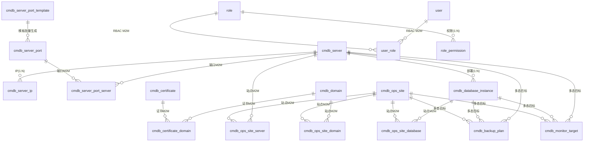

# RzOps CMDB — 项目交接文档

> **面向对象**：后续开发人员 / AI Agent
> **目标**：读完本文档即可完全理解"项目是什么、为什么这样设计、遇到过的坑、下一步怎么走"，无需重读全库。
> **配套**：[README.md](../README.md)（项目介绍与启动）· [AGENTS.md](../AGENTS.md)（AI 速查）· 英文版 [HANDOVER.en.md](HANDOVER.en.md)

---

## 1. 项目概览

| 项 | 值 |
|---|---|
| 定位 | 面向中小运维团队的资产管理（CMDB）平台 |
| 后端 | Rust 2021 edition · axum 0.8 · sqlx 0.8（runtime-tokio/tls-rustls）· tokio 1 · tower-http |
| 前端 | Svelte 5.56（runes）· SvelteKit 2.63 · Vite 8 · TypeScript 6（strict）· Tailwind v4 · bits-ui |
| 数据库 | PostgreSQL 16（开发环境 Docker 容器 `rzops-postgres`，库 `rzopsdb`） |
| 认证 | JWT（HS256），登录返回 `access_token` |
| 菜单 | 19 个业务菜单 + Dashboard（详见 §5） |
| 提交 | git 主分支 106 个提交（2026-06-22 至 2026-09-09） |

**一句话架构**：后端 7-crate workspace 严格分层（SQL 只在 infra），前端 SvelteKit 静态 SPA（API 代理），数据全量字典驱动 + 软删除 + RBAC，列表页统一交互规范。

---

## 2. 快速上手

### 2.1 环境要求

- Docker（含 Compose）——推荐一键启动（**开发与测试统一走 compose**）；或本机 Rust（stable）+ Node 22+ + PostgreSQL 16。
- 运行环境为 Docker Compose 三服务：`rzops-db-1`(5432) / `rzops-api-1`(8000) / `rzops-web-1`(8080)。历史 systemd 方式（`rzops-api.service`/`rzops-web.service`）与开发库容器 `rzops-postgres` 已停用（`systemctl disable`），仅作背景记录。

### 2.2 一键启动（Docker Compose）

```bash
cp .env.example .env        # 可选：改端口/密码/管理员账号
docker compose up -d --build
# Web http://localhost:8080 · API http://localhost:8000 · Postgres :5432
# 默认账号 admin@rzops.local / admin123（seeder 自动创建，幂等）
```

初始化原理：`database/schema.sql`（标准 SQL 建表）+ `database/seed-data.sql`（仅基础数据：字典/角色/角色权限，INSERT 语法）以**指定文件**挂载到 postgres 的 `/docker-entrypoint-initdb.d`，容器首次启动自动建库；API 启动仅执行 seeder（创建 admin 账号、补齐字典），**不使用 sqlx 迁移机制**。业务数据（服务器/域名/站点等）首启为空，由用户录入。

> 可选测试数据：`database/test-data.sql`（模拟真实环境：测试用户 gust/eval、21 张业务表样例、审计/变更记录）**不参与自动初始化**，需手动执行且可重复（自带 TRUNCATE 清空业务表）：`docker exec -i rzops-db-1 psql -U rzops -d rzopsdb < database/test-data.sql`。注意：compose 挂载已改为**指定文件**（`01-schema.sql`/`02-seed-data.sql`），若改回目录挂载会导致 test-data.sql 被首启自动执行。

### 2.3 手动启动（开发）

```bash
# 数据库
docker run -d --name rzops-postgres -e POSTGRES_USER=rzops -e POSTGRES_PASSWORD=rzops \
  -e POSTGRES_DB=rzopsdb -p 5432:5432 postgres:16-alpine
docker exec -i rzops-postgres psql -U rzops -d rzopsdb < database/schema.sql
docker exec -i rzops-postgres psql -U rzops -d rzopsdb < database/seed-data.sql

# 后端（环境变量见 rzops-api/.env.example）
cd rzops-api && cargo run --release -p rzops-app   # 监听 :8000

# 前端（开发）
cd rzops-web && npm install && npm run dev         # :5173，/api 代理到 8000
```

### 2.4 数据库与常用操作

```bash
docker exec -it rzops-db-1 psql -U rzops -d rzopsdb      # psql（compose 主库）
cd rzops-api && cargo clippy --workspace -- -D warnings  # lint
cd rzops-web && npm run check                            # svelte-check
```

> compose 模式改前端后：`docker compose up -d --build web` 即可生效（生产/静态部署见 §6.6 与 README；开发期不依赖 vite watcher 热更新）。

---

## 3. 系统架构

### 3.1 后端分层（7-crate workspace）

```
rzops-api/
├── app/      → main.rs（仅装配：读配置 → 建 AppState → 启动）
├── server/   → 路由注册、AppState、中间件、migrations/、seeder
├── api/      → HTTP handlers + DTO（把领域错误转 HTTP 响应）
├── domain/   → 模型 + 服务 trait（纯业务，禁止 sqlx/axum/HTTP 类型）
├── infra/    → sqlx 仓储实现（全项目唯一允许写 SQL 的层）
├── config/   → 环境变量加载（RZOPS_ 前缀，双下划线嵌套）
└── common/   → 共享错误（AppError, thiserror）与基础类型

依赖方向（严格单向）：
app → server → api → domain
      server → infra → domain
      server → config；全部 → common
```

关键机制：
- **State 注入**：`AppState { Arc<dyn Trait>... }`，handler 通过 `State(state)` 获取服务。
- **表结构**：以 `database/schema.sql`（标准 SQL）为唯一权威；启动**不执行迁移**（迁移模式已废弃，`server/migrations/` 仅留作历史记录）。
- **Seeder**：`server/src/seeder.rs` 启动时按环境变量创建超级管理员（幂等），并写入基础字典（若空）。
- **错误处理**：`common` 定义 `AppError`（NotFound/Unauthorized/Validation/Internal...）→ `api` 层实现 `IntoResponse` 统一 JSON 结构 `{ "error": ... }`；未知错误返回 500 且前端 toast 提示"未知错误"。

### 3.2 前端结构（SvelteKit 静态 SPA）

```
rzops-web/
├── src/routes/            # 68 个页面（列表/新建/详情/编辑/回收站等）
├── src/lib/api/           # client.ts 统一请求封装 + 24 个资源模块
├── src/lib/types/         # 22 个类型模块（镜像后端 DTO）
├── src/lib/components/    # 共享组件
│   ├── shared/            #   DataTable（固定表头/序号/分页/列显隐）、Pagination、
│   │                      #   SearchInput、EmptyState、StatusBadge、PageHeader…
│   ├── forms/             #   各资源表单（ServerForm/OpsSiteForm…）+ 内联卡片
│   └── ui/                #   bits-ui 封装（Modal/Select/Checkbox/Toast…）
└── vite.config.ts         # adapter-static、/api 代理、cacheDir、allowedHosts
```

关键机制：
- **静态 SPA**：`adapter-static` + `ssr=false` + `prerender=false`，`npm run build` 产出纯静态 `build/`，nginx SPA fallback。
- **统一请求** `client.ts`：JWT 注入、401 仅非 `/login` 跳转（防死循环）、`sanitizeEmptyRefs` 提交前剔除空 `_id/_date/_time` 字段（后端 Option 字段拒绝空串）。
- **字典加载**：登录后全局拉取字典缓存，`translateDict` 展示中文，徽章颜色读 `extra_data.color`。
- **错误反馈**：全局 toast（ApiError 信息），登录页不预载需认证接口。

### 3.3 认证与数据流

```
浏览器 → (JWT Bearer) → api handlers → State.services → infra 仓储 → Postgres
             ↑ 401（非/login）→ 前端跳登录页
```

- 登录：`POST /api/v1/auth/login` 返回 `{ access_token }`（RZOPS_JWT__SECRET 签名，默认 86400s）。
- 权限：handler 内校验 `is_superuser` 或 `role_permission`（§7）。

---

## 4. 数据库设计

### 4.1 表总览（25 张，不含迁移记录表）

| 分组 | 表 | 说明 |
|---|---|---|
| 核心资源 | `cmdb_server` / `cmdb_data_center` / `cmdb_provider` | 服务器（含 environment/硬件/租赁）、数据中心、供应商 |
| 网络 | `cmdb_domain` / `cmdb_certificate` / `cmdb_certificate_domain` | 域名、证书、证书-域名绑定（M2M） |
| | `cmdb_server_ip` / `cmdb_server_port` / `cmdb_server_port_server` / `cmdb_server_port_template` | IP、端口、端口-服务器（M2M）、端口模板 |
| 应用 | `cmdb_ops_site` / `cmdb_ops_site_server` / `cmdb_ops_site_database` / `cmdb_ops_site_domain` / `cmdb_database_instance` | 站点 + 三类关联（M2M）、数据库实例 |
| 运维 | `cmdb_backup_plan` / `cmdb_monitor_target` | 备份计划、监控目标（关联目标为多态） |
| 管理 | `cmdb_dict` / `cmdb_attachment` | 字典、附件 |
| 权限 | `user` / `role` / `user_role` / `role_permission` | RBAC 四表 |
| 审计 | `cmdb_audit_log` / `cmdb_change_record` | 审计日志、变更记录 |
| 遗留 | `cmdb_contract` / `cmdb_credential` | 合同（待评估去留）、凭证（功能已下线，表残留待清理） |

### 4.2 关系模型（核心）



设计要点：
- **大表间关系一律中间表**（M2M），不互加外键列——站点↔服务器/数据库/域名、端口↔服务器、证书↔域名均如此。
- **多态关联**（备份计划/监控目标）：`target_type` + `target_id`，后端按类型解析名称并返回 `target_name`；前端展示"名称(状态)"。
- **软删除**：业务表带 `is_deleted` / `deleted_at` / `deleted_by`；删除=UPDATE，列表默认过滤；回收站单独查快照。
- **时间字段**：`created_at` / `updated_at` 由数据库默认值维护；`deleted_at` 软删时间。

### 4.3 表结构演进规范（标准 SQL，无迁移机制）

- **唯一权威**：`database/schema.sql`（标准 `CREATE TABLE` / `ALTER TABLE`，PostgreSQL 方言）。**不使用 sqlx 迁移模式**（`sqlx::migrate!` 已从启动流程移除，`server/migrations/` 目录仅保留作历史记录，不参与运行）。
- **结构变更**：直接修改 `database/schema.sql`（开发环境）→ 在已部署库上手动执行对应的 `ALTER TABLE` 增量 SQL（生产环境）。**每次结构变更同步更新 schema.sql**，保持文件即权威。
- **数据初始化**：`database/seed-data.sql` 仅含基础数据（字典/角色/角色权限，INSERT 语法），账号由 seeder 创建；业务数据首启为空。
- 历史迁移文件命名：`NNN_简短描述.sql`（如 `009_rbac.sql`、`010_system_soft_delete.sql`），仅作演进审计。

### 4.4 数据库兼容性说明（决策记录）

- **现状**：项目从首个提交起就**只支持 PostgreSQL**——`sqlx` 仅启用 `postgres` feature；10 个迁移全为 PG 方言（`jsonb` / `timestamptz` / plpgsql 触发器 / `ON CONFLICT`）；infra 层 SQL 使用 PG `$1` 占位符体系。**SQLite / MySQL 从未实现过**（早期"支持多库"仅停留在口头设想）。
- **决策（2026-09）**：保持 Postgres 为主数据库（CMDB 多用户、并发、JSON 查询场景下最合适）；`database/` 快照明确为 PG 方言。
- **演进通道（已就绪）**：`domain` 层服务 trait 隔离 + `infra` 是唯一 SQL 层。未来支持 MySQL 的路径：仅需在 `infra` 新增 MySQL 方言仓储实现 + `database/` 提供 `schema.mysql.sql` 方言文件，`domain`/`api`/`server` 上层零改动。
- **代价提示**（若未来立项）：迁移双写 + 全部仓储 SQL 双写（占位符体系不同）+ 类型降级（jsonb 函数、触发器、timestamptz 语义）+ 双库测试矩阵，估算数周级；SQLite 因全局写锁/弱类型不推荐用于多用户 CMDB。

---

## 5. 功能全景（按菜单）

> 每个菜单列出：核心能力 / 设计要点 / 特殊交互。列表页通用能力（§5.0）所有菜单共享。

### 5.0 列表页通用规范（所有菜单一致）

- **表格**：固定表头 + 固定序号列；分页（大小可选：10/20/50/100）；列显示/隐藏（列设置弹层，默认显示核心列）。
- **筛选**：顶部搜索框 + 每菜单差异化高级筛选（字典类条件用字典，关联类用远程搜索下拉/最近 6 条）；仅服务器保留"高级搜索"折叠区。
- **排序**：默认 `created_at` 倒序；非活跃/停用/退役/归档记录**置底**并按状态着色（字体颜色，色值来自字典 `extra_data.color`）。
- **行状态**：下线/退役/停用/过期行显示状态色（不再整行灰底——固定序号列导致行背景不同步，历史教训）。
- **操作**：编辑直达编辑页；点击名称/首列进详情；删除弹 Modal 确认（软删除）；删除后本地移除，不整表刷新。
- **详情页**：信息分区展示，关联对象显示**名称（含状态后缀）**，点击可跳转对应资源详情。
- **表单页**：右上角操作栏（保存/取消）+ 底部保存统一；前端校验 + 后端校验双保险。

### 5.1 Dashboard

- 资源统计卡片（服务器/域名/证书/供应商/数据中心/数据库实例等数量）。
- **到期提醒**：服务器、域名、证书的到期/续费提醒，按类型分组卡片展示，已退役/停用资源自动过滤；手机端卡片自适应缩小。

### 5.2 服务器（核心菜单）

- **基本信息**：名称、类型（字典）、环境（生产/测试/预发布，字典）、状态（运行中/已退役等）、所属数据中心/供应商、硬件配置（CPU/内存/磁盘/RAID——**勾选 RAID 才可选级别**，数据服务器勾选后出现**数据库实例内联卡片**）、租赁信息（价格，币种字典）。
- **内联子表卡片**（新建/编辑时同步录入）：IP 地址（只新建，EIP 在云平台维护）、服务端口（支持**从端口模板批量添加、多选服务器**）、数据库实例（勾选"数据库服务器"后显示，位置在服务端口卡片后）、所属站点（只读展示关联）。
- **高级筛选**：名称/关键词搜索 + IP 搜索 + 类型 + 环境 + 是否数据库服务器 + 数据中心。
- **详情**：全量信息 + 关联 IP/端口/数据库实例/站点展示，退役显示"名称(已退役)"。

### 5.3 数据中心 / 供应商

- 数据中心：名称、国家、地址、线路类型（**字典多选**）；仅保留国家（省/市字段已移除，地址已冗余表达）。
- 供应商：名称、类型（**字典，含"域名"分类**）、国家、地址、联系人。
- 筛选：关键词 + 国家（字典）。

### 5.4 域名

- 注册商（字典）、注册日期 / 到期日期（**校验注册 ≤ 到期**）、DNS 记录、状态（启用/停用，字典色）。
- 详情：绑定证书列表（点击跳转）。
- 筛选：关键词 + 注册商 + 状态。

### 5.5 证书

- 证书信息（签发机构、序列号、公私钥算法等）、**绑定域名**（弹层选择**已录入**的域名，多行绑定；每行自动带出域名/模式）。
- 状态：运行中 / 已归档 / 已过期（**颜色由字典 extra_data.color 驱动**，新增状态无需改代码）。
- 筛选：关键词 + 状态；到期提醒参与 Dashboard。

### 5.6 服务器IP

- IP 地址（支持网卡名:IP 形式）、网卡名称、ISP 供应商（字典）、服务器（**单选、非必填**——EIP 可解绑；弹出表格选择器）。
- 状态联动：服务器退役 → 详情/列表显示"服务器名(已退役)"；删除服务器的 IP 置底。
- 筛选：关键词 + IP 类型（字典）+ 服务器（远程搜索下拉，显示最近 6 条）。

### 5.7 服务器端口（架构经历两次重构，见 §6.9）

- **每服务器独立端口**：一条记录 = 一台服务器的一个端口（协议/端口号/服务名/访问范围/服务器，服务器单选——弹出层）。
- 批量录入：**端口模板**（`cmdb_server_port_template`，如 ssh/22、http/80）→ 服务器表单"从模板添加"可多选模板批量生成端口。
- 列表：服务器列多个时截断显示 `名称, xxx, xxx… +N`（省略号收尾）；详情页服务器分页展示（TableSelectModal 规范）。
- 筛选：关键词 + 协议（字典）。（服务器筛选已移除——数据量大时下拉过长，历史决策）

### 5.8 数据库实例

- 类型（MySQL/PostgreSQL/Redis…，字典）、版本、**服务器**（单选，弹出表格选择器）、用途（字典）、端口。
- 站点关联、备份计划/监控目标（多态目标）。
- 筛选：关键词 + 类型 + 服务器（**远程搜索下拉**，最近 6 条——曾用全量下拉，数据量大会很长，已改）。

### 5.9 站点（关联资源是核心）

- 基本信息：名称（必填）、URL（必填）、代码仓库类型（字典）、状态（运行中/临时下线/永久下线——下线状态支持**操作时间**录入）、环境。
- **关联资源**（新建/编辑时内联管理，**只支持新增/删除关联，不支持修改关联**——业务决策）：服务器、数据库实例、域名三类，各一个标签卡片（弹层选择，M2M 中间表）。
- 备份计划 / 监控目标：勾选后出现**新增标签卡片**（与服务器 IP/端口卡片模式一致，非下拉选择）。
- 列表：临时下线在永久下线之前置底，不同状态色。

### 5.10 备份计划 / 监控目标

- 通用字段：名称、频率/策略、状态（启用/停用/归档）。
- **关联信息**（单独标签卡片，统一模式）：目标类型（服务器/数据库实例/站点…）→ 目标对象（弹层选择）；支持多行关联；显示目标名称(状态)。
- 备份计划仅备份**数据库实例、站点**类目标（服务器不作为备份对象——业务决策）。
- 监控目标可关联站点；供应商/数据中心**不参与**监控（业务决策）。

### 5.11 用户 / 角色（RBAC，见 §7）

- 用户：邮箱（登录名）、密码、姓名、启用状态、**多角色**、超级管理员标记。
- 角色：名称、描述；权限 = 业务资源权限（按菜单：查看/新建/编辑/删除，递进式）+ 系统管理权限（字典/附件/用户/角色/回收站等管理类菜单）。

### 5.12 字典管理

- 类型（业务资源类型，如服务器状态、环境、协议…）+ 条目（code/label/排序/状态）。
- **extra_data（JSON）**：状态颜色等扩展属性，前端徽章读取 `extra_data.color`。
- 列表分页 + 搜索；全局缓存（TTL 内存，§8）；新增字典类型/条目即时生效。

### 5.13 回收站（软删除体系）

- 展示所有软删除记录（资源类型 + 快照 JSON + 删除时间/操作人 + 删除类型：临时/永久）。
- 操作：**恢复**（还原数据）、**永久删除**（物理删除，审计日志记 `delete_type=permanent`）。
- 快照展开查看删除前内容；回收站本身也受权限控制。

### 5.14 附件

- 真实文件上传（multipart），关联任意目标类型（服务器/域名/证书…）。
- 列表/详情显示 `目标名称`（可点击跳转目标详情）与 `上传者用户名`，非 uuid。
- 目标类型/目标ID/上传者/存储键/内容类型/文件大小等字段**由程序自动关联计算**，用户不手填。

### 5.15 审计日志 / 变更记录

- 全操作留痕：操作人、动作（create/update/delete）、资源类型/ID/名称快照、时间、变更明细。
- **资源列**：按资源类型解析名称并展示（解析失败回退显示 ID，避免一直 loading）。
- **变更记录**：按变更类型、资源类型、创建时间范围筛选（默认仅展示最常使用的筛选维度）。
- 删除动作区分 `delete_type`（soft/permanent），回收站永久删除同样留痕。

---

## 6. 核心设计决策与踩坑记录（ADR 式）

> 按时间线整理。每条：**背景 → 决策 → 坑/教训**。这是交接文档最有价值的部分。

### 6.1 枚举 → 字典化（大决策）

- **背景**：早期 28 个硬编码枚举散落前端（状态、类型、角色…），新增取值需改代码。
- **决策**：全部收敛到 `cmdb_dict` 表，前端下拉/徽章/筛选统一走字典接口；**禁止新增硬编码枚举**。
- **坑**：字典加载遗漏会导致前端显示 code 而非中文（曾缺 `environment`/`domain_role` 两个类型）——新增字典类型后要在加载清单里登记。

### 6.2 软删除体系（大决策）

- **背景**：CMDB 数据"基本不删除"，早期设计有 `is_delete` 后被移除；后期发现误删无法恢复。
- **决策**：重新引入软删除（`is_deleted`/`deleted_at`/`deleted_by`），删除=UPDATE；新增**回收站**（查看快照/恢复/永久删除）；审计/变更日志记录 `delete_type`。
- **坑**：部分查询曾漏过滤 `is_deleted` 导致已删数据出现在列表/统计——所有列表查询必须带过滤。

### 6.3 关联关系用中间表（大决策）

- **背景**：站点↔服务器/数据库/域名、端口↔服务器、证书↔域名等大表间关系。
- **决策**：一律 M2M 中间表（`cmdb_xxx_yyy`），不互加外键列；多态目标（备份/监控）用 `target_type+target_id`。
- **坑**：中间表曾有 `is_primary` 主用标记，语义混乱（主从节点 vs 生产/测试）——**已移除**，改为各实体 `environment` 字段（字典）。

### 6.4 服务器端口架构两次重构（重要）

- **v1（共享端口）**：一条端口记录绑定多个服务器（M2M）→ **坑**：在某服务器上编辑该端口会**影响所有绑定服务器**；且服务器越多，绑定关系数据膨胀。
- **v2（每服务器独立端口）**：一条记录=一台服务器一个端口；新增**端口模板**批量添加，解决录入效率。
- **决策依据**：调研同类产品（实际场景端口极少共享语义），"共享端口"仅在极少数场景有意义；模板化弥补录入成本。**当前为 v2，勿回退。**

### 6.5 登录页无限刷新死循环（高影响）

- **现象**：`/login` 无限刷新，无法输入。
- **根因**：登录页预加载了需认证的字典接口 → 401 → 跳转逻辑重入 `/login` → reload 循环。
- **修复**：登录页不预载需认证接口；`client.ts` 401 跳转加 `/login` 防重入。
- **教训**：401 全局跳转必须排除登录页，且登录页不得发起需认证请求。

### 6.6 公网反代三连坑（部署）

1. **Blocked request. This host is not allowed** → Vite dev 的 `allowedHosts` 白名单（本地 dev 正常，公网域名被拒）→ 配置 `allowedHosts` 或直接用静态构建。
2. **公网访问无限刷新** → Vite HMR WebSocket 经反代/frp 后失效 → 生产**必须用静态构建**（`npm run build`，无 HMR）。
3. **保存 403** → 云端 WAF（ModSecurity + OWASP CRS）默认只放行 GET/HEAD/POST/OPTIONS，**拦截 PUT**（规则 911100）；含 `ssh` 等词的业务字段被误判 RCE（规则 932250）——**非应用缺陷**，属 WAF 配置问题；结论：程序本身无需为此改接口，若要公网直连需放行 PUT 或调整 CRS 规则。

### 6.7 后端 Option 字段拒绝空串

- **现象**：提交表单报错（字段为空字符串，后端 `Option<Uuid>`/`Option<DateTime>` 解析失败）。
- **决策**：前端 `client.ts` 统一 `sanitizeEmptyRefs`，提交前剔除 `_id/_date/_time` 结尾的空字段；新表单必须沿用该封装。

### 6.8 Vite 开发期性能

- **现状**：改前端后 `docker compose up -d --build web` 生效；开发期直接 `npm run dev` 即可。`vite.config.ts` 保留 `warmup` 预热常用路由以降低首屏延迟。

### 6.9 编辑页"先显示 ID 再显示名称"（体验）

- **现象**：进入编辑页，服务器/供应商等关联字段先闪 ID 再变名称。
- **根因**：异步回填竞态（详情接口先返回原始 ID，名称异步解析后覆盖）。
- **修复**：加载完成前显示占位（`-`），一次解析后渲染名称；禁止先渲染 ID。同类：服务器 IP 编辑页曾显示服务器 ID——统一改为名称。

### 6.10 目标对象选中显示 ID（体验）

- **现象**：备份计划/监控目标选目标对象后回填显示 uuid。
- **修复**：后端返回 `target_name`，前端展示名称；关联信息统一"目标类型 → 目标对象(弹层)"模式。
- **衍生坑**：目标类型切换时目标对象下拉下移数像素（样式位移）——布局加最小高度/固定容器。

### 6.11 TableSelectModal 演进（大数据量选择器）

- **需求**：服务器等选择器在全量下拉时数据过多不可用。
- **历程**：全量下拉 → 弹出表格选择器（远程搜索+分页）→ 美化版 → **还原**（美化版双 X 且更差）→ 规范版（表头固定 + 样式统一 + 单选禁全选勾选框）。
- **结论**：弹出表格选择器为唯一规范（列表页同款组件复用），勿再引入全量下拉。

### 6.12 列表统一体验改造（多轮迭代汇总）

- 固定表头（长表滚动可见表头）→ 分页大小可选 → 列显示/隐藏（默认核心列）→ 序号列固定（横向滚动可见）→ 单元格截断 + tooltip（列隐藏时部分内容遮挡）→ 行状态色（曾用整行灰底，因固定序号列不同步而放弃）→ 删除确认 Modal + 删除后本地移除（避免整表刷新）→ 筛选条件按菜单定制（服务器下拉筛选因数据量过大移除/改远程搜索）→ 非活跃记录置底。
- **字典状态色**：颜色存字典 `extra_data.color`，**新增状态无需改代码**（曾讨论每次加状态改代码不可接受）。

### 6.13 站点关联资源"只增删不改"

- **决策**：站点编辑时，关联资源**只支持新增和删除**，不支持修改单条关联（业务上关联无独立属性可改）。
- 详情页不提供关联编辑入口（右上角"编辑"按钮才进入编辑态）。

### 6.14 删除语义：状态展现而非级联删除（大决策）

- **背景**：服务器退役后，其 IP/端口/站点/数据库实例如何处理？级联删除风险大（端口多绑、数据不可逆）。
- **决策**：**全部用状态展现**——服务器退役置底标灰，关联对象显示"名称(已退役)"，不级联删除；IP/端口同理（端口仅剔除与退役服务器的绑定，端口本身不下线）。删除仍走软删除+回收站。

### 6.15 表单校验与 SQL 注入防护

- 前端为全部表单加校验（必填、格式、**时间范围**如域名注册≤到期）；核心防注入在后端（参数化查询，infra 层 `sqlx::query` 绑定参数）。
- **教训**：动态拼 SQL 存在注入面（曾审计发现 `format!` 拼查询，已修复为参数化）——新增查询禁止字符串拼接用户输入。

### 6.16 静态化部署（adapter-static）

- 前端为 SvelteKit **静态 SPA**（`ssr=false`、`prerender=false`），`npm run build` 产出 `build/`；nginx 配置 SPA fallback + `/api` 反代（`rzops-web/nginx.conf`）。
- 已验证：`build/` + nginx 容器可完整运行（登录、列表、详情）。

### 6.17 查询性能优化（N+1 / 字典缓存）

- 列表接口曾逐个解析关联名称（N+1 查询）→ 改为批量 join/预取，消除 N+1。
- 字典接口加 **TTL 内存缓存**（变更字典时失效），避免每页请求打库；缓存体积极小（百条级），内存占用可忽略。

### 6.18 附件字段自动化

- 附件不允许编辑（只读）；目标ID/上传者ID 显示为关联对象名称（可点击跳转）；目标类型/目标ID/存储键/内容类型/文件大小**程序自动计算**，杜绝用户手填脏数据。

### 6.19 开发脚本约定

- 临时开发脚本统一放 `seed/` 目录、`_` 前缀命名（如 `seed/_xxx.sh` / `seed/_xxx.py`），**用完即删、不提交**；Git 检出后在非 Linux 工具链可能出现 CRLF，脚本类文件用 `sed -i 's/\r$//'` 去除后再执行。

### 6.20 bits-ui 多选 Select：Badge"×"移除按钮失效（重要坑）

- **位置**：`FormMultiSelect.svelte`（供应商类型、服务器角色标签/Web服务器软件、数据中心线路类型共用）。
- **现象**：已选值以 Badge + "×"展示，真实鼠标点击"×"**无反应**（值不移除）；程序化 `el.click()` 却正常；只能打开下拉点"已选（点击取消）"。
- **根因**：bits-ui `Select.Trigger` 在 **pointerdown 阶段**即打开浮层，popover 弹出覆盖原点击位置，吞掉后续 `click` 事件——Badge 上仅 `onclick` 的 `removeValue` 永远不会触发。
- **修复**：Badge 移除按钮同时绑定 `onpointerdown`（`stopPropagation + preventDefault + removeValue`），pointerdown 阶段先于 trigger 拦截；保留 `onclick`/`onkeydown` 兜底。
- **衍生坑（连续删除）**：仅绑 pointerdown + onclick 兜底后，**一次点击可能连续删除多个值**——pointerdown 移除当前 Badge 后 DOM 立即重排（下一个 Badge 左移到原位置），随后浏览器合成的 `click` 落在下一个"×"上又删一次（用户可见"过于灵敏"）。**修复**：pointerdown/keydown 移除时记录时间戳，`onclick` 在 350ms 内一律忽略（`REMOVE_SUPPRESS_MS`），`click` 仅作为 pointerdown 未触发的兜底。
- **衍生坑（单选语义与取消丢失，重要）**：曾用 `type="single" value=""` 模拟多选（onValueChange 里手动 toggle），导致两个现象——①空值时第一个选项点不中/选中态错乱；②**只选一个后，下拉再点该项无法取消**。根因：bits-ui Select 是**半受控**组件，点击后内部 state 记住上次值（`value` prop 恒定不更新时也不回同步），再次点击该选项走"取消"回调 `onValueChange("")`，被 `if (v)` 丢弃。**修复**：改为 **`type="multiple"`**，`value={currentValue}` 双向绑定、`onValueChange` 直接回传完整数组（bits-ui 原生支持"点击即切换"），`toggleValue` 自实现逻辑删除。下拉"已选（点击取消）"标记由 `currentValue` 渲染、与 bits-ui 选中态无关，不受影响。
- **教训**：任何内嵌在 bits-ui Select.Trigger（button）内、需要独立点击的交互元素，都必须用 **pointerdown 阶段拦截**，不能只依赖 click；且 pointerdown 删元素导致 DOM 重排时，必须抑制紧随其后的合成 click（时间戳窗口），否则会误删相邻元素。**用 bits-ui 做"模拟多选"时，优先 `type="multiple"` 而非 `single` + 手动 toggle**——single 的取消回调传空字符串，极易被忽略。测试需用真实鼠标事件（Playwright `page.mouse.click`）而非仅 `el.click()`——bits-ui 的浮层打开/选项选择同样只响应真实 pointer 事件，程序化 click 无效。

### 6.21 快速连续 F5 误退登（重要）

- **现象**：快速连续按 F5（nginx 日志显示 `GET /api/v1/auth/me` 返回 **200**，token 仍有效），前端却跳回 `/login`。
- **根因**：页面卸载会取消进行中的 fetch，浏览器抛 **`TypeError: Failed to fetch`**（不是 AbortError），原 catch 逻辑误判为认证失败 → 清会话跳登录。
- **修复**（+layout.svelte onMount catch）：**仅明确的 `ApiError` 且 status 为 401/403 才清会话跳转**；`AbortError` / `TypeError`（卸载取消、瞬时网络故障）等一律保持登录态（只结束 loading）。
- **设计原则**：认证检查的错误处理只对明确的 401/403 执行登出；网络中断/瞬时故障不应踢用户——宁可本轮不刷新用户信息，也不能误登出。
- **验证**：Playwright 登录后以 100ms 间隔快速刷新 8 次，仍停留在 `/`，token 未清除。

### 6.22 折叠态侧边菜单增强（点击即切换 + 浮层层级）

- **需求**：菜单折叠后，点击菜单图标应直接弹出子菜单可切换页面，无需先展开（参考 Ant Design Pro 风格：hover 预览 + 点击固定弹出）。
- **实现**：折叠态图标按钮 hover 预览 + 点击固定弹出子菜单浮层（fixed 定位挂在按钮右侧）；展开态保持原内联菜单。后续迭代：浮层增加**主/子菜单层级**（主菜单标题 + 缩进子项）；修 a11y 警告（hover 容器补 `role=group`）。
- **两连坑**：
  1. **部署后浏览器加载旧版资源**（功能"没生效"）→ 根因：nginx SPA fallback 对 `index.html` 有缓存（`expires` 等）导致加载旧版入口、资源 404。**修复**：nginx 对 `index.html` 返回 `no-cache` 头（`add_header Cache-Control "no-cache"`），带 hash 的静态资源仍可长缓存。
  2. **浮层被遮挡不可见** → 根因：浮层挂在 nav overflow 容器内被裁剪/被 main 内容 z-index 覆盖。**修复**：浮层改用 `fixed` 定位挂在按钮右侧，脱离 nav overflow。
- **验证**：折叠态点击"网络"图标 → 浮层显示"网络/域名/证书/服务器IP/服务器端口/端口模板"且主/子层级清晰；点击子菜单直接跳转。

---

## 7. 权限体系（RBAC）

### 7.1 模型

```
user ──< user_role >── role ──< role_permission >── 权限点
超级管理员（user.is_superuser=true）绕过全部校验
```

- **一人多角色**：`user_role` M2M（调研结论：实际场景一人多角色常见，单角色仅适用极严格场景）。
- **权限点两分**：
  - **业务资源权限**（按菜单）：查看 / 新建 / 编辑 / 删除，**递进式**——勾选"新建"自动含"查看"，勾选"编辑"必须已含"新建"（历史上曾出现"有新建无编辑"的孤立配置，已通过递进逻辑禁止）。
  - **系统管理权限**（管理类菜单）：字典、附件、用户、角色、回收站等，独立勾选。
- 附件/字典属管理类；业务菜单（服务器/站点/…）属业务类——二者独立管理。

### 7.2 权限校验

- **后端**：handler 入口校验（超级管理员直接放行；否则查 `role_permission` 对应菜单+动作）。
- **前端**：菜单按权限渲染（无权限的菜单不显示）；页面内操作按钮按权限隐藏/禁用。
- **已知**：早期版本"前端隐藏但后端未校验"导致只读角色可编辑（已修，权限必须前后端双校验）。

### 7.3 审计

- 所有写操作写审计/变更日志（含操作人、动作、资源、明细）；删除记录 `delete_type`。

---

## 8. 字典与日志体系

### 8.1 字典（cmdb_dict）

| 字段 | 说明 |
|---|---|
| dict_type | 类型编码（server_status / environment / protocol / 域名角色 / 部署角色 / 数据库用途 / 币种…） |
| code / label | 值编码 + 中文展示 |
| extra_data | JSON 扩展（`{"color": "#..."}` 驱动状态徽章颜色） |
| sort_order / is_active | 排序与停用 |

- 前端登录后拉取全量字典缓存（内存 + TTL），`translateDict(type, code)` 统一翻译；**颜色读 extra_data.color**，新增状态值只加字典不改代码。
- 特殊字典类型（environment / domain_role 等）加载清单在 `src/lib/api/dicts.ts` 或等价位置集中登记，新增类型必须同步登记。

### 8.2 审计/变更日志

- `cmdb_audit_log`：操作流水（谁、何时、对什么资源、做了什么、变更前后 JSON 快照）。
- `cmdb_change_record`：变更维度记录（资源类型、资源名称、变更类型、时间范围筛选）。
- **资源列联动**：按 `resource_type` 查对应资源名称展示，解析失败回退 ID（避免一直 loading）；可点击跳转详情。

---

## 9. 部署与运维

### 9.1 运行环境（Docker Compose，推荐）

| 服务 | 容器 | 端口 | 更新 |
|---|---|---|---|
| Postgres | `rzops-db-1` | 5432 | 数据卷 `rzops_pgdata`；初始化挂载 `database/` |
| API | `rzops-api-1` | 8000 | 改 Rust 后 `docker compose up -d --build api` |
| Web | `rzops-web-1` | 8080 | 改前端后 `docker compose up -d --build web` |

- 端口冲突：根 `.env`（不入库）覆盖 `API_PORT`/`POSTGRES_PORT`/`WEB_PORT`。
- 附件存储：uploads 卷；API 连接参数见 `docker-compose.yml` 的 `RZOPS_*`。
- **历史（已停用）**：systemd 服务 `rzops-api.service`/`rzops-web.service` 与开发库容器 `rzops-postgres` 已 `systemctl disable`/停止，仅作背景记录。

### 9.2 生产部署

1. **构建静态前端**：`cd rzops-web && npm ci && npm run build` → `build/`。
2. **托管**：任意静态服务器（nginx 参考 `rzops-web/nginx.conf`：SPA fallback + `/api` 反代 + 静态资源缓存）。
3. **后端**：`cargo build --release --workspace` → `target/release/rzops-app` + 环境变量（`RZOPS_JWT__SECRET` **必须更换**）。
   - **静态链接（推荐）**：`cargo build --release --target x86_64-unknown-linux-musl --workspace` 产出纯静态二进制（无 glibc 依赖），任意 Linux 直接运行；Dockerfile 已采用此方案（rust:1-alpine 构建 → alpine 运行）。
4. **数据库**：initdb 初始化（`database/schema.sql` 建表 + `database/seed-data.sql` 基础数据）——无迁移机制；生产空库同样先执行这两个文件（或手动执行增量 ALTER）。
5. **公网注意**：勿直接暴露 Vite dev；WAF 需放行 PUT（OWASP CRS 默认拦截，见 §6.6）。

### 9.3 Docker Compose（快速示例）

- 三服务：`db`（postgres:16-alpine，initdb 自动初始化）、`api`（多阶段构建）、`web`（node 构建 + nginx）。
- 数据卷：`pgdata`、`uploads`；端口通过 `.env` 覆盖（`POSTGRES_PORT`/`API_PORT`/`WEB_PORT`）。
- 构建提示：API 首次 `cargo build --release` 约 5~10 分钟；无编译期 sqlx 宏，构建不需要数据库。

---

## 10. 已知问题与遗留

| # | 项 | 状态/建议 |
|---|---|---|
| 1 | `cmdb_contract`（合同） | 菜单存在但业务价值存疑（合同应走 OA/纸质流程），**待决策是否下线** |
| 2 | `cmdb_credential`（凭证） | 功能已下线，表残留；**待清理**（含数据库实例"管理凭证"字段） |
| 3 | 前端 `$app/stores` | 审计建议渐进迁移到 `$app/state`（Svelte 5），当前非阻塞 |
| 4 | 权限系统测试覆盖 | 需系统性验证（业务/管理权限矩阵、多角色叠加、超级管理员） |
| 5 | 附件字段"自动关联" | 目标名称/上传者已显示；若字段级自动化（目标类型联动）未全覆盖，需按 §5.14 收尾 |
| 6 | 列表排序/状态色 | 各菜单已统一；新增菜单须遵守 §5.0 规范 |
| 7 | `seed/` 目录 | 历史累计脚本（80 SQL + 112 sh），`_` 前缀临时脚本用完即删不提交；权威初始化看 `database/` |

---

## 11. 未来规划（用户提出/讨论过，未实施）

1. **权限细分角色**：运维工程师细分 DBA 运维 / 服务器运维等预设角色。
2. **备份物理管理**：软删除已覆盖逻辑恢复；物理删除/备份策略管理（导出/恢复）待评估。
3. **合同功能去留**：见 §10-1，评估后决定移除或补审批流程。
4. **到期提醒增强**：Dashboard 已有展示；后续可加邮件/IM 通知。
5. **用户中心**：头像、个人信息、改密（当前无用户自助页面）。
6. **查询性能深化**：深度分页/游标、索引评审、监控大表归档。
7. **移动端体验**：已做响应式基础适配；复杂表单（服务器新建）在窄屏的进一步优化。
8. **多实例部署**：如多租户/多环境隔离（未评估）。
9. **多数据库支持**：当前 Postgres 深度绑定（见 §4.4）；架构通道已就绪，若需 MySQL 支持按 §4.4 路径立项。

---

## 附：文档与代码地图

| 关注点 | 位置 |
|---|---|
| 路由/State/中间件/迁移/seeder | `rzops-api/server/src/`、`server/migrations/` |
| HTTP 接口与 DTO | `rzops-api/api/src/` |
| 领域模型/服务 trait | `rzops-api/domain/src/` |
| SQL 实现（唯一） | `rzops-api/infra/src/db/` |
| 配置加载 | `rzops-api/config/src/settings.rs` |
| 前端页面 | `rzops-web/src/routes/`（68 页） |
| 前端 API 客户端 | `rzops-web/src/lib/api/`（24 模块） |
| 前端类型镜像 | `rzops-web/src/lib/types/`（22 模块） |
| 共享组件 | `rzops-web/src/lib/components/` |
| 数据库快照 | `database/schema.sql`、`database/seed-data.sql` |
| Rust 审计报告 | `rzops-api/docs/AUDIT_REPORT.md` |
| 前端审计报告 | `rzops-web/docs/FRONTEND_AUDIT_REPORT.md` |

---

## 附：近期变更记录

### 2026-09-11 构建告警清零与操作列修复
- **构建三线清零**：`cargo clippy --workspace --all-targets` 0 警告（infra 闭包→函数指针、未读索引移除、死代码删除；api 层 unwrap_or_default / from_ref / clamp；auth_extractor `result_large_err` 与 change_log `too_many_arguments` 属 clippy 官方豁免场景）；前端 `npm run build` 0 警告（a11y label 关联 23 处、Svelte 5 值捕获 24 处、`$derived` 闭合 3 处）；容器 api/web 两 Dockerfile 构建 0 警告。
- **列表操作列最终形态**（多次迭代后的定稿）：DataTable 默认操作列 `w-[120px]`，按钮组与表头"操作"统一**水平居中**（`justify-center` + `text-center`），删除按钮距表格右缘 18-19px；用户管理页 3 操作按钮（重置密码+编辑+删除）操作列 `w-[200px]`。修复高分辨率下"删除"按钮被裁成"删"以及贴右缘的问题。
- **踩坑：问题定位方向**——"操作列贴右"先被误判为浏览器/内容区边距问题（试过 `max-w-[1600px]` 固定值、`xl:px-[5vw]` 视口比例留白两个方案），实际根因是操作列内部按钮与 td 右缘间距不足（td 仅 8px padding）。教训：布局类视觉问题先用浏览器实测（`getBoundingClientRect` 量 td/按钮右缘差）精确定位，再改对应层，避免改错层级。
- **窄屏自动隐藏列语义修正**：`hideBelow` 原先在渲染过滤里硬性隐藏（勾选也不显示），改为仅影响**默认勾选值**——窄屏时该列默认不勾选，用户显式勾选后始终显示（选择优先于自动隐藏）；"恢复默认"按当前视口宽度计算默认值。
- **踩坑：多行提交信息丢失（重要）**——通过 `wsl -e sh -lc '...git commit -m "多行..."'` 提交时，多行正文被 PowerShell→WSL 传参截断，最终提交信息只剩 `fix:` 一个词。**规范：带多行正文的提交一律用 `git commit -F <文件>`**（先 Write 写文件 → `sed -i 's/\r$//'` 去 CRLF → `git commit -F`）。
- **行尾治理经验**：仓库历史为混合行尾（Windows 开发多数 CRLF）；WSL 内 python 写文件默认 LF 会触发整文件 diff。改动后应按基线（上一正式提交）**逐文件**对齐行尾（LF 保持 LF、CRLF 保持 CRLF），不可整批统一。
- **三个 `.env.example` 模板分工（知识沉淀）**：根目录模板 = docker compose 主配置（`cp .env.example .env`，compose 自动读取）；`rzops-api/.env.example` = 后端单独运行（`cargo run`）模板，后端 `main.rs` 用 `dotenvy::dotenv()` 自动加载运行目录 `.env`；`rzops-web/.env.example` = 前端 vite dev 用（仅 `RZOPS_PUBLIC_HOST`，本地直连无需配置）。**曾踩坑**：rzops-api 模板长期停留在旧值（库名 `rzops`/密码 `changeme` 与根模板 `rzopsdb`/`rzops` 不一致），单独运行后端会连错库——已统一为与根模板一致。
- **项目许可改为 Apache-2.0**（2026-09-12）：`LICENSE` 为 Apache-2.0 官方全文（不可改动）；署名按 Apache 规范放 `NOTICE` 文件（`Copyright 2026 0x5c0f`），**不写进 LICENSE 正文**；`rzops-api/Cargo.toml` workspace.package 与 7 个子 crate（`license.workspace = true`）均标 Apache-2.0；`rzops-web/package.json` 加 `"license": "Apache-2.0"`；README（中/英）License 章节更新为 Apache-2.0 + 版权行。


### 2026-09-14 回收站确认弹窗 / 单选选择器统一 / 下拉回填布局
- **回收站彻底删除加确认弹窗与结果提示**：`recycle/+page.svelte` 的 `handlePurge`（原直接调 API 后刷列表）拆为 `requestPurge`（打开 `ConfirmDialog`）+ `confirmPurge`（成功 `showToast('已彻底删除','success')` 后 `loadData()`，失败 `showToast('彻底删除失败，请重试','error')`，`finally` 复位 `purging/pendingPurge/confirmOpen`）；`handleRestore` 同步补成功/失败 Toast。**踩坑**：浏览器端点击确认曾连续报"彻底删除失败"，一度怀疑前后端协议问题；实际是测试会话 token 过期（api 容器重启 + 多脚本重复登录）与 bu 沙箱 fetch 被禁（bu.js 内一切 fetch 均 Failed to fetch，含同源 GET）叠加造成，后端/代理层（8000/8080 直连）purge 均 200 `{"ok":true}` 实删成功。教训：UI 现象与后端直连结果矛盾时，先排除会话/token 与浏览器自动化沙箱因素，再怀疑业务代码。
- **监控目标/备份计划目标对象单选统一为 RemoteSearchSelect**：两表单从 `TableSelectModal`（弹层表格）改为 `RemoteSearchSelect`（触发按钮 + 远程搜索面板，与数据库实例编辑页服务器选择一致），目标类型映射 server/database/site/domain（监控另含 certificate，新增 `searchCertificateOptions`）；`TableSelectModal` 单选时 `triggerText` 显示已选名称（回填到框内），已选 Badge 仅多选时渲染——解决"选择回填显示在选择框上方导致布局下移"。**踩坑（重要）**：`$effect(() => { if (form.target_type) { form.target_id = ''; ... } })` 在 Svelte 5 中**首次挂载也会执行**，会清空编辑页回显的 `target_id`（新建页无感知、编辑页静默丢数据）。修复：`let prevTargetType = $state(form.target_type)` + `$effect` 内仅当 `t !== prevTargetType` 才清空（首跑相等不清空）。凡"监听某字段变化执行副作用"且副作用会改动其他字段的 `$effect`，都要先比较前值，避免首跑误触发。
- **数据库实例状态联动评估结论（未改代码）**：后端 `database_instance_repo::find_all` 的 ORDER BY 已含 `CASE WHEN status IN (retired/offline/inactive/disabled) THEN 2 WHEN server_id IS NULL OR server 已删/退役 THEN 1 ELSE 0 END`，前端列表服务器列已展示服务器状态标签、失效实例行变色——服务器退役/删除后实例自动沉底并标注，无需新增联动。
- **监控目标关联目标多选评估结论（保持单选）**：`target_id` 为后端单值字段，改多选需新增 `target_ids` 字段与关联表，当前业务（一个监控/备份对象）单选足够；多选场景（服务器端口、站点关联资源）继续用 TableSelectModal 弹层表格。

### 2026-09-14 回收站软删除统一 / 数据库实例编辑回显 / 关联下拉限流
- **回收站"只有站点能进、其他菜单删不进"严重 bug 根因与修复**：回收站列表本身工作正常（`recycle_repo.rs` 从各业务表 `deleted_at IS NOT NULL` 动态 UNION，`RESOURCE_TABLE` 白名单 17 类型全覆盖、17 张表均有 `deleted_at` 列）；根因是 **9 个 repo 的 `delete()` 是物理删除（`DELETE FROM`）**，数据直接没了。已逐一改为软删除 `UPDATE ... SET deleted_at = now() WHERE id=$1 AND deleted_at IS NULL`，并给对应表 `find_by_id`/`find_all`/`count` 的 SQL 加 `deleted_at IS NULL` 过滤：`server_port_repo.rs`、`datacenter_repo.rs`、`provider_repo.rs`、`server_ip_repo.rs`、`server_port_template_repo.rs`、`backup_plan_repo.rs`、`monitor_target_repo.rs`、`attachment_repo.rs`、`contract_repo.rs`。**端到端实测**：登录→分别创建并删除 server/datacenter/provider/server_ip/server_port/server_port_template/backup_plan/monitor_target/contract 共 9 类→`/recycle?resource_type=*` 全部命中（delete=204 + recycle_hit=True）。server/domain/certificate/database_instance/ops_site/role 原本就是软删除，dict 为 `enabled=FALSE` 式软删，未动。**教训：新增业务表时，删除语义必须全局统一为软删除（deleted_at），否则回收站（动态 UNION 查询）会静默丢失该类型数据。**
- **数据库实例编辑页"服务器先显示 ID 再显示名字"根因与修复**：`DatabaseInstanceForm.onMount` 原用 `searchServerOptions('')` 只取最新 6 台做回显，命不中时以 `{ label: server_id, value: server_id }` 兜底写入 displayOptions，RemoteSearchSelect 的 `labelOf` 找不到 labelCache/allOptions 时原样返回 value（即 ID）；且 onMount 异步赋值导致首帧先渲染 ID。修复：表单新增 `initialServerName` prop，**同步**初始化 `serverDisplayOptions`（`form.server_id && initialServerName ? [{label: initialServerName, value: form.server_id}] : []`），编辑页传 `instance.server_name`（后端 JOIN 已返回），onMount 仅在无名称的异常数据时才 fallback 搜索。与 ServerIpForm 既有方案统一。**规范：编辑回显关联对象名称一律由父页面传入名称字段同步初始化，禁止依赖搜索命中或裸显示 ID。**
- **关联下拉"空关键字全量展示"统一限流**：`entity-options.ts` 中 `searchDatabaseInstanceOptions`/`searchDomainOptions`/`searchCertificateOptions`/`searchOpsSiteOptions`/`searchProviderOptions` 原固定 `per_page: 20`（打开即拉 20 条，数据量大后仍会很长），已统一为 `keyword.trim() ? 20 : 6`（空关键字只返回最新创建 6 条，输入关键字返回 20 条），与 `searchServerOptions` 既有做法一致。**规范：所有 RemoteSearchSelect 的 searchFn 空关键字必须限 6 条（最新创建优先），有关键字限 20 条。**

### 2026-09-14 打包告警清零（npm notice 与 Dockerfile 输出治理）
- **无缓存完整重建暴露唯一告警**：`docker compose build --no-cache api web` 全量输出仅 npm 的版本更新提示（`npm notice New major version of npm available! 10.9.8 -> 12.0.2`），Rust 编译（cargo build --release --target x86_64-unknown-linux-musl）0 警告、前端 `npm run build` 0 警告、容器运行日志 0 warn/error。
- **修复 npm notice**：web Dockerfile 增加 `ENV npm_config_update_notifier=false`。**踩坑：`NO_UPDATE_NOTIFIER=1` 对 npm 10 不生效**（那是 yarn/pnpm 的变量），npm 必须用 `npm_config_update_notifier=false`。
- **api Dockerfile 去掩盖**：依赖缓存层原为 `cargo build ... 2>/dev/null || true`（静默吞 stderr），已去掉 `2>/dev/null` 保留 `|| true`——该层仅预编译依赖缓存、失败不致命，但输出必须可见，告警才能被发现和修复。
- **排查方法沉淀**：验证打包告警的正确姿势是 `docker compose build --no-cache` 全量重建（缓存命中会掩盖 npm install/cargo 阶段输出）；grep 关键词时注意 `serde_path_to_error`/`thiserror`/`_error.svelte`/`error_response` 等**文件名含 "error" 的误匹配**，须按上下文甄别。

### 2026-09-14 TDZ 踩坑：$state 初始化引用顺序（数据库实例编辑页白屏）
- **现象**：数据库实例新建/编辑页无法进入，控制台 `Uncaught ReferenceError: Cannot access 'Y' before initialization`（压缩后变量名）。
- **根因**：上一轮修复"编辑页服务器字段先闪 ID"时，把 `serverDisplayOptions` 的同步初始化（`form.server_id && initialServerName ? [...] : []`）放在了 **`form` 定义之前**——`let` 存在暂时性死区（TDZ），初始化表达式引用后声明变量直接抛错。ServerIpForm 同款写法没问题是因为其 `form` 定义在 `serverDisplayOptions` 之前。
- **修复**：将 `serverDisplayOptions` 初始化移到 `form` 定义之后；并用 Python 脚本扫描全部 13 个表单组件，确认无其他 `$state` 初始化引用后声明变量的情况（0 风险）。
- **教训（重要）**：Svelte 5 中**任何 `$state` 初始化表达式引用了其它 `let`/`$state` 变量，被引用变量必须已声明在前**；改"回显优化"类代码时，先在源码里确认变量声明顺序，再构建部署。另：用户浏览器报错产物 hash（`app.B5yKyMB2.js`）与部署产物（`app.BfomGHhY.js`）不一致时，先让用户**强制刷新（Ctrl+Shift+R）**排除旧 JS 缓存，再判断是否真未修复。
- **排查手段**：bu 浏览器沙箱内页面 `fetch` 被拦截（`Failed to fetch`）、沙箱网络与 WSL 隔离（127.0.0.1 连接被拒），**无法用 bu 做本机 SPA 的 UI 级验证**；替代为 `npx svelte-check`（确认改动文件无新增 Error）+ API 直连验证数据层 + 静态检查编译产物 hash 已更新 + 用户强刷确认。控制台出现 `VM1079 ... reportAllChanges ... startTime` 类报错为**浏览器扩展**（injected.js WebSocket Proxy/性能脚本）所致，与应用无关。

### 2026-09-14 回收站 502 panic：名称列 NULL 解码崩溃 + 数据库实例双名称字段
- **现象**：用户通过前端 UI 新建数据库实例并删除后，回收站接口 `/api/v1/recycle` 返回 502；API 日志：`panicked at recycle_repo.rs:113 ... ColumnDecode { index: "name", source: UnexpectedNullError }`。
- **根因（两层）**：
  1. **前端字段名与后端不一致**：数据库实例表单绑定/校验/提交都用 `name` 字段，后端 `CreateDatabaseInstanceRequest` 同时存在 `name`（必填）与 `instance_name`（可选）两个字段——前端只发 `name`，导致 `instance_name` 永远为 NULL（此前测试数据都是 SQL 直插，未暴露）。
  2. **回收站查询不抗 NULL**：`recycle_repo.rs` 用 `({name_col})::text AS name` 做 17 张表 UNION，任一表名称列出现 NULL（如 `instance_name`）→ `r.get::<String>("name")` 抛 `UnexpectedNullError` → tokio worker panic → 502。
- **修复**：
  1. `recycle_repo.rs`：名称列包 `COALESCE(({name_col})::text, '')`，所有资源类型容错 NULL。
  2. `database_instance_handlers.rs` create/update：`instance_name` 未传时自动用 `name` 兜底（`body.instance_name.or(Some(body_name))`），注意先从 body 提取字段再组合，避免 Rust 部分 move 编译错误。
  3. 历史脏数据补齐：`UPDATE cmdb_database_instance SET instance_name = name WHERE instance_name IS NULL AND name <> ''`。
- **教训**：① 前后端字段名必须逐一对齐（新资源类型接入时核对 DTO 与表单绑定）；② 后端 UNION/聚合查询对可空列必须 `COALESCE` 或 `Option<T>` 解码，**禁止对可能 NULL 的列 `unwrap()`**（这是 panic 源头，回收站之前一直没测到是因为测试数据都是 SQL 直插、名称列非空）；③ 此类端到端数据流问题（前端录入 → 落库 → 跨表查询）必须用"前端录入路径 + 数据库核对"的方式测试，SQL 直插数据测不出来。


### 2026-09-14 前端全功能 UI 测试（bu 浏览器自动化，报告见 UI_TEST_REPORT.md）
- **方式**：bu（seed_browser_use）真实浏览器逐菜单测试，全部测试数据前端录入；覆盖 19 个菜单 + 面板 + 回收站 + 权限。报告 `docs/UI_TEST_REPORT.md`。
- **关键坑①（严重·数据丢失）**：**编辑页枚举字段（状态/环境）回显丢失**——服务器编辑页状态显示"请选择"、环境"选择环境"，**此时保存会把状态/环境提交为空**（实测 e2e-test-srv-01 状态列已被清空）；数据库实例/站点编辑页环境同样回显丢失。属系统性：`ServerForm`/`DatabaseInstanceForm`/`OpsSiteForm` 的 initialSnapshot→createInitial 枚举字段映射缺失。教训：**编辑页枚举字段必须从 snapshot 同步初始化；保存前对未修改字段不得提交空值**。
- **关键坑②（中）**：列表高级筛选的 RemoteSearchSelect（服务器）**点击选项无效**（server-ips/database-instances 等），但**表单内同组件正常**（数据库实例新建、备份计划目标对象、合同供应商均成功）——组件本身没问题，问题在列表页 `{#if}` 条件渲染容器 + `query` 对象整体替换的绑定上下文。排查时先对比同组件在表单/筛选两处行为，别怀疑组件本身。
- **关键坑③（中）**：服务器端口表单 TableSelectModal `multiple={false}` + 保存只取 `server_ids[0]`——**与"端口支持多服务器绑定"需求不符**（用户曾明确要求多选）。
- **关键坑④（中）**：详情页顶部状态徽章映射错误（数据中心"运行中"应为"活跃"、证书"运行中"应为"有效"、服务器"数据库服务器"应为状态）——各资源详情页徽章映射表需按各自状态枚举。
- **关键坑⑤（低）**：服务器/站点详情页缺"环境"字段；审计日志资源列新建记录显示"-"（变更记录正常）；只读用户详情页仍可见附件"删除"按钮（列表已正确隐藏，详情页附件删除未按权限控制）；viewer 角色菜单无"审计"入口（待确认是配置或代码）。
- **已回归验证**：回收站 502、数据库实例 TDZ 白屏、权限不生效、编辑页闪 ID、审计资源列"加载中"均已在当前版本修复（详见报告 §四）。
- **bu 点击技巧沉淀**：bits-ui Dialog 弹窗的确认按钮**不能用 `[role="dialog"]` 定位**（bits-ui 的 role 不是 dialog），需从弹窗标题文本（如"确认删除"）向上找含 `data-[state=open]` 的容器再取按钮；`b.click()`（原生）对部分按钮无效，用 `['pointerdown','mousedown','pointerup','mouseup','click']` 事件序列。删除流程验证要点：点删除→弹窗出现→定位容器→点确认→**看列表是否移除 + Toast**，中途勿刷新（刷新会丢弹窗状态）。

### 2026-09-14 8 个 BUG 修复（UI 测试报告问题闭环）

- **背景**：UI 测试报告（`docs/UI_TEST_REPORT.md`）8 个问题经用户确认为真，本轮全部修复并回归。**容器已重建**（`docker compose build web api`），`npm run build` 成功，本次修改文件 `svelte-check` 清零。
- **BUG-1（严重·数据丢失）修复**：根因链 ① `servers/[id]/edit` 等 3 个 edit 页 `toForm()` 缺 `environment` 映射；② 编辑页 `status` 用 `?? 'active'` 对空串不兜底；③ 前端把空串序列化提交；④ 后端 `unwrap_or(existing.status)` 只保护 None 不保护 `Some("")`。前端 3 个 edit 页 toForm 补 environment、10 个 edit 页 status `??`→`||`；ServerForm createInitial 补 `status:'active'`；后端 3 个 handler update 加空串过滤（注意 **`unwrap_or` 的闭包惰性坑：`or(existing.status.clone())` 需改 `unwrap_or_else(|| existing.status.clone())`**）。**教训：空串（`Some("")`）≠ None，前端 `??` 兜底对空串无效，必须用 `||`；后端必须同时过滤 `Some("")`**。
- **BUG-2（筛选无效）修复**：RemoteSearchSelect 新增 `onValueChange` 回调 prop，列表页传入 `query={...query,page:1}; loadData()`。**教训：受控筛选组件值变化后必须显式触发重新查询**，不能只改 query 状态。
- **BUG-3（端口多选）修复**：数据模型确认=**每台服务器一条 `cmdb_server_port` 记录**（多服务器绑定=批量创建）；ServerPortForm `multiple={!editing}` + 新建多选循环提交 `CreateServerPortRequest[]`；onSubmit/handleUpdate 类型兼容数组。
- **BUG-4（徽章映射）修复**：详情页 StatusBadge 传 `label`/`color`（`getOptionLabel`/`getOptionColor`，字典权威映射），不再走静态 `resource-status.ts`。
- **BUG-5（详情补环境）**：服务器/站点详情页基本信息区补"环境"行。
- **BUG-6（审计资源列"-"）修复（重写 audit 中间件）**：根因=请求前按 URL 解析资源 id，POST 新建无 id→None；变更记录是 handler 内拿真实 id 落库所以正常。改**同步写入**（不再 `tokio::spawn`）：① POST 可在响应体提取新建 id 后再落库；② 避免异步与后续读取竞态。POST 通过 `axum::body::to_bytes` 读响应体、`extract_resource_id` 提取 `{"id":...}`；**读取失败时需移除 Content-Length header 回空 body 兜底**（否则响应体长度不匹配报错）。坑：`finalize` 签名 `&str`、`extract_resource_id` 借用生命周期、`to_bytes` 后 body move。
- **BUG-7（viewer 详情附件删除）**：AttachmentSection 用 `canDelete('attachment')` 控制条目删除按钮。
- **BUG-8（viewer 菜单无审计）**：`database/seed-data.sql` viewer 角色补 `system:audit`/`system:change` 两行（运行库直接 INSERT）。**教训：改 seed-data.sql 后运行库需手动补 INSERT，否则不生效**。
- **连带发现并修复**：**TableSelectModal 复选框双重 toggle 坑**——checkbox `onchange` 与所在行 `tr onclick` 都调 `toggleRow`，点 checkbox 先触发 change 再冒泡到 tr → 两次 toggle 抵消（选不中）。修复：checkbox 加 `onclick={(e)=>e.stopPropagation()}`。ServerForm 清理已删"主用节点"（is_primary）残留 UI/类型；`lease_amount`→`price` 校验名；RemoteSearchSelect `selectedValues` 显式 `$derived<string[]>`（`multiple` 是 boolean 非字面量，TS 无法收窄 `[value]` 分支，需显式标注+`typeof value==='string'` 收窄）；ServerPortForm createInitial 逐字段兜底（spread 覆盖报"specified more than once"）；`hideBelow: 'sm' as const`、`link` 返回 `null` 非 undefined（Column 类型要求）。
- **回归结果**：BUG-1~8 全部通过浏览器回归（详见 UI_TEST_REPORT §六）。**弹窗关闭已人工复核通过（2026-09-14）**：真实浏览器点"确认"弹窗正常关闭、选项回填、Esc 正常——bu 自动化下 Dialog 不关闭属**自动化工具兼容限制，非产品缺陷**。**踩坑：Dialog 开启/关闭类行为必须以真实浏览器人工复核为准，bu 自动化环境的 Dialog 状态不可作为判据（bits-ui Dialog + portal 在自动化环境关闭失效，但真实点击正常）。**
- **存量待办**：`svelte-check` 全库仍有 72 errors + 2 warnings（历史遗留：servers/+page `is_database_server` 查询字段、users/+page asChild/email 校验、certificates 列表 `certificate_type`、backup-plans edit entityId、ServerPortTemplateForm spread 覆盖等，分布于旧文件，非本轮范围）——**建议下轮全面清理**。

### 2026-09-15 第二轮体验优化（6 项 + 4 处关联修复）

- **背景**：用户提出 6 个待优化点，要求"处理过程中注意关联性测试"。本轮全部改码完成、`svelte-check`（修改文件）无错误、`npm run build` 成功、web 容器已重建。**浏览器回归**：问题 6 已 bu 实测通过；问题 1-5 因 bu 沙箱 fetch 代理不稳定（本轮反复出现 `Failed to fetch`/`ERR_CONNECTION_REFUSED`，等待自愈亦无效）仅代码级验证——**bu 基础设施问题，非产品缺陷**，建议人工抽查 1-5。
- **①供应商类型下拉回填布局（FormMultiSelect 组件级重构）**：原实现把已选标签渲染在 Trigger **上方独立 Badge 行**，选择回填后 Trigger 被"顶下去"整体下移。重构：已选标签改为 **Trigger 内部 `flex-wrap` 内联渲染**（Badge + 移除 X），`maxDisplay=2` 超出折叠 `+N`；移除 X 用 `<span role=button>` + `stopPropagation/preventDefault`（避免误触发下拉，Trigger 的 `[&_svg]:pointer-events-none` 会让 svg 不接事件，点击落在 span 上）；Trigger 传 `flex-wrap whitespace-normal` 覆盖 bits-ui 的 `whitespace-nowrap`。**注意：不要给内联标签加 `data-slot="select-value"`**——Trigger 基类 `*:data-[slot=select-value]:line-clamp-1` 会截断多标签。该组件被 ServerForm（角色标签）/DataCenterForm（线路类型）/ProviderForm（供应商类型）三处复用，一处修复全站受益。
- **②域名必填**：注册日期/到期日期 validate 加 `required: true` + DateField `required`；顺带补注册商 FormSelect `required`（本就必填缺红*）。
- **③服务器IP必填标识**：IP类型 FormSelect 补 `required`（validate 本就 required，缺红*）。
- **④备份计划文案/标识**：调度计划 Label 补红*；validate 提示文案 label 由"执行计划"改"调度计划"（与字段名一致）；**移除 `target_type` 必填校验**（后端 `backup_plan.target_type` 为 Option 可空，卡片标注"（可选）"属实，前端强校验与之矛盾）。
- **⑤监控目标校验评估**：后端 `monitor_target.target_type`/`target_id` 均为 `Option`（schema 仅 name NOT NULL，`chk_monitor_target_target_type` CHECK 允许 NULL）→ **取消前端 target_type 必填**（"该监控目标监控的具体对象（可选）"属实）；**监控类型保留必填并补红***。
- **⑥服务器端口列表已删服务器**：`cmdb_server_port.server_id` NOT NULL（端口是服务器子资源），服务器软删后 JOIN 无 name → 列表显示"-"且 link 仍跳 `/servers/{id}`（404）。修复：`!server_name` 显示"服务器已删除"；link 在 `!server_name` 返回 `null`（不可点击）；getRowClass 加 `text-red-500` 分支（**与 server-ips 列表"已删除服务器"口径一致；用户原话"整体灰色"，实现为红色文字，交付时已说明差异**）。
- **关联性检查额外修复（4 处）**：
  1. `CertificateForm`：证书类型必填缺红* → 补 `required`；
  2. `DatabaseInstanceForm`：label 曾写"数据库类型 *"（业务星号 + 组件 required 星号 = 双星）→ 改"数据库类型"+`required`；
  3. `backup-plans/+page`：目标对象列目标已删除时（`target_id` 有值但 `target_name` 空）显示"目标已删除"、link 置 null（此前跳 404）；
  4. `monitor-targets/+page`：同上。
- **DateField 星号统一**：`{label}{required ? ' *' : ''}` 改为红色 `<span class="text-destructive">*</span>`（与全站其他控件统一）。
- **踩坑**：① 表单必填标识检查**不要只扫 validate**——要逐个对照模板控件是否传 `required`（本轮 CertificateForm/ServerIpForm 都是"validate 有 required 但控件缺红*"）；② 标签里手动写 `*` + 组件 required 会**双星号**（DatabaseInstanceForm 实例）；③ bu 沙箱 fetch 代理时好时坏：登录表单 submit 被拦但 `bu.js` 内 fetch 正常时可 `localStorage` 注入 token 绕过；导航进 chrome-error 后需 `bu.resync()` + 关标签重开；**bu 不可用时后端逻辑一律用 WSL `curl` 验证**（本轮 provider API、端口创建/软删/聚合均 curl 验证 200 与 `server_name:null`）。

---

*交接文档由 RzOps 开发全过程沉淀整理（2026-09-09，持续更新）。配合 [AGENTS.md](../AGENTS.md) 使用，AI 与人类开发者均可快速接手。*
### 2026-09-15 第三轮体验优化（3 项新问题）
- **供应商类型"不可取消"交互修复**：`FormMultiSelect` 下拉列表中的已选项原先 `disabled`（点击无反应，只能点 Trigger 内标签的 × 移除，用户感知"选择后不可取消"）。改为**可点击切换**（toggle）：已选项点击即取消、未选项点击即添加；已选项加 `text-primary` 高亮与"已选（点击取消）"提示；同时补 X 的 `onkeydown`（Enter/Space）消除 a11y 警告。**待确认（产品决策）**：供应商类型数据模型为 JSONB 数组（`provider_types text[]`），UI 与之一致支持多选（一个供应商可同时标记多个类型）；用户认为"应该单选"。若改为单选需调整：DB 列（`provider_types jsonb → provider_type varchar`）+ 运行库迁移 + 后端 DTO/repo + 种子数据 + ProviderForm（FormMultiSelect→FormSelect）+ 列表/筛选，工作量中等，**待用户确认后实施**。
- **域名注册日期校验与详情展示**：
  - **日期联动（选择器级限制）**：注册日期 `max=到期日期`、到期日期 `min=注册日期`（未选注册日期时用今天）——从 UI 上杜绝"注册日期晚于到期日期"的组合；保存侧 `validateDateRange` 校验本就存在（`start > end` 报"注册日期不能晚于到期日期"），双保险。
  - **详情页补注册日期**：`/domains/[id]/+page.svelte` 基本信息卡片新增"注册日期"行（此前只有到期日期）。API 已返回 `registered_date`，无需后端改动。
- **服务器IP 重复键友好处理（duplicate key 修复）**：根因是 `cmdb_server_ip` 表 `UNIQUE(ip_address)` 对**软删记录仍生效**，新建同 IP 直接撞唯一约束，后端所有 DB 错误统一返回 500 + 原始数据库错误文案。修复：repo create 层捕获 `sqlx::Error::Database` 且 `is_unique_violation()` 时映射 `RepositoryError::Constraint("该 IP 地址已存在（可能已被删除，可在回收站处理）")`（该变体此前只存在于枚举、从未使用）；handler 对 `Constraint` 返回 `409 Conflict` + 友好文案（其余仍 500）。前端 `ServerIpForm` catch 改为显示 `err.message`（后端友好文案）而非固定"保存失败，请重试"。
- **测试记录**：后端 409 已 curl 实测（重复 IP 创建返回 `{"error":"该 IP 地址已存在（可能已被删除，可在回收站处理）"}` + HTTP 409）；域名详情 API 确认返回 `registered_date`。**bu 浏览器沙箱本轮 fetch 代理损坏**（登录点击无 network 请求、reload 超时），前端交互（多选 toggle、日期选择器联动）为代码级验证（svelte-check 干净 + npm run build 成功），待人工复核。
- **踩坑：PowerShell→WSL 参数透传**——`wsl -e bash -lc "...$VAR...@file..."` 中 `$` 与 `@` 会被 PowerShell 提前解释（splatting 报错），含变量/文件引用的命令一律写脚本文件（Write → `sed -i 's/\r$//'` → `bash script.sh`）执行。
### 2026-09-15 第四轮：服务器IP 移除全局唯一约束
- **需求背景**：`cmdb_server_ip.ip_address` 原为 `UNIQUE(ip_address)` 全局唯一约束。用户指出该约束不合理：① 回收 IP 复用（软删记录仍占位，退役设备释放的 IP 无法分配给新设备）；② IP 未绑定服务器时的复用场景；③ 异地机房私有网段相同（10.x/172.16/192.168 在不同网络划分内重复合法）。
- **实施**：运行库 `ALTER TABLE cmdb_server_ip DROP CONSTRAINT cmdb_server_ip_ip_address_key`（已执行）；`database/schema.sql` 同步移除该约束定义（CREATE TABLE 内联无 UNIQUE，仅约束段）；全仓无其他引用该约束名；seed-data.sql 不含 IP 记录无需改动。
- **后端**：`server_ip_repo::create` 的 `is_unique_violation` → `RepositoryError::Constraint` → 409 映射**保留**（防御性，约束移除后正常流程不再触发）。
- **实测**：同 IP 连续创建两次均返回 201（此前第二次 409）；测试数据已清理。
- **踩坑：PowerShell→WSL 引号嵌套**——含 psql `'...'::regclass` 与内层引号的命令在 `wsl -e bash -lc` 内必炸（PowerShell 先解析 `$`/`"`/`@`），一律写脚本文件执行。
### 2026-09-15 第五轮：服务器IP 重复提醒（新建时）
- **需求**：新建服务器 IP 时，若库中已有同 IP 且**未绑定任何服务器**的记录，提示确认（不拦截）；已绑定服务器的同 IP 不提醒（异地机房同网段合法场景）；**软删记录不参与提醒**（列表接口 `WHERE deleted_at IS NULL` 天然排除，回收 IP 复用不受打扰）。
- **实现（纯前端，后端零改动）**：`ServerIpForm.handleSave` 校验通过后、提交前，调 `GET /api/v1/server-ips?q={ip}&per_page=100`，过滤 `ip_address === 输入 && !server_id` 的记录；有命中则 `ConfirmDialog`（"该 IP 已存在 N 条未绑定服务器的记录，确认继续添加吗？"），确认后 `doSave()`；检查失败静默跳过（`console.warn`）不阻塞保存；编辑自身记录跳过检查。
- **实测**：API 造未绑定 IP `203.0.113.251` → `q` 查询返回 1 条且 `server_id=None`，前端过滤条件成立。**bu 浏览器沙箱连续两轮损坏**（fetch 代理失效），弹窗交互为代码级验证（svelte-check 干净 + build 成功），待人工复核。测试数据 `203.0.113.251` 保留供复核，复核后清理。
### 2026-09-15 第五轮补充：同服务器同 IP 重复绑定提醒
- **需求补充**：原"IP 重复提醒"只覆盖"同 IP 未绑定服务器"记录；用户指出边界：同 IP 已绑定服务器 S，新增时**仍选服务器 S + 同 IP** 会形成"同一服务器绑定多条相同 IP"——当前检查拦不住。补充检查条件。
- **实现**：`ServerIpForm` 命中条件扩展为 `同 IP && (未绑定服务器 || 绑定与本次相同的服务器)`；文案按命中类型区分（"X 条未绑定服务器的记录"、"Y 条绑定当前服务器的记录"）。绑定**其他**服务器的同 IP 仍不提醒（异地机房同网段合法）；软删记录仍天然排除；编辑页跳过。
- **实测**：API 造"绑定服务器 S 的 IP 203.0.113.252" → 模拟前端过滤条件 hits=1、same_server=1（命中）；svelte-check 干净 + build 成功；测试数据已清理。bu 沙箱仍损坏，弹窗待人工复核。

### 2026-09-15 补充：IP 重复提醒"不生效"排查与容器缓存踩坑
- **现象**：用户在远程环境（拉取 main 后）连续新增同服务器同 IP 两条记录，无任何提醒。
- **排查结论**：① 功能已推送（main 与 feature 均已到 4a43c12，main 已 fast-forward 合并）——用户拉取分支正确；② **真正根因是运行环境跑的是旧构建**：`docker compose build web` 命中构建缓存，ServerIpForm 改动未进镜像（容器内 chunks 无新文案）。
- **验证方法（重要）**：SvelteKit 表单组件是**懒加载 chunk**，页面 HTML 不直接引用——检查容器是否含新逻辑要 `docker exec rzops-web-1 sh -c "grep -rl '文案' /usr/share/nginx/html/_app/immutable/"` 全量搜，**不要**只 grep 页面 HTML 引用的 js。
- **修复**：`docker compose build --no-cache web && docker compose up -d web` 后，容器内 `DvebhqAm.js` 含「绑定当前服务器」「IP 重复提醒」，HTTP 可达确认。本机 8080 已可实测。
- **踩坑**：`docker compose build`（不带 --no-cache）对前端静态构建**可能复用旧 COPY 层**，前端代码更新后务必验证容器内产物，必要时 --no-cache。
### 2026-09-15 第六轮：IP 重复提醒真正根因（前端路径前缀） + 关联目标文案统一
- **IP 重复提醒" 仍不生效\根因（重大踩坑）**：即使重建容器、检查请求正常发出（带

### 2026-09-15 第六轮：IP 重复提醒真正根因（前端路径前缀） + 关联目标文案统一
- **IP 重复提醒"仍不生效"根因（重大踩坑）**：即使重建容器、检查请求正常发出（带 `_t` 且返回 200），用户控制台报 `Duplicate IP check failed: SyntaxError: Unexpected token '<', "<!doctype "... is not valid JSON`。**根因：前端 `api.get('/server-ips', ...)` 写漏了 `/api/v1` 前缀**——`client.ts` 的 `request()` 不自动拼接 baseURL，路径原样请求；nginx 对非 `/api/` 路径走 SPA fallback 返回 `index.html`，`JSON.parse` 失败 → catch 静默跳过 → 不弹窗。**修复**：检查路径改为 `/api/v1/server-ips`；curl 对比确认 `/api/v1/server-ips` 返回 JSON、`/server-ips` 返回 `<!doctype html>`。
- **同轮修复**：检查请求增加 `_t=Date.now()` 时间戳参数（防止浏览器内存缓存复用同 URL GET 的旧检查结果，旧缓存导致第二次添加不弹）；增加 `console.info('[dup-check] ...')` 观测日志便于定位。
- **约定（重要）**：本项目前端 `api.get/post/put/delete` **必须写完整 `/api/v1/...` 路径**，client 不做前缀拼接；写漏前缀不会报错，而是被 nginx 当成 SPA 路由返回 HTML，表现为"接口静默失败"。
- **关联目标显示文案统一**：列表/详情页的"关联目标/所属服务器/服务器"列，未关联时由 `-` 统一为**"未关联目标"**（目标类）/ **"未关联服务器"**（服务器归属类）；服务器列 "已删除" 统一为 **"服务器已删除"**（server-ips / database-instances / server-ports 详情）；**行级颜色逻辑全部保留**（未关联无强调色、已删除红 text-red-500、已退役橙/黄 text-amber-600，各列表 getRowClass 不动）。涉及文件：backup-plans、monitor-targets、server-ips、database-instances（列表+详情）、server-ports 详情共 9 处。
- **待办（已给用户评估，待拍板）**：**服务器/站点/数据库实例编辑页的关联卡片删除语义**——当前 `ServerForm.syncIps`（`serverIpsApi.delete`）、`syncDbInstances`（`databaseInstancesApi.delete`）、`OpsSiteForm.syncBackupPlans`/`syncMonitorTargets`（`backupPlansApi.delete`/`monitorTargetsApi.delete`）、`DatabaseInstanceForm` 同款——**父实体编辑页删除关联 = 直接软删子实体记录**。建议统一为"解绑/解除关联"：IP/DB 实例 `server_id` 置空、备份计划/监控目标 `target_type/target_id` 置空（子实体有独立管理页，应保留可复用）；端口（每服务器独立记录，`UNIQUE(server_id,protocol,port)`）删自己的记录合理；站点关联/证书域名（中间表）已正确。后端需新增 4 个 unbind 端点（server-ips / database-instances / backup-plans / monitor-targets）。

### 2026-09-15 Round 7: 父实体编辑页"删除关联"改为解绑（unbind），新增 4 个后端端点
- **需求背景**：用户发现服务器编辑页 IP 标签卡片"删除已添加的 IP"实际是软删 IP 记录本身（`serverIpsApi.delete`），而非解除 IP 与服务器的关联——IP/数据库实例是独立资产（有独立管理页），删除关联后应保留记录可复用。评估结论（6 处应改 + 4 处已正确）：ServerForm.syncIps / syncDbInstances、OpsSiteForm.syncBackupPlans / syncMonitorTargets、DatabaseInstanceForm 同款 → 改解绑；端口（每服务器独立记录 `UNIQUE(server_id,protocol,port)`）删自己的记录合理、站点关联/证书域名（多对多中间表）删 relation 记录本来就对。
- **后端实施（4 个 unbind 端点）**：
  - `POST /api/v1/server-ips/{id}/unbind`：`UPDATE cmdb_server_ip SET server_id=NULL, updated_at=now() WHERE id=$1 AND deleted_at IS NULL RETURNING ...`
  - `POST /api/v1/database-instances/{id}/unbind`：`server_id=NULL`
  - `POST /api/v1/backup-plans/{id}/unbind`：`target_type=NULL, target_id=NULL`
  - `POST /api/v1/monitor-targets/{id}/unbind`：`target_type=NULL, target_id=NULL`
  - 均复用各自 `row_to_*` 转换 + `record_change(ChangeType::Update)` 变更日志；改动面 = domain trait（4 个 `ports/*_repository.rs` 加 `unbind(&self, id)`）+ infra repo（4 个 `repositories/*_repo.rs` 实现）+ api handler（4 个 `routes/*_handlers.rs` 加 `unbind_*`）+ `routes/mod.rs` 注册 `/{id}/unbind` POST + `openapi.rs` 注册。注意 monitor_target_handlers.rs 的 delete 签名是 `State(r):State<...>`（无空格），Edit 精确匹配失败后需按原文改。
- **前端实施**：4 个 `lib/api/{server-ips,database-instances,backup-plans,monitor-targets}.ts` 加 `unbind: (id) => api.post(`/api/v1/.../${id}/unbind`)`；3 个表单 sync 由 `Api.delete` 改为 `Api.unbind`（ServerForm 267/315 行、OpsSiteForm 233/257 行、DatabaseInstanceForm 124/148 行）；端口/站点关联/证书域名保持原样。
- **测试结果**：后端 curl 端到端全绿（登录→造 4 条绑定数据→逐个 unbind HTTP 200→GET 验证 server_id/target_id 为 null 且记录仍在）；`cargo check` / `cargo build --release --target x86_64-unknown-linux-musl`（1m44s）无警告；`npm run build` 无警告；容器 `--no-cache` 重建后 grep 确认 `.unbind(` 调用与 4 个 API 路径已入 chunk（ServerForm 的 sync 变为 `some(t=>t.id===e.id)&&await R.unbind(e.id)` 形式）。
- **坑（提交管理）**：`git add -A` 会把工作目录里的 `tmp_*.sh` 临时脚本一并提交——临时脚本应放子目录或用 `git status --short` 检查后再 add；误提交后用 `git rm <file>` 清理并单独 commit。
- **bu 沙箱状态**：登录点击仍无网络请求（fetch 代理失效），UI 自动化不可用；本轮前端验证依赖"后端 curl 端到端 + 前端构建 + 容器产物 grep + 用户人工复核"。

### 2026-09-16 Round 8: F5 误退登修复 + IP 未关联状态颜色/筛选 + 服务器列跳转 + 回收站 JSON 视图
- **问题 1（F5 误退登）根因与修复**：`+layout.svelte` onMount 里 `authApi.me()` 请求在用户按 F5 刷新时被浏览器中断（`DOMException: AbortError`），catch 误判为认证失败 → `auth.logout()` 清 token → 新页面加载无 token → 跳登录。**修复**：catch 中先判断 `err instanceof DOMException && err.name === 'AbortError'` 则直接 return（不 logout 不跳转）。client.ts 的 401 处理只在响应 401 时清 token，abort 不触发，无需改。
- **问题 2（未关联状态）**：
  - 颜色：server-ips 列表 `getRowClass` 增加"未关联服务器"分支 → `text-sky-600`（蓝色，区别于停用灰 text-slate-400、删除红 text-red-500、退役橙 text-amber-600）；backup-plans / monitor-targets 同步补"未关联目标" → `text-sky-600`；database-instances 已有"未选择服务器" amber 保持。
  - 筛选：后端 `ServerIpFilter` + `ListServerIpsQuery` dto 增加 `server_bound: Option<bool>`，repo find_all **与 count** 都加 `AND server_id IS (NOT) NULL` 条件（**坑：首轮只改了 find_all，count 漏改导致筛选后总数恒为全部**）；前端高级筛选加"关联状态"下拉（全部/已关联/未关联）+ 已选条件徽章。curl 验证：已关联 count=2、未关联 count=5、合计 7。
- **问题 3（服务器列跳转）**：server-ips 列表服务器列加 `link: (item) => item.server_id ? `/servers/${item.server_id}` : null`（DataTable 的 link 属性支持 per-item，返回 null 时纯文本，未关联/已删除不可点）。
- **问题 4（回收站详情 JSON）**：展开详情由键值对 grid 改为格式化 JSON 视图（`<pre>` + `JSON.stringify(item.data, null, 2)` + 浅色背景 + 最大高度滚动），删除不再使用的 HIDDEN_FIELDS / formatSnapshotValue。
- **测试**：cargo check / npm run build 无警告；容器 --no-cache 重建后 grep 确认 server_bound、text-sky-600、服务器跳转链接、JSON.stringify 快照、AbortError 均已入产物；后端 curl 验证 server_bound=true/false 的 data 与 count 均正确。
- **bu 沙箱仍不可用**（登录点击无网络请求），前端交互验证依赖容器产物 grep + 后端 curl + 用户人工复核。

### 2026-09-16 Round 9: IP 编辑页改绑/清空闭环 + 颜色设计调整（文本级标色）+ Playwright 前端实测
- **IP 改绑/清空闭环**：此前 IP 编辑页 `handleUpdate` 故意剔除 server_id（后端 UpdateServerIpRequest 无该字段），导致服务器页 unbind 后的 IP 永远无法重新绑定（只能删除）。**修复**：后端 dto 加 `server_id: Option<Uuid>`（传 uuid=改绑，不传=不变），repo update SQL 增加 `server_id = $10` 与 bind；前端 ServerIpForm 去掉 `disabled={editing}`（编辑时服务器字段可操作），编辑页 handleUpdate 分路：`server_id === '' && 原已绑定` → 先 `update(rest)` 再 `unbind(id)`（清空走专门端点）；否则 `update({...rest, server_id})`（改绑）。**验证**：编辑未关联 IP → 选择 test001 → 保存 → 详情显示 test001 链接；再清除选择 → 保存 → 详情"未关联服务器"。
- **serde 大坑（记录）**：`Option<Option<Uuid>>` 无法区分"JSON 不传该字段"与"传 null"——serde 对 `Option<T>` 遇到 JSON null 一律反序列化为外层 `None`（而非 `Some(None)`）。因此"清空绑定"不能靠 update 传 null，必须走专门端点（如 POST /{id}/unbind）。本轮先实现了 Option<Option<Uuid>> + unwrap_or 方案，实测传 null 未清空后改为 Option<Uuid> + unbind 端点方案。
- **颜色设计调整（用户明确意图）**："未关联服务器"这类关联状态**只做文本级标色**（仅该单元格文字染色），**不做整行染色**；整行颜色只跟随主数据自身状态（启用/停用/预留等）。**实施**：DataTable 新增列属性 `cellClass?: (item: T) => string | null`（仅作用于该列单元格，渲染处 `cn('truncate', col.class, col.cellClass?.(item) ?? '')`）；四个列表调整——server-ips / database-instances 的 getRowClass 精简为仅按主数据状态（停用灰），服务器列加 cellClass（未关联→text-purple-600、已删→text-red-500、已退役→text-amber-600）；backup-plans / monitor-targets 同理（目标列 key 是 `target_name` 不是 `target_id`，正则匹配列定义时注意）。**坑**：BP/MT 页面原来未 import `isResourceOffline`，cellClass 引入后运行时报 ReferenceError（前端 build 不报错，运行时才炸），需补 import。
- **Playwright MCP 连接器启用**：用户新装 playwright-browser-automation 连接器（MCP），可用于真实前端 E2E（此前 bu 沙箱损坏）。本轮用它验证：登录 → 连续 F5×3 token 保留不跳登录；server-ips 未关联行文本紫/整行不染；高级筛选"关联状态"下拉（未关联 3 条/已关联 4 条 + 徽章）；服务器列点击跳 `/servers/{id}`；编辑页改绑/清空闭环；回收站展开 JSON 视图（`<pre>` + 等宽字体 + max-height 320px 滚动）；backup-plans / monitor-targets / database-instances 文本标色。工具名 `mcp__playwright__browser_*`，先 browser_navigate 再 browser_snapshot 拿 ref，browser_click/browser_type/browser_select_option(需 values 数组)/browser_run_code_unsafe(页面级 JS 断言)。

### 2026-09-16 Round 10: 折叠态侧边栏菜单支持点击弹出子菜单直接切换页面
- **问题**：折叠态（collapsed）菜单项只剩图标，子菜单此前是纯 CSS `group-hover` 浮层——不习惯 hover / 触屏环境下无法使用，用户必须展开菜单才能选具体项。
- **方案**（参考 Ant Design Pro / Element Plus 等后台框架折叠菜单惯例）：hover 预览 + **点击图标固定弹出子菜单浮层（Popover）**，点击子项直接跳转并关闭，点击页面其他区域自动关闭。桌面 hover 快速预览、触屏点击触发，两者并存。
- **实现**：Sidebar.svelte 加 `collapsedPopover`（click 固定的分组）与 `hoverGroup`（hover 预览分组）两个 state；显隐 = `collapsedPopover === label || hoverGroup === label`；按钮 onclick `stopPropagation` 后切换 collapsedPopover；子项 onclick `stopPropagation` + 清空两个 state + onMobileClose；`$effect` 监听 window click 在 collapsedPopover 非空时自动关闭（点击外部）。浮层加 `role="menu"`、按钮加 `aria-expanded/aria-haspopup`。
- **验证**（Playwright MCP）：折叠 → 点击"网络"图标 → menu 浮层出现（5 个子项）→ 点击"服务器IP" → URL 变 /server-ips、浮层关闭、侧边栏保持 64px 折叠态。

### 2026-09-16 Round 10-fix: 折叠态浮层"看不到效果"两个根因（缓存 + 遮挡）排查修复
- **现象**：Round 10 提交后用户人工验证看不到折叠态弹出菜单，且浏览器控制台出现资源 404 / 报错。
- **根因 A（nginx 缓存）**：rzops-web/nginx.conf 的 SPA fallback `location /` 只有 `try_files`，**无任何缓存头** → 浏览器启发式缓存 index.html → 部署后浏览器继续加载旧 HTML，引用已被新构建删除的旧 hash 静态资源 → **JS 404 / 功能不生效**。**修复**：`location /` 加 `add_header Cache-Control "no-cache, must-revalidate"`（HTML 每次回源校验）；`/_app/` 静态资源保持 `expires 30d; Cache-Control public, immutable`（带 hash 永久缓存，正确）。**验证**：`curl -sI /` → `Cache-Control: no-cache, must-revalidate`；静态资源 → `public, immutable` + `max-age=2592000`。
- **根因 B（浮层被遮挡，重要）**：折叠态 aside 在 md 断点下是 `md:static`（**position: static 时 z-index 完全失效**），nav 有 `overflow-x-hidden`，浮层 `absolute left-full` 溢出 nav 宽度被**裁剪**，且 main 内容（DOM 顺序靠后）覆盖浮层——**DOM 中 computed visibility=visible，但 elementFromPoint(浮层中心) 命中的是 main 的"列设置"而非浮层 → 屏幕上看不见**。**修复**：折叠态浮层改 `fixed` 定位 + `z-[9999]`，锚点用按钮 `getBoundingClientRect()`（`top: r.top; left: r.left + r.width + 8`）存到 `popoverAnchor` state，onmouseenter/onclick 都刷新锚点；`$effect` 监听 window click + scroll(capture=true，捕获 nav 内部滚动) 关闭浮层。**验证**：`elementFromPoint` 命中浮层自身（inMenu=true），浮层 position=fixed、z-index=9999。
- **MCP Playwright 截图坑**：`browser_take_screenshot` / `run_code_unsafe` 内 `page.screenshot()` 的截图与实际页面状态可能不同步（连接器每次调用重载/重置页面上下文，折叠状态丢失后截到展开态）——**DOM 级断言（evaluate + elementFromPoint）才是可靠验证**，截图仅作参考。
- **打包"报错"澄清**：npm run build 与 docker compose build web 完整输出均无错误无警告（已核对 [PLUGIN_TIMINGS] 只是性能提示）；用户看到的控制台错误是根因 A 的旧资源 404 连锁反应。

### 2026-09-16 Round 11: 折叠态浮层主/子菜单层级
- 需求：折叠态点击分组图标弹出的浮层里，主菜单（如"网络"）与子菜单（域名/证书/服务器IP/...）原先平铺同一列、无层级感。
- 实现（rzops-web/src/lib/components/layout/Sidebar.svelte 折叠分支）：浮层内主菜单头改为 `flex items-center gap-2 border-b border-sidebar-border px-2 pb-2 pt-1`（分组图标 + 加粗名称 + 底部 1px 分隔线）；子菜单容器 `ml-3 ... border-l border-sidebar-border pl-2 pt-1`（左缩进 12px + 1px 前导线，与展开态子项风格一致）；当前选中子项左侧加 `absolute -left-[11px] ... rounded-full bg-sidebar-primary` 圆条指示器（与展开态高亮样式统一）。浮层宽度 min-w-44 → min-w-48。
- 验证：DOM 断言 headerText=网络、headerHasBorder=true、子项 5 个均缩进；elementFromPoint 命中浮层自身（仍为 fixed z-[9999]）。MCP 截图工具与页面状态不同步的老问题依旧（每次调用重载页面上下文），以 DOM 断言为准。
- 注：主菜单头不可点击（分组无独立页面），只做视觉层级。

### 2026-09-16 Round 12: 快速 F5 误退登再修复（仅 401/403 才清会话）
- **现象**：以极快频率按 F5 时自动退出登录。nginx 日志证据：`GET /api/v1/auth/me` 返回 **200**（token 有效）但随后前端跳 `/login`——**前端把非 401 的瞬时错误误判为认证失败**。
- **根因**：Round 8 只在 catch 里处理了 `DOMException AbortError`；快速刷新时页面卸载会取消进行中的 fetch，浏览器抛 **`TypeError: Failed to fetch`**（不是 AbortError）→ 走 `auth.logout() + goto('/login')` → 误退登。
- **修复**（rzops-web/src/routes/+layout.svelte onMount catch）：改为**只有明确 `ApiError` 且 status 为 401/403 才清会话跳登录**；`AbortError` / `TypeError`（页面卸载取消 / 网络瞬时失败）/ 其他非认证错误一律**保持登录态**（仅 `loading = false` 结束加载态）。需要 `import { ApiError } from '$lib/api/client'`。
- **验证**：Playwright 登录后连续 8 次高速 reload（100ms 间隔）——最终仍在首页、`localStorage.token` 存在、未跳 `/login`。
- **设计原则**：认证检查的错误处理应"只对明确的 401/403 采取踢出动作"，网络中断/瞬时故障不应影响会话；宁可本次不刷新用户信息，也不能误杀会话。
